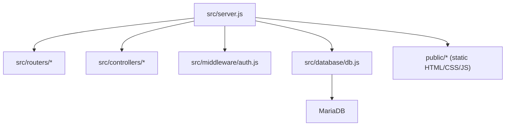
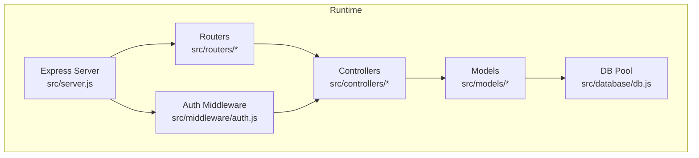
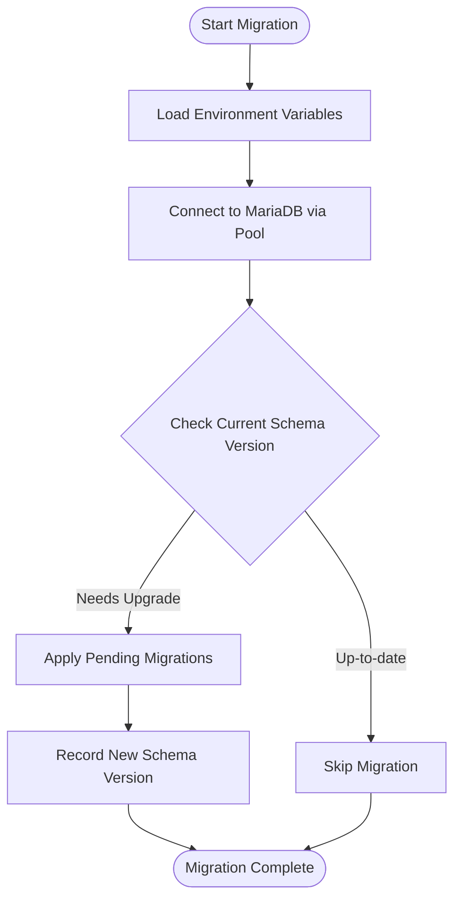
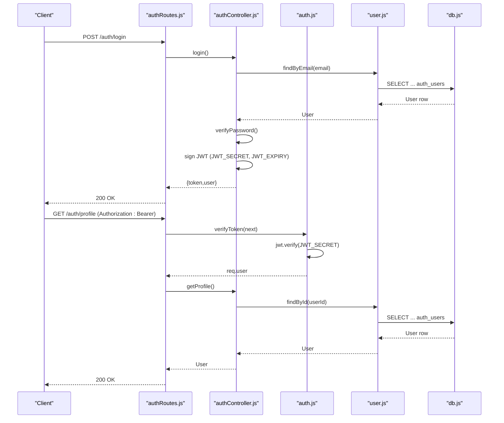
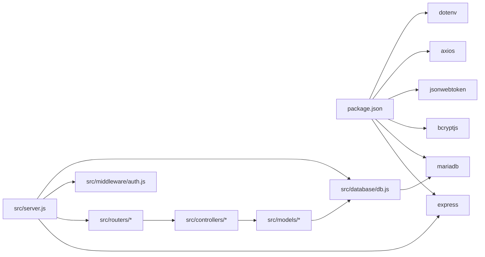

# Deployment & DevOps

<cite>
**Referenced Files in This Document**
- [package.json](file://package.json)
- [README.md](file://README.md)
- [AUTH_GUIDE.md](file://AUTH_GUIDE.md)
- [src/server.js](file://src/server.js)
- [src/database/db.js](file://src/database/db.js)
- [src/database/setupAuthUsers.js](file://src/database/setupAuthUsers.js)
- [src/database/setupUsers.js](file://src/database/setupUsers.js)
- [src/middleware/auth.js](file://src/middleware/auth.js)
- [src/controllers/authController.js](file://src/controllers/authController.js)
- [src/routers/authRoutes.js](file://src/routers/authRoutes.js)
- [src/models/user.js](file://src/models/user.js)
- [.gitignore](file://.gitignore)
- [test/check_tables_temp.js](file://test/check_tables_temp.js)
- [test/create_estagio_table.js](file://test/create_estagio_table.js)
- [test/verify_estagio.js](file://test/verify_estagio.js)
</cite>

## Table of Contents
1. [Introduction](#introduction)
2. [Project Structure](#project-structure)
3. [Core Components](#core-components)
4. [Architecture Overview](#architecture-overview)
5. [Detailed Component Analysis](#detailed-component-analysis)
6. [Dependency Analysis](#dependency-analysis)
7. [Performance Considerations](#performance-considerations)
8. [Troubleshooting Guide](#troubleshooting-guide)
9. [Conclusion](#conclusion)
10. [Appendices](#appendices)

## Introduction
This document provides comprehensive deployment and DevOps guidance for NodeMural. It covers production deployment procedures, environment configuration management, database initialization and migration strategies, package scripts, build processes, deployment automation, environment variable management, security configuration, database setup, monitoring and logging, performance optimization, scaling, containerization approaches, CI/CD integration, backup and recovery, security hardening, SSL/TLS configuration, troubleshooting, deployment checklists, rollback procedures, and production maintenance guidelines.

## Project Structure
NodeMural is a modular Express application with a clear separation of concerns:
- Entry point initializes Express, middleware, static serving, and routes.
- Database configuration uses a connection pool with environment-driven settings.
- Authentication and authorization are implemented via JWT and role-based middleware.
- Controllers and routers encapsulate business logic and endpoint definitions.
- Environment variables are loaded via dotenv and consumed across modules.
- Tests demonstrate database inspection and CRUD verification.

**Diagram sources**
- [src/server.js](file://src/server.js#L1-L73)
- [src/database/db.js](file://src/database/db.js#L1-L15)

**Section sources**
- [src/server.js](file://src/server.js#L1-L73)
- [src/database/db.js](file://src/database/db.js#L1-L15)
- [package.json](file://package.json#L1-L32)

## Core Components
- Application entry and routing: Initializes Express, registers routes, serves static assets, and listens on a configurable port.
- Database pool: Creates a MariaDB connection pool using environment variables for host, user, password, database, and pool limits.
- Authentication system: JWT-based authentication with role-based access control (RBAC), ownership checks, and protected routes.
- Environment configuration: Uses dotenv to load environment variables; sensitive keys are stored in .env and excluded from version control.
- Testing utilities: Scripts to inspect tables and verify CRUD operations for specific entities.

Key configuration and runtime behaviors:
- Port binding and fallback to default.
- Static asset serving from the public directory.
- Centralized route registration under multiple prefixes.
- Nested routes for cross-entity relationships.
- Environment-driven database pool sizing.

**Section sources**
- [src/server.js](file://src/server.js#L31-L73)
- [src/database/db.js](file://src/database/db.js#L5-L13)
- [AUTH_GUIDE.md](file://AUTH_GUIDE.md#L1-L312)
- [.gitignore](file://.gitignore#L7-L11)

## Architecture Overview
The runtime architecture integrates Express, middleware, controllers, models, and the database pool. Authentication middleware validates tokens and enforces roles, while controllers interact with the database through models.

**Diagram sources**
- [src/server.js](file://src/server.js#L1-L73)
- [src/middleware/auth.js](file://src/middleware/auth.js#L1-L137)
- [src/controllers/authController.js](file://src/controllers/authController.js#L1-L157)
- [src/models/user.js](file://src/models/user.js#L1-L146)
- [src/database/db.js](file://src/database/db.js#L1-L15)

## Detailed Component Analysis

### Database Initialization and Migration Strategies
- Initialization scripts create required tables for authentication and general users.
- The application connects to MariaDB using environment variables and a configurable pool limit.
- Migration strategy recommendation:
  - Use a lightweight migration tool (e.g., a simple SQL-based migration runner) to apply schema changes in production.
  - Keep migrations idempotent and versioned.
  - Apply migrations during pre-deploy hooks before starting the service.
  - Maintain a rollback plan by storing previous schema snapshots.

**Diagram sources**
- [src/database/db.js](file://src/database/db.js#L5-L13)
- [src/database/setupAuthUsers.js](file://src/database/setupAuthUsers.js#L6-L35)
- [src/database/setupUsers.js](file://src/database/setupUsers.js#L6-L35)

**Section sources**
- [src/database/db.js](file://src/database/db.js#L1-L15)
- [src/database/setupAuthUsers.js](file://src/database/setupAuthUsers.js#L1-L38)
- [src/database/setupUsers.js](file://src/database/setupUsers.js#L1-L38)

### Authentication and Authorization
- JWT secret and expiry are configured via environment variables.
- Middleware verifies tokens and enforces roles and ownership.
- Controllers implement protected endpoints and admin-only routes.

**Diagram sources**
- [src/routers/authRoutes.js](file://src/routers/authRoutes.js#L1-L20)
- [src/controllers/authController.js](file://src/controllers/authController.js#L76-L127)
- [src/middleware/auth.js](file://src/middleware/auth.js#L6-L29)
- [src/models/user.js](file://src/models/user.js#L36-L60)
- [src/database/db.js](file://src/database/db.js#L1-L15)

**Section sources**
- [AUTH_GUIDE.md](file://AUTH_GUIDE.md#L1-L312)
- [src/middleware/auth.js](file://src/middleware/auth.js#L1-L137)
- [src/controllers/authController.js](file://src/controllers/authController.js#L1-L157)
- [src/models/user.js](file://src/models/user.js#L1-L146)

### Environment Variable Management
- Required variables include database connection settings, JWT secret and expiry, and server port.
- Production guidance:
  - Store secrets in a secure secrets manager or environment injection mechanism.
  - Never commit .env to version control; rely on .gitignore protection.
  - Use separate environment files per environment (e.g., .env.production).

**Section sources**
- [README.md](file://README.md#L18-L28)
- [.gitignore](file://.gitignore#L7-L11)

### Package Scripts and Build Processes
- Scripts:
  - start: Runs the production server.
  - dev: Starts the development server with auto-reload.
  - test: Placeholder for tests.
- Build process:
  - The project is a pure ES module Node.js application without a transpile/build step.
  - No bundling or minification is performed; production runs the source directly.

**Section sources**
- [package.json](file://package.json#L10-L14)

### Monitoring and Logging
- Logging:
  - Console logs are used for operational events (e.g., startup, table creation).
  - Recommendation: Integrate structured logging (e.g., pino) and log aggregation (e.g., ELK stack or cloud provider logging).
- Metrics:
  - Expose metrics endpoints (e.g., Prometheus) and integrate with monitoring dashboards.
- Health checks:
  - Implement a simple GET health endpoint returning application and database connectivity status.

**Section sources**
- [src/server.js](file://src/server.js#L71-L73)
- [src/database/setupAuthUsers.js](file://src/database/setupAuthUsers.js#L25-L25)

### Security Configuration for Production
- Secrets:
  - Change JWT_SECRET immediately in production.
  - Use strong, randomly generated secrets.
- Transport security:
  - Enforce HTTPS in production behind a reverse proxy or load balancer.
  - Configure TLS certificates and cipher suites appropriately.
- Access control:
  - Apply auth middleware to all routes.
  - Enforce RBAC and ownership checks.
- Input validation and sanitization:
  - Validate and sanitize all inputs; consider adding middleware for this.
- Rate limiting and CORS:
  - Implement rate limiting and appropriate CORS policies.

**Section sources**
- [AUTH_GUIDE.md](file://AUTH_GUIDE.md#L243-L280)
- [src/middleware/auth.js](file://src/middleware/auth.js#L32-L48)

### Database Setup Procedures
- Ensure MariaDB is running and the target database exists.
- Initialize required tables using the provided setup scripts.
- For production, run migrations during deployment to keep schema synchronized.

**Section sources**
- [README.md](file://README.md#L44-L47)
- [src/database/setupAuthUsers.js](file://src/database/setupAuthUsers.js#L1-L38)
- [src/database/setupUsers.js](file://src/database/setupUsers.js#L1-L38)

### Testing and Verification
- Use test scripts to inspect tables and verify CRUD operations for specific entities.
- Integrate automated tests into CI/CD pipelines.

**Section sources**
- [test/check_tables_temp.js](file://test/check_tables_temp.js#L1-L40)
- [test/create_estagio_table.js](file://test/create_estagio_table.js#L1-L41)
- [test/verify_estagio.js](file://test/verify_estagio.js#L1-L90)

## Dependency Analysis
- Runtime dependencies include Express, MariaDB driver, bcryptjs, jsonwebtoken, axios, dotenv, and nodemon.
- The server depends on routers, controllers, middleware, and the database pool.
- Controllers depend on models, which depend on the database pool.

**Diagram sources**
- [package.json](file://package.json#L22-L30)
- [src/server.js](file://src/server.js#L1-L73)
- [src/database/db.js](file://src/database/db.js#L1-L15)

**Section sources**
- [package.json](file://package.json#L22-L30)
- [src/server.js](file://src/server.js#L1-L73)

## Performance Considerations
- Connection pooling:
  - Tune DB_POOL_LIMIT according to workload and database capacity.
- Request handling:
  - Use compression and caching for static assets.
- Routing and middleware:
  - Minimize synchronous operations in middleware and routes.
- Asynchronous patterns:
  - Ensure database queries are awaited and errors are handled to prevent resource leaks.

[No sources needed since this section provides general guidance]

## Troubleshooting Guide
Common issues and resolutions:
- Authentication failures:
  - Verify JWT_SECRET and token validity.
  - Confirm user roles and ownership checks.
- Database connectivity:
  - Check DB_HOST, DB_USER, DB_PASSWORD, DB_NAME, and DB_POOL_LIMIT.
  - Ensure the database is reachable and the schema is initialized.
- Port conflicts:
  - Adjust PORT environment variable if the default port is in use.
- Static assets not loading:
  - Confirm public directory paths and Express static configuration.

**Section sources**
- [src/middleware/auth.js](file://src/middleware/auth.js#L22-L28)
- [src/database/db.js](file://src/database/db.js#L5-L13)
- [src/server.js](file://src/server.js#L34-L35)

## Conclusion
NodeMural is a modular Express application with a robust authentication and authorization system, environment-driven configuration, and straightforward database initialization. For production, focus on secure secrets management, transport encryption, strict access controls, scalable database pooling, and comprehensive monitoring. Adopt a migration strategy, containerize the application, and automate deployments with CI/CD pipelines to ensure reliable and repeatable releases.

[No sources needed since this section summarizes without analyzing specific files]

## Appendices

### A. Production Deployment Checklist
- Prepare environment variables (DB_* and JWT_*).
- Initialize database schema and run migrations.
- Build/deploy artifacts (no build step required).
- Start the server using the production script.
- Verify health, authentication, and core endpoints.
- Configure reverse proxy/load balancer with TLS termination.
- Set up monitoring, logging, and alerting.
- Schedule backups and test recovery procedures.

**Section sources**
- [README.md](file://README.md#L18-L28)
- [src/database/setupAuthUsers.js](file://src/database/setupAuthUsers.js#L1-L38)
- [package.json](file://package.json#L10-L14)

### B. Rollback Procedures
- Keep previous artifact versions available.
- Revert database schema using stored migration snapshots.
- Switch DNS or routing back to the previous healthy instance.
- Monitor metrics and logs post-rollback.

[No sources needed since this section provides general guidance]

### C. Maintenance Guidelines
- Regularly rotate JWT_SECRET.
- Patch dependencies and monitor for vulnerabilities.
- Review and update RBAC policies.
- Audit logs and access patterns periodically.

**Section sources**
- [AUTH_GUIDE.md](file://AUTH_GUIDE.md#L243-L253)

### D. Containerization Approaches
- Use a minimal base image (e.g., node:alpine).
- Copy package files and install dependencies.
- Copy application source and set working directory.
- Expose the configured port.
- Use non-root user and read-only root filesystem where possible.
- Define health check endpoint.

[No sources needed since this section provides general guidance]

### E. CI/CD Pipeline Integration
- Build stage: Install dependencies and run tests.
- Deploy stage: Push container image to registry, deploy to infrastructure, run migrations, restart service.
- Rollback: Automated rollback to last successful image/tag.

[No sources needed since this section provides general guidance]

### F. Backup and Recovery Procedures
- Database backups: Use logical or physical backups of MariaDB.
- Recovery: Restore to a new instance, reapply migrations, and switch traffic.
- Test recovery regularly.

[No sources needed since this section provides general guidance]

### G. SSL/TLS Configuration
- Terminate TLS at a reverse proxy or load balancer.
- Configure strong ciphers and protocols.
- Manage certificates via automated tools or cloud providers.

[No sources needed since this section provides general guidance]