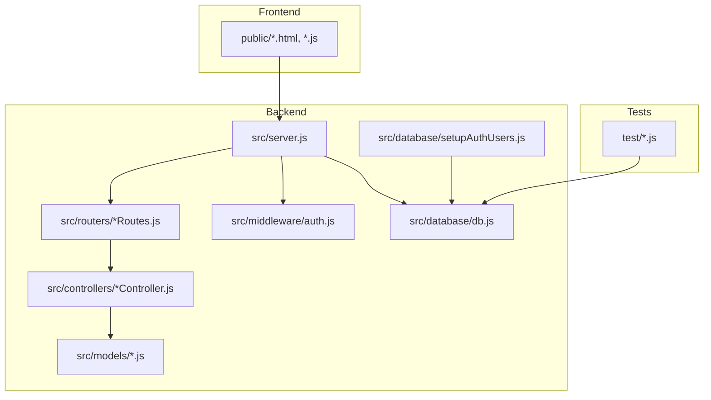
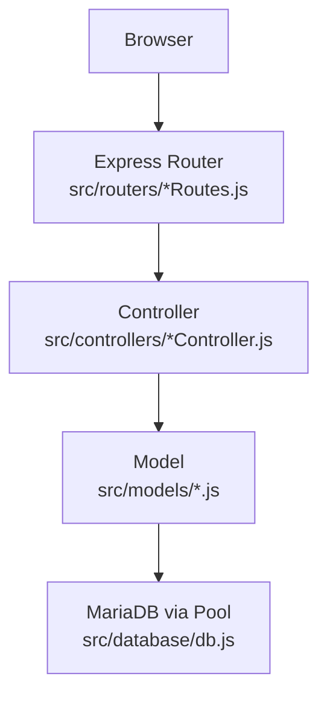
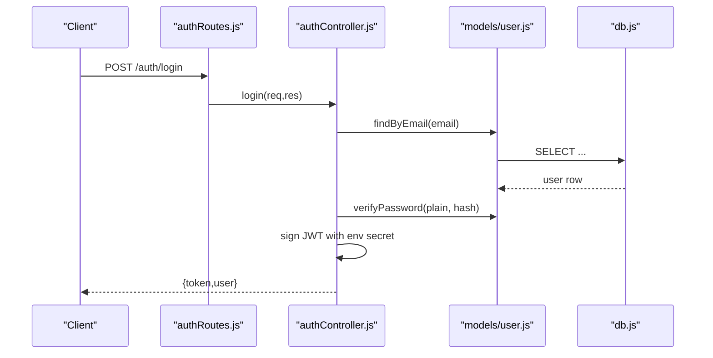
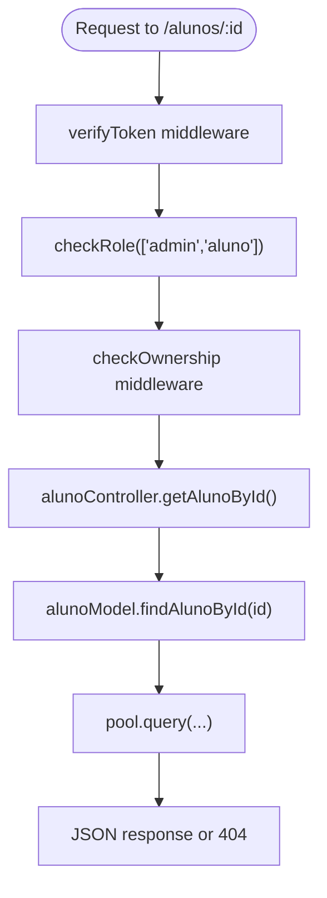
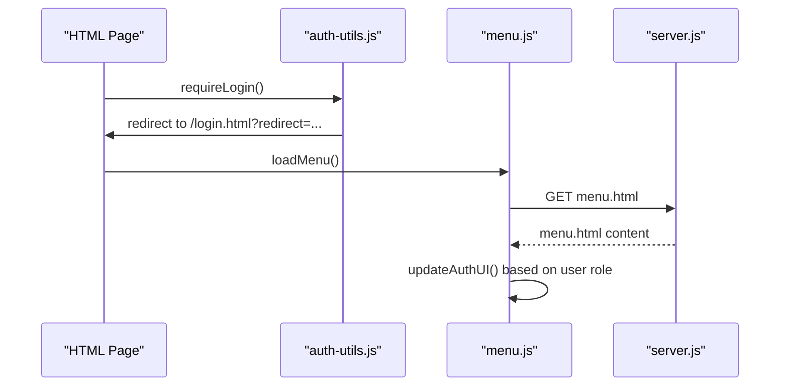
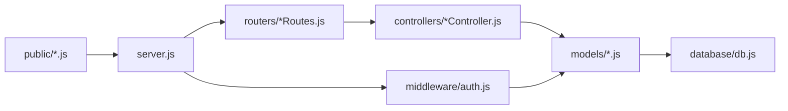

# Developer Guidelines

<cite>
**Referenced Files in This Document**
- [README.md](file://README.md)
- [AUTH_GUIDE.md](file://AUTH_GUIDE.md)
- [package.json](file://package.json)
- [.gitignore](file://.gitignore)
- [src/server.js](file://src/server.js)
- [src/middleware/auth.js](file://src/middleware/auth.js)
- [src/controllers/authController.js](file://src/controllers/authController.js)
- [src/routers/authRoutes.js](file://src/routers/authRoutes.js)
- [src/models/user.js](file://src/models/user.js)
- [src/controllers/alunoController.js](file://src/controllers/alunoController.js)
- [src/routers/alunoRoutes.js](file://src/routers/alunoRoutes.js)
- [src/models/aluno.js](file://src/models/aluno.js)
- [src/database/db.js](file://src/database/db.js)
- [src/database/setupAuthUsers.js](file://src/database/setupAuthUsers.js)
- [public/auth-utils.js](file://public/auth-utils.js)
- [public/menu.js](file://public/menu.js)
- [test/check_tables_temp.js](file://test/check_tables_temp.js)
</cite>

## Table of Contents
1. [Introduction](#introduction)
2. [Project Structure](#project-structure)
3. [Core Components](#core-components)
4. [Architecture Overview](#architecture-overview)
5. [Detailed Component Analysis](#detailed-component-analysis)
6. [Dependency Analysis](#dependency-analysis)
7. [Performance Considerations](#performance-considerations)
8. [Troubleshooting Guide](#troubleshooting-guide)
9. [Development Workflow](#development-workflow)
10. [Testing Requirements](#testing-requirements)
11. [Documentation Standards](#documentation-standards)
12. [Database Schema Changes](#database-schema-changes)
13. [API Evolution and Backward Compatibility](#api-evolution-and-backward-compatibility)
14. [Best Practices for Extending Functionality](#best-practices-for-extending-functionality)
15. [Conclusion](#conclusion)

## Introduction
This document provides comprehensive developer guidelines for contributing to NodeMural. It covers code style conventions, architectural patterns, MVC implementation, file organization, naming conventions, development workflow, testing, documentation, performance optimization, database schema changes, API evolution, and backward compatibility considerations. The application follows a layered MVC architecture with Express, MariaDB, and a simple client-side frontend.

## Project Structure
The project is organized into clear layers:
- Backend: Express server, controllers, models, routers, middleware, and database utilities
- Frontend: Static HTML pages and client-side JavaScript modules under public/
- Tests: Database inspection scripts under test/

**Diagram sources**
- [src/server.js](file://src/server.js#L1-L73)
- [src/middleware/auth.js](file://src/middleware/auth.js#L1-L137)
- [src/controllers/authController.js](file://src/controllers/authController.js#L1-L157)
- [src/routers/authRoutes.js](file://src/routers/authRoutes.js#L1-L20)
- [src/models/user.js](file://src/models/user.js#L1-L146)
- [src/controllers/alunoController.js](file://src/controllers/alunoController.js#L1-L114)
- [src/routers/alunoRoutes.js](file://src/routers/alunoRoutes.js#L1-L25)
- [src/models/aluno.js](file://src/models/aluno.js#L1-L146)
- [src/database/db.js](file://src/database/db.js#L1-L15)
- [src/database/setupAuthUsers.js](file://src/database/setupAuthUsers.js#L1-L38)
- [public/auth-utils.js](file://public/auth-utils.js#L1-L88)
- [public/menu.js](file://public/menu.js#L1-L78)
- [test/check_tables_temp.js](file://test/check_tables_temp.js#L1-L40)

**Section sources**
- [README.md](file://README.md#L1-L61)
- [src/server.js](file://src/server.js#L1-L73)

## Core Components
- Server bootstrap and routing orchestration
- Authentication and authorization middleware
- Controllers implementing CRUD operations
- Models encapsulating database queries and business rules
- Database connection pool configuration
- Frontend authentication utilities and menu integration

Key responsibilities:
- src/server.js: Registers middleware, mounts routers, exposes nested routes, serves static assets
- src/middleware/auth.js: JWT verification, role checks, ownership checks, and permission helpers
- src/controllers/*Controller.js: Request handlers delegating to models
- src/models/*.js: Data access, validation, and business logic
- src/database/db.js: Pool configuration and connection management
- public/auth-utils.js: Client-side auth helpers and authenticated fetch wrapper
- public/menu.js: Dynamic menu rendering based on user role

**Section sources**
- [src/server.js](file://src/server.js#L1-L73)
- [src/middleware/auth.js](file://src/middleware/auth.js#L1-L137)
- [src/controllers/authController.js](file://src/controllers/authController.js#L1-L157)
- [src/routers/authRoutes.js](file://src/routers/authRoutes.js#L1-L20)
- [src/models/user.js](file://src/models/user.js#L1-L146)
- [src/controllers/alunoController.js](file://src/controllers/alunoController.js#L1-L114)
- [src/routers/alunoRoutes.js](file://src/routers/alunoRoutes.js#L1-L25)
- [src/models/aluno.js](file://src/models/aluno.js#L1-L146)
- [src/database/db.js](file://src/database/db.js#L1-L15)
- [public/auth-utils.js](file://public/auth-utils.js#L1-L88)
- [public/menu.js](file://public/menu.js#L1-L78)

## Architecture Overview
NodeMural follows an MVC architecture:
- Models: Encapsulate database access and business rules
- Controllers: Handle HTTP requests, validate inputs, and orchestrate responses
- Views: Static HTML pages served from public/
- Frontend logic: Lightweight client-side scripts for navigation and auth

**Diagram sources**
- [src/server.js](file://src/server.js#L31-L54)
- [src/routers/authRoutes.js](file://src/routers/authRoutes.js#L1-L20)
- [src/controllers/authController.js](file://src/controllers/authController.js#L1-L157)
- [src/models/user.js](file://src/models/user.js#L1-L146)
- [src/database/db.js](file://src/database/db.js#L1-L15)

## Detailed Component Analysis

### Authentication and Authorization
- JWT-based authentication with environment-managed secrets
- Role-based access control (RBAC) with middleware
- Ownership checks for resource-specific access
- Protected endpoints for profile and admin-only user listing

**Diagram sources**
- [src/routers/authRoutes.js](file://src/routers/authRoutes.js#L1-L20)
- [src/controllers/authController.js](file://src/controllers/authController.js#L76-L127)
- [src/models/user.js](file://src/models/user.js#L36-L104)
- [src/database/db.js](file://src/database/db.js#L1-L15)

**Section sources**
- [AUTH_GUIDE.md](file://AUTH_GUIDE.md#L1-L312)
- [src/middleware/auth.js](file://src/middleware/auth.js#L1-L137)
- [src/controllers/authController.js](file://src/controllers/authController.js#L1-L157)
- [src/routers/authRoutes.js](file://src/routers/authRoutes.js#L1-L20)
- [src/models/user.js](file://src/models/user.js#L1-L146)
- [src/database/setupAuthUsers.js](file://src/database/setupAuthUsers.js#L1-L38)

### Student Management (Example Feature)
- CRUD endpoints protected by authentication and role checks
- Ownership validation ensures users can only modify their own records
- Nested routes expose related resources (e.g., inscriptions, internships)

**Diagram sources**
- [src/routers/alunoRoutes.js](file://src/routers/alunoRoutes.js#L1-L25)
- [src/middleware/auth.js](file://src/middleware/auth.js#L77-L98)
- [src/controllers/alunoController.js](file://src/controllers/alunoController.js#L42-L56)
- [src/models/aluno.js](file://src/models/aluno.js#L44-L51)
- [src/database/db.js](file://src/database/db.js#L1-L15)

**Section sources**
- [src/controllers/alunoController.js](file://src/controllers/alunoController.js#L1-L114)
- [src/routers/alunoRoutes.js](file://src/routers/alunoRoutes.js#L1-L25)
- [src/models/aluno.js](file://src/models/aluno.js#L1-L146)
- [src/middleware/auth.js](file://src/middleware/auth.js#L1-L137)

### Frontend Integration
- Client-side utilities for authentication state and authenticated requests
- Dynamic menu rendering based on user role and login status
- Static asset serving from public/ with index as default route

**Diagram sources**
- [public/auth-utils.js](file://public/auth-utils.js#L80-L88)
- [public/menu.js](file://public/menu.js#L1-L78)
- [src/server.js](file://src/server.js#L67-L69)

**Section sources**
- [public/auth-utils.js](file://public/auth-utils.js#L1-L88)
- [public/menu.js](file://public/menu.js#L1-L78)
- [src/server.js](file://src/server.js#L1-L73)

## Dependency Analysis
- Express server orchestrates middleware and routes
- Controllers depend on models for data operations
- Models depend on the database pool for SQL operations
- Middleware depends on environment variables for JWT configuration
- Frontend utilities depend on localStorage and fetch API

**Diagram sources**
- [src/server.js](file://src/server.js#L1-L73)
- [src/middleware/auth.js](file://src/middleware/auth.js#L1-L137)
- [src/controllers/authController.js](file://src/controllers/authController.js#L1-L157)
- [src/models/user.js](file://src/models/user.js#L1-L146)
- [src/database/db.js](file://src/database/db.js#L1-L15)
- [public/auth-utils.js](file://public/auth-utils.js#L1-L88)

**Section sources**
- [package.json](file://package.json#L1-L32)
- [src/server.js](file://src/server.js#L1-L73)

## Performance Considerations
- Use database pool limits configured via environment variables to control concurrency
- Minimize unnecessary joins in models; prefer targeted queries
- Cache frequently accessed static assets (already served via Express static middleware)
- Keep controllers thin; delegate heavy logic to models
- Use pagination or filtering for large datasets (see model search patterns)

[No sources needed since this section provides general guidance]

## Troubleshooting Guide
Common issues and resolutions:
- Missing environment variables: Ensure .env is present and contains required keys
- JWT errors: Verify JWT_SECRET and expiry configuration; check token presence and validity
- Database connectivity: Confirm DB_HOST, DB_USER, DB_PASSWORD, DB_NAME, and pool limit
- CORS and static assets: Confirm Express static middleware path and route order

**Section sources**
- [AUTH_GUIDE.md](file://AUTH_GUIDE.md#L18-L28)
- [src/middleware/auth.js](file://src/middleware/auth.js#L6-L29)
- [src/database/db.js](file://src/database/db.js#L5-L13)
- [src/server.js](file://src/server.js#L34-L35)

## Development Workflow
- Branching: Use feature branches prefixed with feature/, fix/, or chore/
- Commit messages: Use imperative mood; reference issue numbers when applicable
- Pull requests: Open against develop or main; include summary, rationale, and testing notes
- Code review: Ensure adherence to naming conventions, error handling, and RBAC patterns
- Local setup: Install dependencies, configure .env, run database setup script, start server

**Section sources**
- [README.md](file://README.md#L10-L42)
- [.gitignore](file://.gitignore#L1-L39)

## Testing Requirements
- Unit/integration tests: Validate controller responses, middleware behavior, and model queries
- Database tests: Use scripts similar to test/check_tables_temp.js to inspect schema and data
- Manual testing: Verify authentication flows, role-based access, and nested routes
- Frontend tests: Validate menu rendering and auth state transitions

**Section sources**
- [test/check_tables_temp.js](file://test/check_tables_temp.js#L1-L40)
- [AUTH_GUIDE.md](file://AUTH_GUIDE.md#L281-L286)

## Documentation Standards
- Keep README.md updated with installation, setup, and feature highlights
- Document new endpoints and changes in AUTH_GUIDE.md
- Inline comments: Explain complex logic in controllers and models
- API coverage: Maintain parity between routes and controller implementations

**Section sources**
- [README.md](file://README.md#L1-L61)
- [AUTH_GUIDE.md](file://AUTH_GUIDE.md#L1-L312)

## Database Schema Changes
- Initialize auth_users via src/database/setupAuthUsers.js
- Use environment variables for DB configuration
- Apply migrations or manual DDL for new tables; keep schema changes backward compatible when possible
- Update models to reflect schema changes and add validation where appropriate

**Section sources**
- [src/database/setupAuthUsers.js](file://src/database/setupAuthUsers.js#L1-L38)
- [src/database/db.js](file://src/database/db.js#L1-L15)

## API Evolution and Backward Compatibility
- Version endpoints or maintain base URLs while extending functionality
- Respect role-based access; avoid breaking changes to protected endpoints
- Return structured error responses with consistent status codes
- Document breaking changes and migration steps in release notes

**Section sources**
- [AUTH_GUIDE.md](file://AUTH_GUIDE.md#L289-L300)
- [src/middleware/auth.js](file://src/middleware/auth.js#L31-L48)

## Best Practices for Extending Functionality
- Follow MVC: Add router, controller, and model files with consistent naming
- Enforce RBAC: Protect new endpoints with verifyToken and checkRole
- Implement ownership checks: Use checkOwnership for resource-level access
- Validate inputs: Add validation in controllers and models
- Keep controllers thin: Move logic to models
- Use environment variables: Never hardcode secrets or configuration
- Serve static assets: Place HTML and JS under public/ and reference via server routes

**Section sources**
- [src/server.js](file://src/server.js#L31-L54)
- [src/middleware/auth.js](file://src/middleware/auth.js#L1-L137)
- [src/controllers/alunoController.js](file://src/controllers/alunoController.js#L1-L114)
- [src/routers/alunoRoutes.js](file://src/routers/alunoRoutes.js#L1-L25)
- [src/models/aluno.js](file://src/models/aluno.js#L1-L146)

## Conclusion
These guidelines standardize development practices across the NodeMural codebase. By adhering to the MVC architecture, RBAC patterns, consistent naming, and documented workflows, contributors can efficiently extend functionality while maintaining code quality and system reliability.