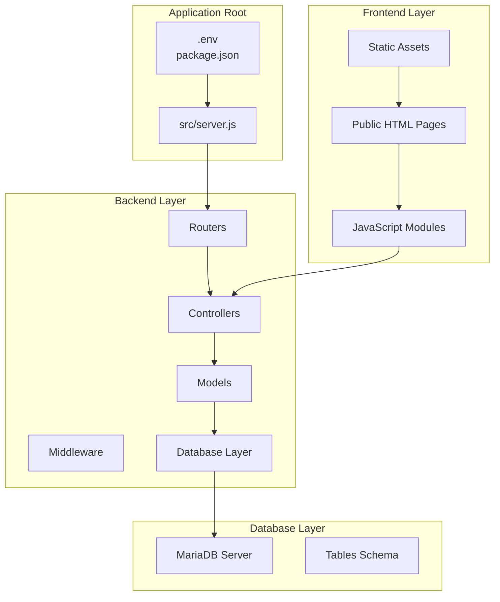
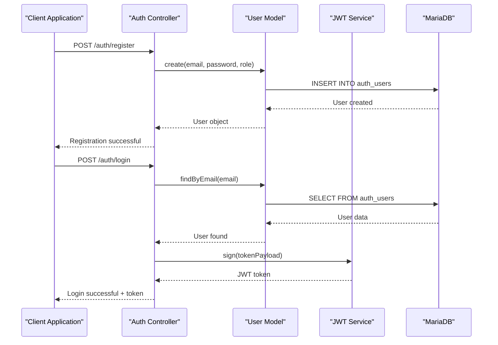
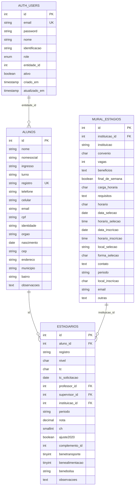
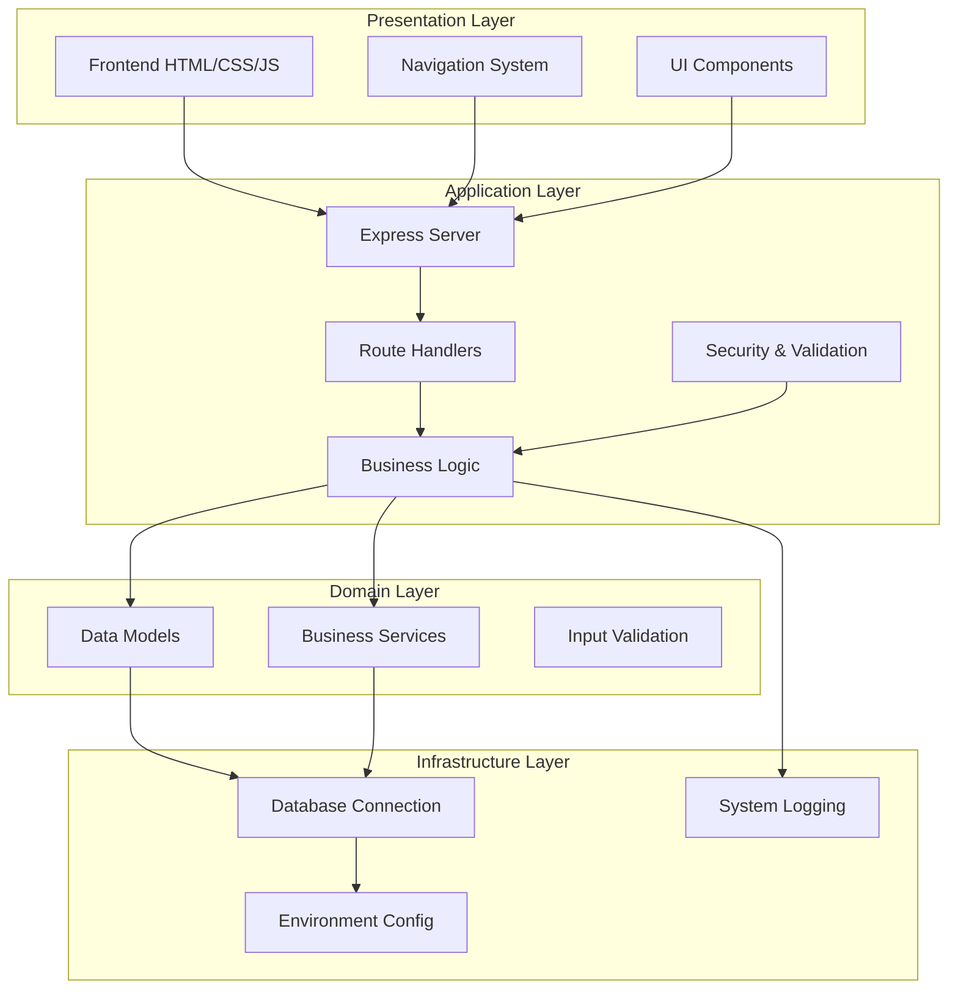
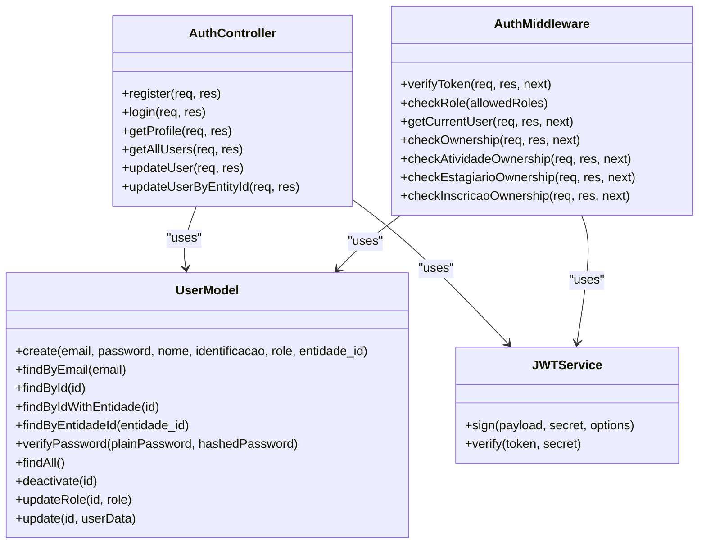
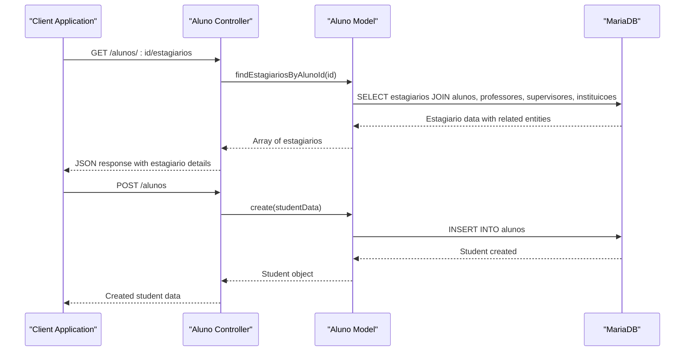
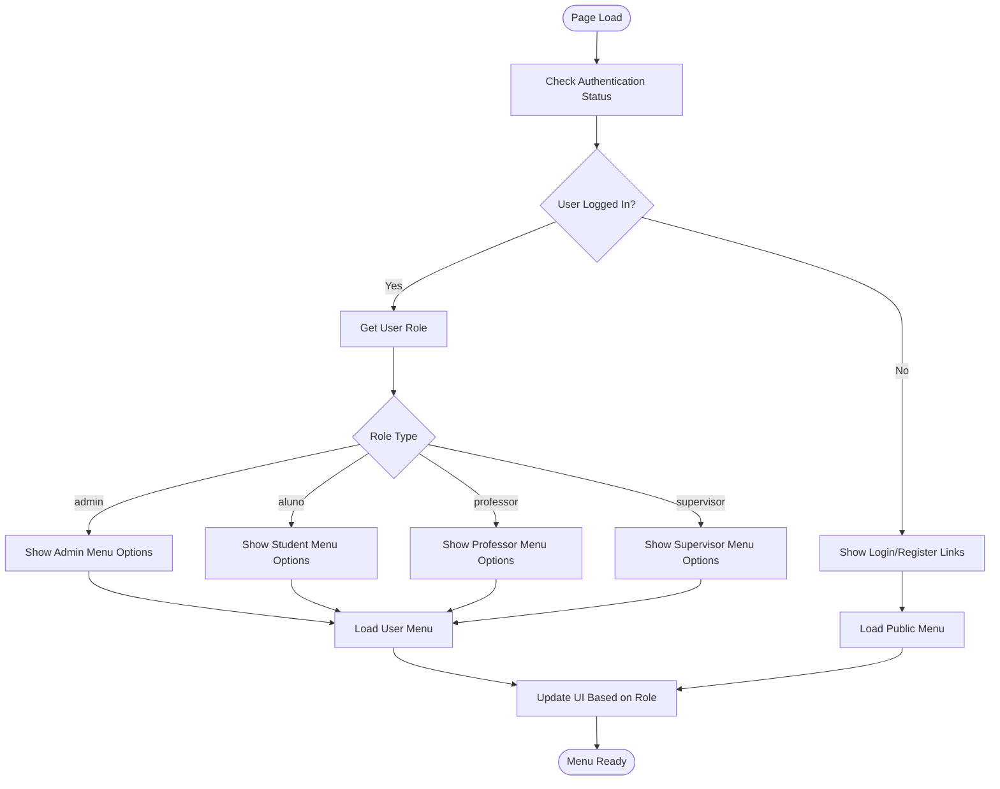
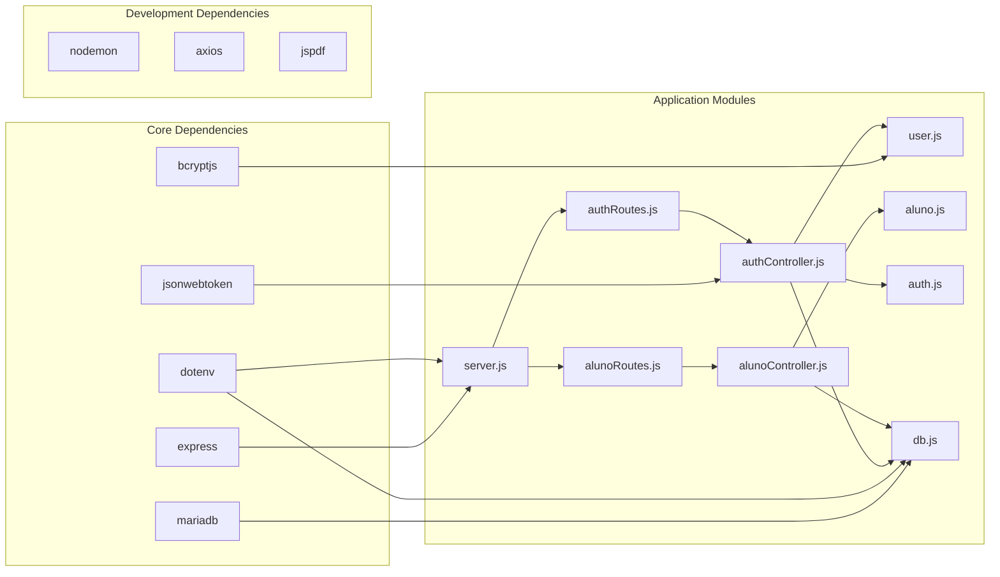

# GitHub Copilot Development Guide

<cite>
**Referenced Files in This Document**
- [README.md](file://README.md)
- [package.json](file://package.json)
- [src/server.js](file://src/server.js)
- [src/database/db.js](file://src/database/db.js)
- [src/database/setupFullDatabase.js](file://src/database/setupFullDatabase.js)
- [src/middleware/auth.js](file://src/middleware/auth.js)
- [src/controllers/authController.js](file://src/controllers/authController.js)
- [src/models/user.js](file://src/models/user.js)
- [src/routers/authRoutes.js](file://src/routers/authRoutes.js)
- [src/controllers/alunoController.js](file://src/controllers/alunoController.js)
- [src/models/aluno.js](file://src/models/aluno.js)
- [src/routers/alunoRoutes.js](file://src/routers/alunoRoutes.js)
- [AUTH_GUIDE.md](file://AUTH_GUIDE.md)
- [public/index.html](file://public/index.html)
- [public/mural.html](file://public/mural.html)
- [public/menu.js](file://public/menu.js)
</cite>

## Table of Contents
1. [Introduction](#introduction)
2. [Project Structure](#project-structure)
3. [Core Components](#core-components)
4. [Architecture Overview](#architecture-overview)
5. [Detailed Component Analysis](#detailed-component-analysis)
6. [Dependency Analysis](#dependency-analysis)
7. [Performance Considerations](#performance-considerations)
8. [Troubleshooting Guide](#troubleshooting-guide)
9. [Conclusion](#conclusion)

## Introduction
This document provides a comprehensive development guide for the GitHub Copilot implementation of the NodeMural application. The project is a Node.js web application built with Express and MariaDB, featuring JWT-based authentication, role-based access control (RBAC), and a modular MVC architecture. The system manages university internship processes including student management, teacher supervision, questionnaire systems, activity tracking, and institutional coordination.

The application follows modern development practices with environment-based configuration, secure password handling using bcrypt, and comprehensive middleware for authentication and authorization. The frontend consists of static HTML pages with JavaScript modules for dynamic functionality and navigation.

## Project Structure
The NodeMural application follows a clean MVC (Model-View-Controller) architecture with clear separation of concerns:

**Diagram sources**
- [src/server.js](file://src/server.js#L1-L62)
- [package.json](file://package.json#L1-L33)

The project is organized into several key directories:

- **src/**: Contains all backend source code with separate folders for controllers, models, routers, middleware, and database configuration
- **public/**: Contains frontend HTML pages, JavaScript modules, and static assets
- **test/**: Contains database testing scripts
- **.qoder/**: Contains AI agent configurations and skills

**Section sources**
- [README.md](file://README.md#L1-L61)
- [package.json](file://package.json#L1-L33)

## Core Components

### Authentication System
The authentication system implements JWT-based security with role-based access control:

**Diagram sources**
- [src/controllers/authController.js](file://src/controllers/authController.js#L1-L260)
- [src/models/user.js](file://src/models/user.js#L1-L185)

### Database Management
The application uses a comprehensive database schema designed for university internship management:

**Diagram sources**
- [src/database/setupFullDatabase.js](file://src/database/setupFullDatabase.js#L1-L279)

**Section sources**
- [src/middleware/auth.js](file://src/middleware/auth.js#L1-L216)
- [src/database/db.js](file://src/database/db.js#L1-L15)
- [src/database/setupFullDatabase.js](file://src/database/setupFullDatabase.js#L1-L279)

## Architecture Overview

The NodeMural application implements a layered architecture with clear separation between presentation, business logic, and data access layers:

**Diagram sources**
- [src/server.js](file://src/server.js#L1-L62)
- [src/middleware/auth.js](file://src/middleware/auth.js#L1-L216)

The architecture follows these key principles:
- **Separation of Concerns**: Clear boundaries between presentation, business logic, and data access
- **Dependency Injection**: Services are injected into controllers rather than being tightly coupled
- **Middleware Pattern**: Authentication, authorization, and validation handled through middleware
- **Environment Configuration**: All sensitive data configured via environment variables

**Section sources**
- [src/server.js](file://src/server.js#L1-L62)
- [AUTH_GUIDE.md](file://AUTH_GUIDE.md#L1-L312)

## Detailed Component Analysis

### Authentication and Authorization System

The authentication system provides comprehensive security features including JWT token management, role-based access control, and ownership verification:

**Diagram sources**
- [src/controllers/authController.js](file://src/controllers/authController.js#L1-L260)
- [src/models/user.js](file://src/models/user.js#L1-L185)
- [src/middleware/auth.js](file://src/middleware/auth.js#L1-L216)

The system implements several security mechanisms:

1. **JWT Token Verification**: All protected routes require valid JWT tokens
2. **Role-Based Access Control**: Different roles have different permission levels
3. **Ownership Verification**: Users can only access their own data
4. **Password Security**: Passwords are hashed using bcrypt with salt rounds of 10
5. **Input Validation**: Comprehensive validation for all user inputs

**Section sources**
- [src/controllers/authController.js](file://src/controllers/authController.js#L1-L260)
- [src/middleware/auth.js](file://src/middleware/auth.js#L1-L216)
- [src/models/user.js](file://src/models/user.js#L1-L185)

### Student Management System

The student management system handles university student records and their internship associations:

**Diagram sources**
- [src/controllers/alunoController.js](file://src/controllers/alunoController.js#L1-L113)
- [src/models/aluno.js](file://src/models/aluno.js#L1-L130)

The student management system provides comprehensive functionality:

- **Student Registration**: Complete student profile management with validation
- **Search Functionality**: Advanced search across multiple student attributes
- **Internship Tracking**: Links between students and their internship records
- **Academic Information**: Handles university enrollment data and academic periods
- **Data Integrity**: Prevents deletion of students who have associated records

**Section sources**
- [src/controllers/alunoController.js](file://src/controllers/alunoController.js#L1-L113)
- [src/models/aluno.js](file://src/models/aluno.js#L1-L130)
- [src/routers/alunoRoutes.js](file://src/routers/alunoRoutes.js#L1-L30)

### Frontend Navigation System

The frontend implements a dynamic navigation system that adapts based on user roles and authentication status:

**Diagram sources**
- [public/menu.js](file://public/menu.js#L1-L103)

The navigation system provides role-specific functionality:
- **Admin Users**: Full system access with administrative capabilities
- **Students**: Access to personal data, activities, and internship management
- **Professors**: Access to student management and activity tracking
- **Supervisors**: Access to internship evaluation and supervision tools

**Section sources**
- [public/menu.js](file://public/menu.js#L1-L103)
- [public/index.html](file://public/index.html#L1-L34)
- [public/mural.html](file://public/mural.html#L1-L70)

## Dependency Analysis

The application has a well-defined dependency structure with clear module relationships:

**Diagram sources**
- [package.json](file://package.json#L1-L33)
- [src/server.js](file://src/server.js#L1-L62)

Key dependency relationships:
- **Express**: Core web framework providing routing and middleware support
- **MariaDB**: Database driver for connecting to MariaDB server
- **JWT**: Token-based authentication implementation
- **Bcrypt**: Password hashing and verification
- **Dotenv**: Environment variable management

**Section sources**
- [package.json](file://package.json#L1-L33)
- [src/server.js](file://src/server.js#L1-L62)

## Performance Considerations

The application implements several performance optimization strategies:

### Database Connection Pooling
The MariaDB connection pool is configured with:
- **Connection Limit**: Default 10 concurrent connections
- **Wait Queue**: Unlimited queue for handling connection spikes
- **Automatic Release**: Proper connection cleanup in finally blocks

### Caching Strategies
- **JWT Token Caching**: Tokens are validated server-side without external caching
- **Static Asset Caching**: Frontend assets served with appropriate cache headers
- **Query Result Caching**: Not implemented due to data freshness requirements

### Memory Management
- **Proper Resource Cleanup**: Database connections released in finally blocks
- **Error Handling**: Comprehensive error handling prevents memory leaks
- **Array Operations**: Efficient array filtering and mapping operations

### Scalability Considerations
- **Horizontal Scaling**: Stateless design allows multiple server instances
- **Database Scaling**: Connection pooling supports database scaling
- **Load Balancing**: No session affinity required due to stateless architecture

## Troubleshooting Guide

### Common Authentication Issues

**Problem**: Users cannot log in despite correct credentials
**Solution**: 
1. Verify JWT_SECRET environment variable is set correctly
2. Check database connectivity and auth_users table structure
3. Ensure password hashing is working properly

**Problem**: Token validation fails with "Token inválido"
**Solution**:
1. Verify token was generated with the same JWT_SECRET
2. Check token expiration settings
3. Ensure proper Authorization header format: "Bearer <token>"

### Database Connection Problems

**Problem**: Application fails to connect to MariaDB
**Solution**:
1. Verify DB_HOST, DB_USER, DB_PASSWORD, DB_NAME environment variables
2. Check MariaDB server is running and accessible
3. Ensure database user has proper permissions

**Problem**: SQL errors when accessing data
**Solution**:
1. Verify table schemas match the setup script
2. Check foreign key relationships
3. Ensure proper data types and constraints

### Frontend Navigation Issues

**Problem**: Menu items not displaying correctly
**Solution**:
1. Verify auth-utils.js is loading properly
2. Check browser console for JavaScript errors
3. Ensure menu.html is accessible and properly formatted

**Section sources**
- [AUTH_GUIDE.md](file://AUTH_GUIDE.md#L289-L300)
- [src/middleware/auth.js](file://src/middleware/auth.js#L26-L33)

## Conclusion

The NodeMural application demonstrates a well-architected Node.js solution for university internship management. The implementation successfully combines modern development practices with comprehensive security features, making it suitable for production deployment.

Key strengths of the implementation include:
- **Robust Authentication**: JWT-based security with comprehensive role management
- **Clean Architecture**: Clear separation of concerns with proper MVC pattern
- **Database Design**: Well-normalized schema supporting complex academic workflows
- **Frontend Integration**: Dynamic navigation adapting to user roles
- **Security Practices**: Proper password handling, input validation, and access control

The application provides a solid foundation for further development and can be extended with additional features such as advanced reporting, notification systems, and integration with external academic systems.

Future enhancement opportunities include implementing rate limiting, adding CORS configuration, enhancing input validation, and setting up HTTPS for production environments.