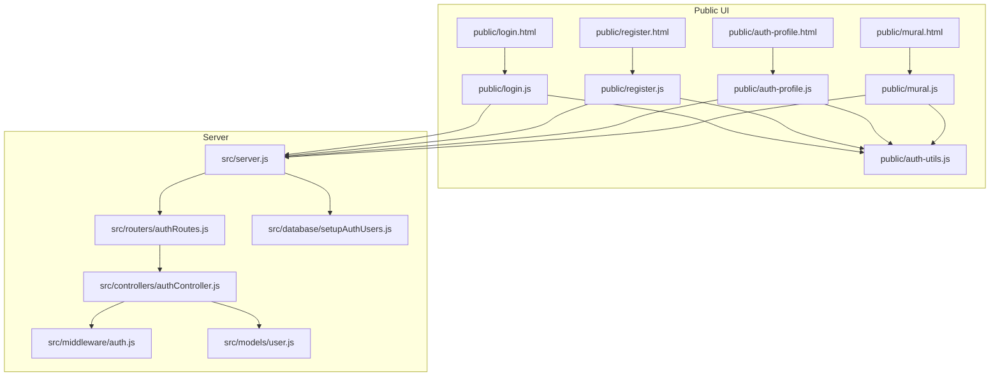
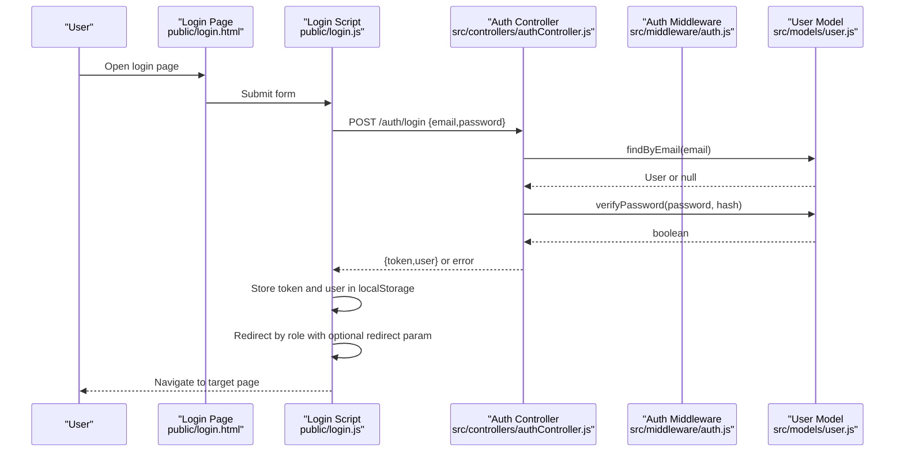
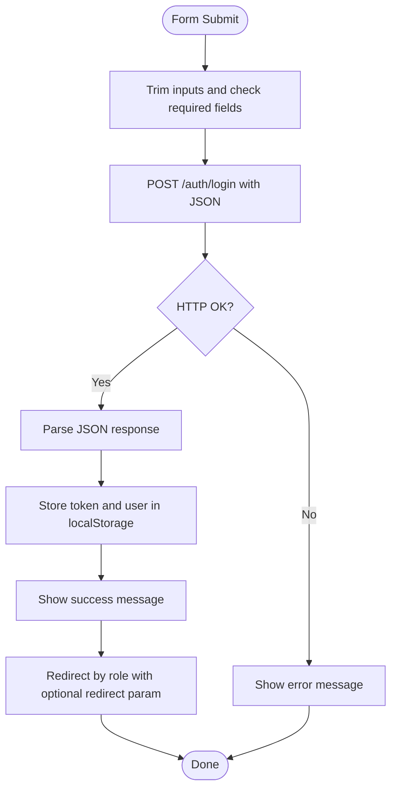
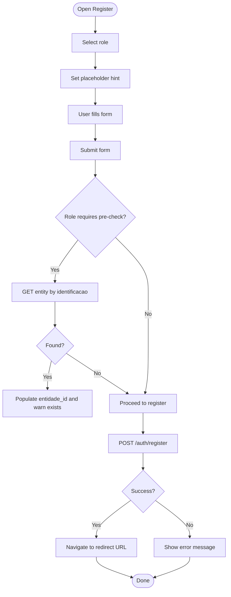
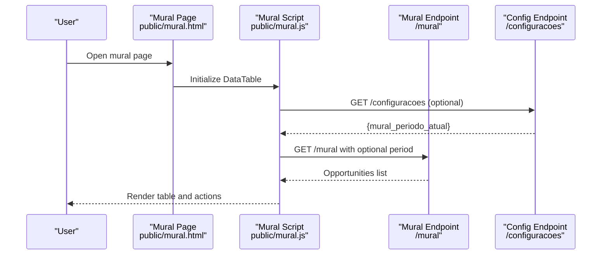
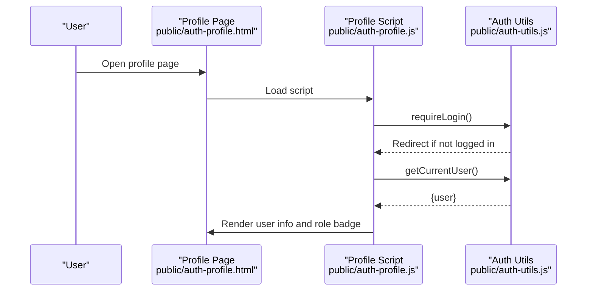
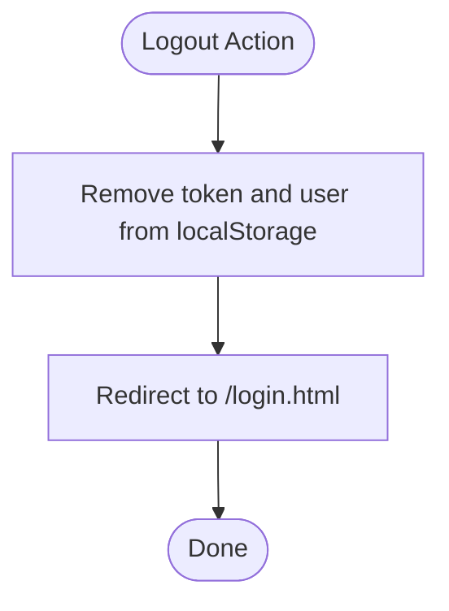
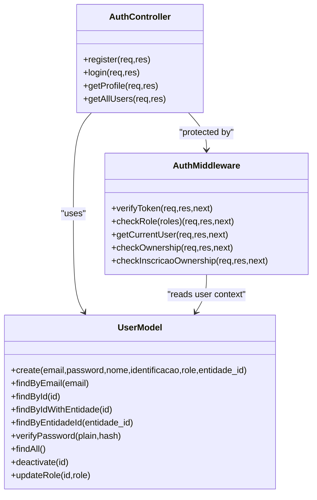
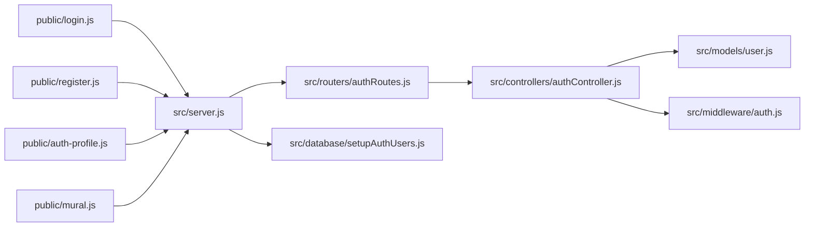

# Authentication & User Experience

<cite>
**Referenced Files in This Document**
- [login.html](file://public/login.html)
- [login.js](file://public/login.js)
- [register.html](file://public/register.html)
- [register.js](file://public/register.js)
- [auth-profile.html](file://public/auth-profile.html)
- [auth-profile.js](file://public/auth-profile.js)
- [auth-utils.js](file://public/auth-utils.js)
- [mural.html](file://public/mural.html)
- [mural.js](file://public/mural.js)
- [authController.js](file://src/controllers/authController.js)
- [authRoutes.js](file://src/routers/authRoutes.js)
- [auth.js](file://src/middleware/auth.js)
- [user.js](file://src/models/user.js)
- [setupAuthUsers.js](file://src/database/setupAuthUsers.js)
- [server.js](file://src/server.js)
- [AUTH_GUIDE.md](file://AUTH_GUIDE.md)
- [package.json](file://package.json)
</cite>

## Table of Contents
1. [Introduction](#introduction)
2. [Project Structure](#project-structure)
3. [Core Components](#core-components)
4. [Architecture Overview](#architecture-overview)
5. [Detailed Component Analysis](#detailed-component-analysis)
6. [Dependency Analysis](#dependency-analysis)
7. [Performance Considerations](#performance-considerations)
8. [Troubleshooting Guide](#troubleshooting-guide)
9. [Conclusion](#conclusion)
10. [Appendices](#appendices)

## Introduction
This document explains NodeMural’s authentication system and user experience components. It covers the login and registration interfaces, form validation, error handling, and redirect logic. It documents the public mural interface for viewing internship opportunities without authentication, user profile management, session handling via local storage, and logout functionality. It also provides guidelines for customizing authentication flows, adding new user roles, implementing additional security measures, and ensuring accessibility and mobile responsiveness.

## Project Structure
The authentication system spans client-side HTML/JS and server-side Express with JWT-based authentication and role-based access control (RBAC). The public folder hosts UI pages and scripts, while the src folder contains controllers, middleware, models, and routing for backend services.

**Diagram sources**
- [login.html](file://public/login.html#L1-L35)
- [login.js](file://public/login.js#L1-L62)
- [register.html](file://public/register.html#L1-L54)
- [register.js](file://public/register.js#L1-L127)
- [auth-profile.html](file://public/auth-profile.html#L1-L35)
- [auth-profile.js](file://public/auth-profile.js#L1-L29)
- [mural.html](file://public/mural.html#L1-L70)
- [mural.js](file://public/mural.js#L1-L157)
- [auth-utils.js](file://public/auth-utils.js#L1-L88)
- [server.js](file://src/server.js#L1-L73)
- [authRoutes.js](file://src/routers/authRoutes.js#L1-L20)
- [authController.js](file://src/controllers/authController.js#L1-L157)
- [auth.js](file://src/middleware/auth.js#L1-L137)
- [user.js](file://src/models/user.js#L1-L146)
- [setupAuthUsers.js](file://src/database/setupAuthUsers.js#L1-L38)

**Section sources**
- [server.js](file://src/server.js#L1-L73)
- [authRoutes.js](file://src/routers/authRoutes.js#L1-L20)

## Core Components
- Authentication utilities: token retrieval, user checks, logout, authenticated fetch, role checks, and login requirement enforcement.
- Login page and script: form submission, fetch to backend, token and user storage, redirect logic by role, and error messaging.
- Registration page and script: role-dependent placeholder hints, pre-check against entity registries, validation, and redirect behavior.
- Profile page and script: protected access, role badge coloring, and user info rendering.
- Public mural page and script: unauthenticated listing of opportunities with optional filtering and admin actions.
- Backend controller: validation, password hashing, JWT generation, and role-aware redirects.
- Middleware: JWT verification, role checks, ownership checks, and current user extraction.
- User model: CRUD operations, password verification, soft deletion, and role updates.
- Database setup: creation of the auth_users table with roles and timestamps.

**Section sources**
- [auth-utils.js](file://public/auth-utils.js#L1-L88)
- [login.js](file://public/login.js#L1-L62)
- [register.js](file://public/register.js#L1-L127)
- [auth-profile.js](file://public/auth-profile.js#L1-L29)
- [mural.js](file://public/mural.js#L1-L157)
- [authController.js](file://src/controllers/authController.js#L1-L157)
- [auth.js](file://src/middleware/auth.js#L1-L137)
- [user.js](file://src/models/user.js#L1-L146)
- [setupAuthUsers.js](file://src/database/setupAuthUsers.js#L1-L38)

## Architecture Overview
The system uses JWT for stateless authentication. Clients store a token and user object in local storage. Protected routes require a valid, non-expired token and optional role checks. The public mural page is accessible without authentication but can include admin controls when a token is present.

**Diagram sources**
- [login.html](file://public/login.html#L1-L35)
- [login.js](file://public/login.js#L1-L62)
- [authController.js](file://src/controllers/authController.js#L76-L127)
- [auth.js](file://src/middleware/auth.js#L6-L29)
- [user.js](file://src/models/user.js#L36-L104)

## Detailed Component Analysis

### Login Interface
- Form validation: client-side trimming and required fields; server-side validation enforces presence and correctness.
- Submission flow: posts credentials to backend, parses JSON, handles errors, stores token and user, displays feedback, and redirects after delay.
- Redirect logic: chooses destination based on role and optional redirect query parameter; admin goes to mural, students and staff to their entity view/edit pages.
- Error handling: catches network and server errors, sets message color to red, and shows user-friendly messages.

**Diagram sources**
- [login.js](file://public/login.js#L31-L62)
- [authController.js](file://src/controllers/authController.js#L76-L127)

**Section sources**
- [login.html](file://public/login.html#L18-L26)
- [login.js](file://public/login.js#L31-L62)
- [authController.js](file://src/controllers/authController.js#L76-L127)

### Registration System
- Role selection: dynamically updates placeholder hints for identification (DRE/SIAPE/CRESS).
- Pre-check logic: queries entity registries by identification to detect existing records and populate hidden entidade_id.
- Validation: server enforces required fields, password confirmation, minimum length, email format, and uniqueness; client-side feedback is shown.
- Password strength: enforced by server-side minimum length check.
- Role assignment: defaults to student; administrators can set other roles during registration.
- Redirect behavior: server determines redirect based on role and whether entity linkage exists; client receives redirect URL and navigates.

**Diagram sources**
- [register.html](file://public/register.html#L24-L39)
- [register.js](file://public/register.js#L19-L96)
- [authController.js](file://src/controllers/authController.js#L5-L74)

**Section sources**
- [register.html](file://public/register.html#L24-L39)
- [register.js](file://public/register.js#L19-L96)
- [authController.js](file://src/controllers/authController.js#L5-L74)

### Public Mural Interface
- Access: open to everyone; does not require authentication.
- Filtering: optional period filter; when a token is present, requests include Authorization header; otherwise, default period is applied.
- Admin controls: admin users see edit/delete buttons; non-admins see empty action column.
- Data table: loads opportunities via AJAX, renders dates and links to views.

**Diagram sources**
- [mural.html](file://public/mural.html#L1-L70)
- [mural.js](file://public/mural.js#L5-L157)

**Section sources**
- [mural.html](file://public/mural.html#L1-L70)
- [mural.js](file://public/mural.js#L1-L157)

### User Profile Management
- Access control: requires login; otherwise redirects to login with current URL encoded as redirect.
- Rendering: displays name, email, role, and user ID; role badges are colored by role.
- Role badge mapping: admin, supervisor, docente, aluno mapped to distinct Bootstrap badge variants.

**Diagram sources**
- [auth-profile.html](file://public/auth-profile.html#L1-L35)
- [auth-profile.js](file://public/auth-profile.js#L1-L29)
- [auth-utils.js](file://public/auth-utils.js#L83-L87)

**Section sources**
- [auth-profile.html](file://public/auth-profile.html#L1-L35)
- [auth-profile.js](file://public/auth-profile.js#L1-L29)
- [auth-utils.js](file://public/auth-utils.js#L83-L87)

### Session Handling and Logout
- Storage: token and user object stored in local storage upon successful login.
- Retrieval: utilities provide helpers to check login status, get current user, and extract token.
- Logout: clears local storage entries and redirects to login page.

**Diagram sources**
- [auth-utils.js](file://public/auth-utils.js#L33-L37)

**Section sources**
- [auth-utils.js](file://public/auth-utils.js#L33-L37)

### Backend Authentication Flow
- Controllers:
  - Registration validates inputs, ensures password match and length, checks email format, hashes password, and creates user.
  - Login validates credentials, verifies password, generates JWT with role and entity info, and returns token/user.
  - Profile and users endpoints support protected access and admin-only listing.
- Middleware:
  - verifyToken extracts and validates JWT from Authorization header.
  - checkRole enforces RBAC.
  - getCurrentUser decodes and returns user info.
  - Ownership checks restrict access to personal records or administrative privileges.
- Model:
  - User operations include creation with hashed passwords, lookup by email/ID, verification, and role updates.
  - Soft-deletion via active flag and role-aware queries.

**Diagram sources**
- [authController.js](file://src/controllers/authController.js#L1-L157)
- [auth.js](file://src/middleware/auth.js#L1-L137)
- [user.js](file://src/models/user.js#L1-L146)

**Section sources**
- [authController.js](file://src/controllers/authController.js#L1-L157)
- [auth.js](file://src/middleware/auth.js#L1-L137)
- [user.js](file://src/models/user.js#L1-L146)

## Dependency Analysis
- Frontend depends on auth-utils for shared authentication logic and on server endpoints for registration, login, and protected profile access.
- Backend routes depend on controllers for business logic and middleware for authentication and authorization.
- Controllers depend on the user model for persistence and bcrypt/jwt for security and identity.
- Database initialization creates the auth_users table with role enums and timestamps.

**Diagram sources**
- [login.js](file://public/login.js#L1-L62)
- [register.js](file://public/register.js#L1-L127)
- [auth-profile.js](file://public/auth-profile.js#L1-L29)
- [mural.js](file://public/mural.js#L1-L157)
- [server.js](file://src/server.js#L1-L73)
- [authRoutes.js](file://src/routers/authRoutes.js#L1-L20)
- [authController.js](file://src/controllers/authController.js#L1-L157)
- [auth.js](file://src/middleware/auth.js#L1-L137)
- [user.js](file://src/models/user.js#L1-L146)
- [setupAuthUsers.js](file://src/database/setupAuthUsers.js#L1-L38)

**Section sources**
- [server.js](file://src/server.js#L1-L73)
- [authRoutes.js](file://src/routers/authRoutes.js#L1-L20)
- [authController.js](file://src/controllers/authController.js#L1-L157)
- [auth.js](file://src/middleware/auth.js#L1-L137)
- [user.js](file://src/models/user.js#L1-L146)
- [setupAuthUsers.js](file://src/database/setupAuthUsers.js#L1-L38)

## Performance Considerations
- Token reuse: clients store the JWT in local storage to avoid repeated logins; ensure short-lived tokens and refresh strategies if needed.
- Network efficiency: the mural page uses AJAX with DataTables; consider pagination and server-side filtering to reduce payload sizes.
- Validation latency: keep client-side validation lightweight; rely on server-side validation for correctness.
- Database queries: ensure indexes on auth_users email and role fields to optimize lookups.

## Troubleshooting Guide
Common issues and remedies:
- Login fails with invalid credentials: verify email and password match server-side validation and that the account is active.
- Token errors: ensure Authorization header is present and formatted as “Bearer <token>”; check for expiration and secret mismatches.
- Access denied: confirm user role matches required permissions; admin-only endpoints require admin role.
- Registration errors: check password confirmation, minimum length, email uniqueness, and role constraints.
- Redirect loops: inspect redirect parameter handling and role-based destinations.

Error codes and meanings:
- 400: Validation errors (missing/invalid fields).
- 401: Unauthorized (missing/expired/invalid token; wrong credentials).
- 403: Insufficient permissions.
- 500: Internal server error.

**Section sources**
- [AUTH_GUIDE.md](file://AUTH_GUIDE.md#L289-L300)
- [auth.js](file://src/middleware/auth.js#L22-L28)
- [authController.js](file://src/controllers/authController.js#L123-L127)

## Conclusion
NodeMural’s authentication system provides a robust, JWT-based solution with role-aware access control and practical user experience patterns. The frontend integrates seamlessly with backend endpoints, offering clear feedback, role-specific navigation, and secure session handling. The public mural remains accessible while enabling admin capabilities when authenticated. The architecture supports straightforward customization for additional roles and enhanced security measures.

## Appendices

### Guidelines for Customizing Authentication Flows
- Add new roles:
  - Extend the role enum in the auth_users table setup.
  - Update frontend redirect logic and profile rendering to handle the new role.
  - Add middleware protections for endpoints requiring the new role.
- Implement additional security measures:
  - Enforce rate limiting on login/register endpoints.
  - Configure CORS appropriately.
  - Add input sanitization and stricter password policies.
  - Rotate JWT secrets and monitor token lifetimes.

**Section sources**
- [setupAuthUsers.js](file://src/database/setupAuthUsers.js#L11-L22)
- [auth-utils.js](file://public/auth-utils.js#L1-L88)
- [auth.js](file://src/middleware/auth.js#L1-L137)
- [AUTH_GUIDE.md](file://AUTH_GUIDE.md#L275-L279)

### User Experience Patterns, Accessibility, and Mobile Responsiveness
- Forms:
  - Use Bootstrap form controls and labels for clarity.
  - Provide inline validation feedback and clear error messages.
- Accessibility:
  - Ensure labels are associated with inputs.
  - Provide keyboard navigation and focus indicators.
  - Use ARIA attributes where necessary for dynamic content.
- Mobile responsiveness:
  - Utilize Bootstrap grid and responsive breakpoints.
  - Keep form fields touch-friendly and ensure adequate spacing.

[No sources needed since this section provides general guidance]

### API Definitions
- Public endpoints:
  - POST /auth/register: registers a new user with validation and returns user and redirect URL.
  - POST /auth/login: authenticates and returns JWT token and user payload.
  - GET /auth/me: returns decoded user info from token.
- Protected endpoints:
  - GET /auth/profile: returns authenticated user profile.
  - GET /auth/users: lists all users (admin only).

**Section sources**
- [AUTH_GUIDE.md](file://AUTH_GUIDE.md#L66-L161)
- [authRoutes.js](file://src/routers/authRoutes.js#L8-L17)