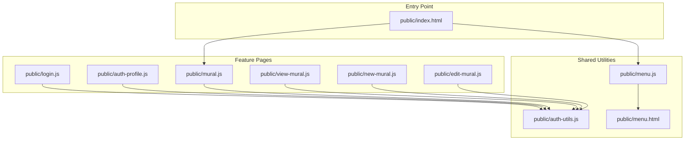
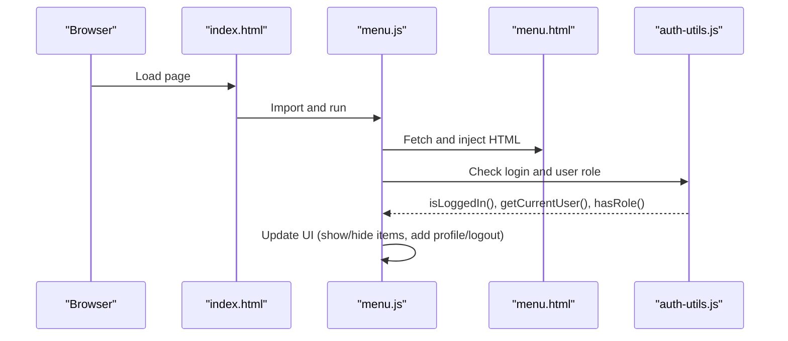
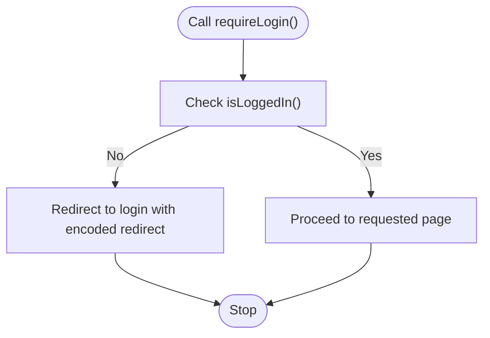
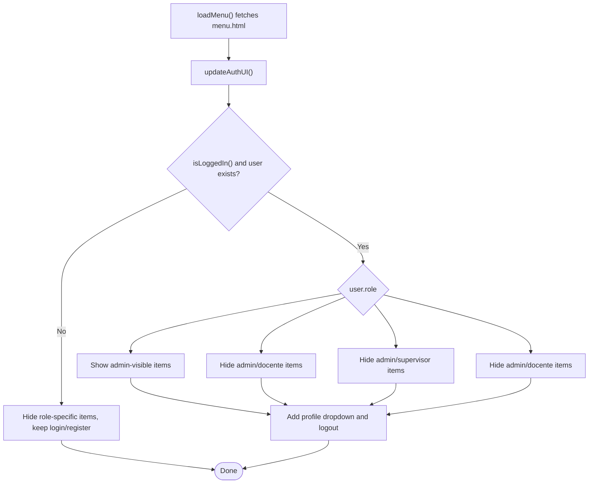
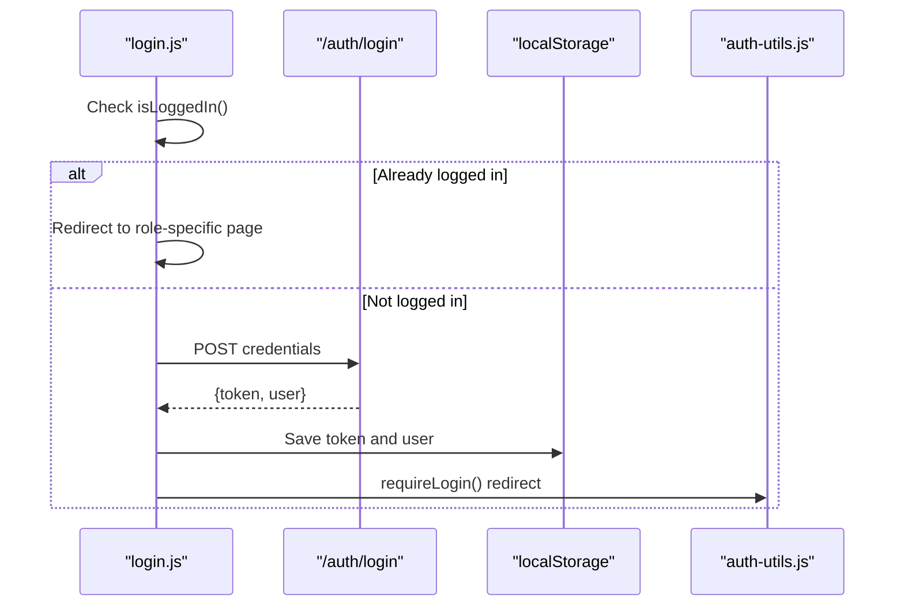
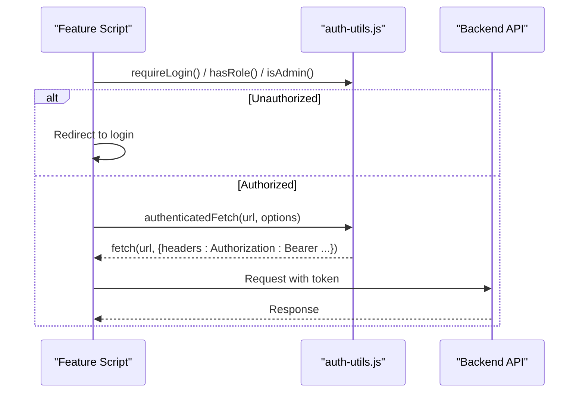
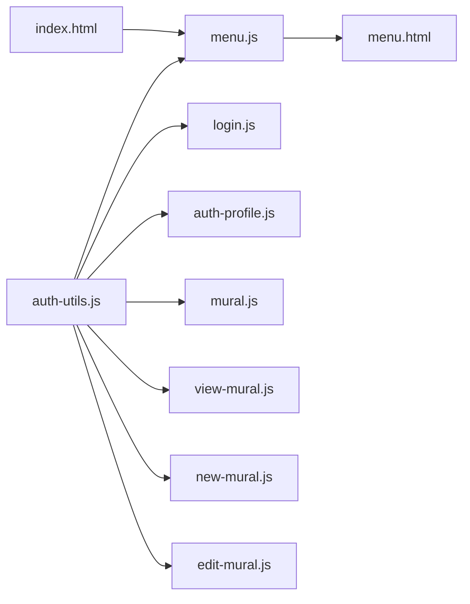

# Core Frontend Utilities

<cite>
**Referenced Files in This Document**
- [index.html](file://public/index.html)
- [auth-utils.js](file://public/auth-utils.js)
- [menu.js](file://public/menu.js)
- [menu.html](file://public/menu.html)
- [AUTH_GUIDE.md](file://AUTH_GUIDE.md)
- [login.js](file://public/login.js)
- [auth-profile.js](file://public/auth-profile.js)
- [mural.js](file://public/mural.js)
- [view-mural.js](file://public/view-mural.js)
- [new-mural.js](file://public/new-mural.js)
- [edit-mural.js](file://public/edit-mural.js)
- [package.json](file://package.json)
</cite>

## Table of Contents
1. [Introduction](#introduction)
2. [Project Structure](#project-structure)
3. [Core Components](#core-components)
4. [Architecture Overview](#architecture-overview)
5. [Detailed Component Analysis](#detailed-component-analysis)
6. [Dependency Analysis](#dependency-analysis)
7. [Performance Considerations](#performance-considerations)
8. [Troubleshooting Guide](#troubleshooting-guide)
9. [Conclusion](#conclusion)
10. [Appendices](#appendices)

## Introduction
This document describes the core frontend utilities that power NodeMural’s user interface and access control. It focuses on:
- The main application entry point and its redirection behavior
- Authentication utilities for JWT token handling, user session management, and role-based UI rendering
- The dynamic menu system that adapts to user roles and permissions
- Shared JavaScript utilities, common DOM manipulation patterns, and global state management via localStorage
- Guidelines for extending utility functions, adding new authentication guards, and maintaining a consistent user experience
- Browser compatibility, error handling, and performance optimization recommendations

## Project Structure
The frontend is organized around small, focused HTML/JS modules per feature page, with shared utilities centralized under public/. The entry point index.html loads the menu module and redirects to the main landing page.

**Diagram sources**
- [index.html](file://public/index.html#L1-L34)
- [auth-utils.js](file://public/auth-utils.js#L1-L88)
- [menu.js](file://public/menu.js#L1-L78)
- [menu.html](file://public/menu.html#L1-L58)
- [login.js](file://public/login.js#L1-L62)
- [auth-profile.js](file://public/auth-profile.js#L1-L29)
- [mural.js](file://public/mural.js#L1-L157)
- [view-mural.js](file://public/view-mural.js#L1-L143)
- [new-mural.js](file://public/new-mural.js#L1-L108)
- [edit-mural.js](file://public/edit-mural.js#L1-L130)

**Section sources**
- [index.html](file://public/index.html#L1-L34)
- [auth-utils.js](file://public/auth-utils.js#L1-L88)
- [menu.js](file://public/menu.js#L1-L78)
- [menu.html](file://public/menu.html#L1-L58)

## Core Components
- Application entry point: index.html initializes the menu and redirects to the main page.
- Authentication utilities: auth-utils.js centralizes token retrieval, user parsing, logout, authenticated fetch, role checks, and login requirement enforcement.
- Dynamic menu: menu.js loads menu.html and updates UI based on login status and user role.
- Feature pages: login.js, auth-profile.js, mural.js, view-mural.js, new-mural.js, and edit-mural.js demonstrate consistent use of auth-utils.js for guards and API calls.

Key responsibilities:
- auth-utils.js: JWT lifecycle, user session, role-based checks, and authenticated network requests.
- menu.js: modular menu rendering and role-aware visibility toggles.
- Feature scripts: enforce guards, populate views, and call authenticated APIs.

**Section sources**
- [index.html](file://public/index.html#L1-L34)
- [auth-utils.js](file://public/auth-utils.js#L1-L88)
- [menu.js](file://public/menu.js#L1-L78)
- [menu.html](file://public/menu.html#L1-L58)
- [login.js](file://public/login.js#L1-L62)
- [auth-profile.js](file://public/auth-profile.js#L1-L29)
- [mural.js](file://public/mural.js#L1-L157)
- [view-mural.js](file://public/view-mural.js#L1-L143)
- [new-mural.js](file://public/new-mural.js#L1-L108)
- [edit-mural.js](file://public/edit-mural.js#L1-L130)

## Architecture Overview
The frontend follows a modular, role-driven architecture:
- Entry point loads the shared menu module.
- Menu dynamically adapts to user roles and permissions.
- Feature pages import auth-utils.js to enforce guards and perform authenticated operations.
- Global state is stored in localStorage for token and user identity.

**Diagram sources**
- [index.html](file://public/index.html#L1-L34)
- [menu.js](file://public/menu.js#L1-L78)
- [menu.html](file://public/menu.html#L1-L58)
- [auth-utils.js](file://public/auth-utils.js#L1-L88)

## Detailed Component Analysis

### Application Entry Point: index.html
- Initializes the page with Bootstrap and DataTables styles.
- Injects the menu module and immediately redirects to the main page.
- Provides a welcome message and links for navigation.

Behavior highlights:
- Uses module script for menu.js.
- Redirects to mural.html via inline script.

**Section sources**
- [index.html](file://public/index.html#L1-L34)

### Authentication Utilities: auth-utils.js
Core capabilities:
- Session detection and user retrieval from localStorage.
- Token retrieval and authenticatedFetch wrapper that injects Authorization headers.
- Role-based checks (single role or array) and admin guard.
- Login requirement enforcement with redirect preservation.
- Logout that clears storage and navigates to a target URL.

Usage patterns:
- Feature pages call requireLogin() to protect routes.
- Guards use hasRole() and isAdmin() to toggle UI and access.
- authenticatedFetch() ensures all protected API calls include the Bearer token.

**Diagram sources**
- [auth-utils.js](file://public/auth-utils.js#L83-L87)

**Section sources**
- [auth-utils.js](file://public/auth-utils.js#L1-L88)

### Dynamic Menu System: menu.js and menu.html
- Loads menu.html content into a container and updates UI based on login state.
- Removes role-specific navigation items when logged in and adds a profile dropdown with logout.
- Removes navigation items when not logged in (e.g., login/register links).
- Delegates logout to auth-utils.js.

Role-aware behavior:
- Admin sees all items.
- Aluno, Docente, Supervisor hide items not applicable to their roles.

**Diagram sources**
- [menu.js](file://public/menu.js#L4-L77)
- [menu.html](file://public/menu.html#L1-L58)
- [auth-utils.js](file://public/auth-utils.js#L8-L19)

**Section sources**
- [menu.js](file://public/menu.js#L1-L78)
- [menu.html](file://public/menu.html#L1-L58)

### Login Page Integration: login.js
- Redirects already logged-in users to role-specific destinations.
- Submits credentials to the backend, stores token and user in localStorage, and redirects accordingly.
- Handles errors and displays messages.

**Diagram sources**
- [login.js](file://public/login.js#L1-L62)
- [auth-utils.js](file://public/auth-utils.js#L83-L87)

**Section sources**
- [login.js](file://public/login.js#L1-L62)

### Authenticated Profile: auth-profile.js
- Enforces login requirement.
- Displays user details and applies role-based styling.

**Section sources**
- [auth-profile.js](file://public/auth-profile.js#L1-L29)

### Feature Pages: Guards and Authenticated Calls
- mural.js: Uses authenticatedFetch and role checks to conditionally show admin controls and set Authorization headers.
- view-mural.js: Guards access for non-logged-in users and hides admin-only UI for non-admin roles.
- new-mural.js: Requires admin role and uses authenticatedFetch for creation.
- edit-mural.js: Requires admin role and populates form data.

**Diagram sources**
- [mural.js](file://public/mural.js#L2-L67)
- [view-mural.js](file://public/view-mural.js#L1-L94)
- [new-mural.js](file://public/new-mural.js#L2-L95)
- [edit-mural.js](file://public/edit-mural.js#L2-L9)
- [auth-utils.js](file://public/auth-utils.js#L45-L54)

**Section sources**
- [mural.js](file://public/mural.js#L1-L157)
- [view-mural.js](file://public/view-mural.js#L1-L143)
- [new-mural.js](file://public/new-mural.js#L1-L108)
- [edit-mural.js](file://public/edit-mural.js#L1-L130)

## Dependency Analysis
- Shared dependency: auth-utils.js is imported by menu.js, login.js, auth-profile.js, mural.js, view-mural.js, new-mural.js, and edit-mural.js.
- Module loading: index.html imports menu.js as a module; menu.js fetches menu.html.
- External libraries: Bootstrap and DataTables are loaded via CDN in index.html; jQuery is used by feature scripts (evident from DOM manipulation and DataTables usage).

**Diagram sources**
- [auth-utils.js](file://public/auth-utils.js#L1-L88)
- [menu.js](file://public/menu.js#L1-L78)
- [menu.html](file://public/menu.html#L1-L58)
- [index.html](file://public/index.html#L1-L34)
- [login.js](file://public/login.js#L1-L62)
- [auth-profile.js](file://public/auth-profile.js#L1-L29)
- [mural.js](file://public/mural.js#L1-L157)
- [view-mural.js](file://public/view-mural.js#L1-L143)
- [new-mural.js](file://public/new-mural.js#L1-L108)
- [edit-mural.js](file://public/edit-mural.js#L1-L130)

**Section sources**
- [auth-utils.js](file://public/auth-utils.js#L1-L88)
- [menu.js](file://public/menu.js#L1-L78)
- [menu.html](file://public/menu.html#L1-L58)
- [index.html](file://public/index.html#L1-L34)

## Performance Considerations
- Minimize DOM queries: Cache selectors (e.g., table instances) and avoid repeated DOM traversal.
- Lazy initialization: Initialize heavy components (e.g., DataTables) only when needed.
- Reduce network calls: Batch related operations and reuse authenticatedFetch to avoid redundant header construction.
- Optimize menu updates: Avoid removing and re-adding nodes repeatedly; prefer conditional visibility or template caching.
- LocalStorage access: Keep reads/writes minimal; batch updates when possible.
- CDN assets: Bootstrap and DataTables are loaded from CDNs; ensure availability and consider fallbacks or self-hosting for reliability.

[No sources needed since this section provides general guidance]

## Troubleshooting Guide
Common issues and resolutions:
- Redirect loops on login: Verify redirect parameter encoding and ensure requireLogin() is called before any guarded operation.
- Missing Authorization header: Confirm authenticatedFetch is used for protected endpoints and that getToken() returns a non-empty value.
- Role-based UI not updating: Ensure updateAuthUI() runs after menu injection and that role checks align with backend user roles.
- DataTables not loading: Check that jQuery and DataTables are loaded and that AJAX URLs match backend endpoints.
- Logout not clearing state: Confirm localStorage removal and that logout() is invoked from the profile dropdown.

**Section sources**
- [auth-utils.js](file://public/auth-utils.js#L33-L37)
- [menu.js](file://public/menu.js#L64-L67)
- [login.js](file://public/login.js#L55-L57)

## Conclusion
NodeMural’s frontend utilities provide a clean, modular foundation for authentication and navigation. By centralizing session and role logic in auth-utils.js and applying consistent guards across feature pages, the system maintains a coherent user experience. Extending the utilities—adding new guards, expanding role-aware UI, or introducing additional helpers—should remain cohesive with the existing patterns to preserve maintainability and performance.

[No sources needed since this section summarizes without analyzing specific files]

## Appendices

### Browser Compatibility
- Modules: index.html imports menu.js as a module; ensure target browsers support ES modules.
- jQuery: Used by feature scripts; confirm jQuery availability and version compatibility.
- DataTables: Requires jQuery; ensure DataTables initialization occurs after jQuery is loaded.
- localStorage: Supported in modern browsers; consider polyfills or feature detection if targeting legacy environments.

**Section sources**
- [index.html](file://public/index.html#L1-L34)
- [package.json](file://package.json#L1-L32)

### Guidelines for Extending Utilities and Maintaining Consistency
- Add new guards: Extend auth-utils.js with role or permission helpers; apply requireLogin() and hasRole()/isAdmin() in feature scripts before rendering or API calls.
- Extend menu visibility: Add new role-aware conditions in menu.js updateAuthUI() and ensure corresponding links exist in menu.html.
- Centralize authenticated requests: Use authenticatedFetch() for all protected endpoints to ensure consistent Authorization headers.
- Maintain consistent UX: Apply the same error messaging patterns, redirects, and role-based UI toggles across pages.
- Document role permissions: Align frontend role checks with backend roles and middleware as documented in AUTH_GUIDE.md.

**Section sources**
- [auth-utils.js](file://public/auth-utils.js#L1-L88)
- [menu.js](file://public/menu.js#L1-L78)
- [AUTH_GUIDE.md](file://AUTH_GUIDE.md#L194-L202)