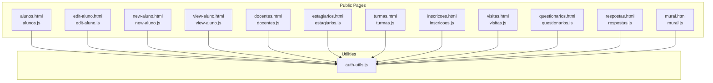
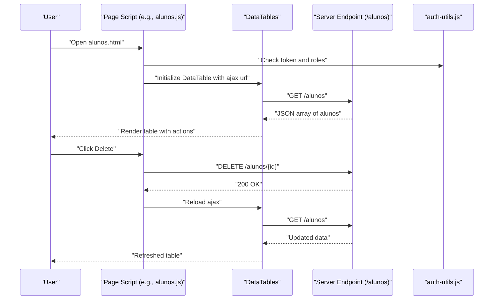
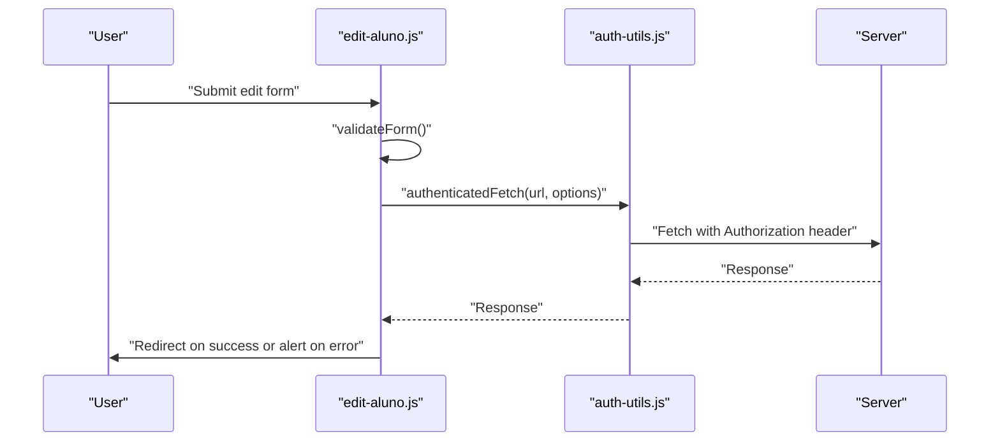
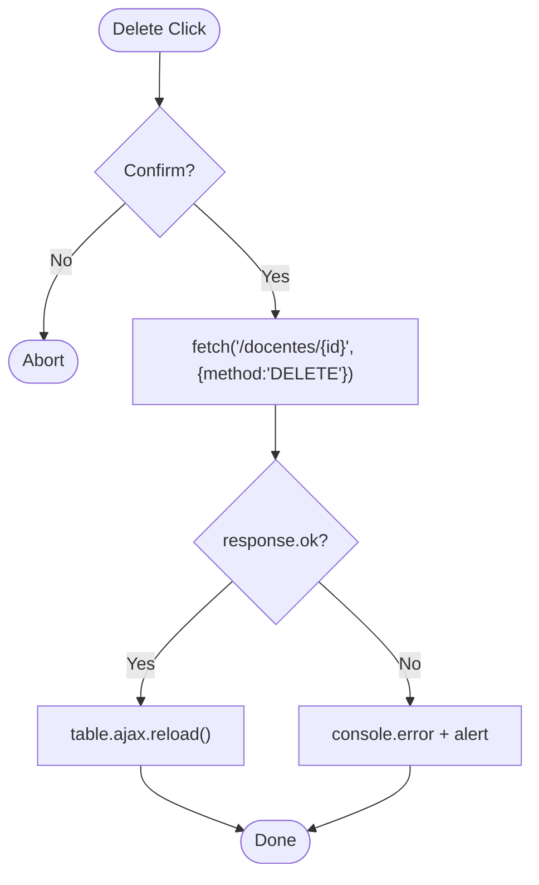
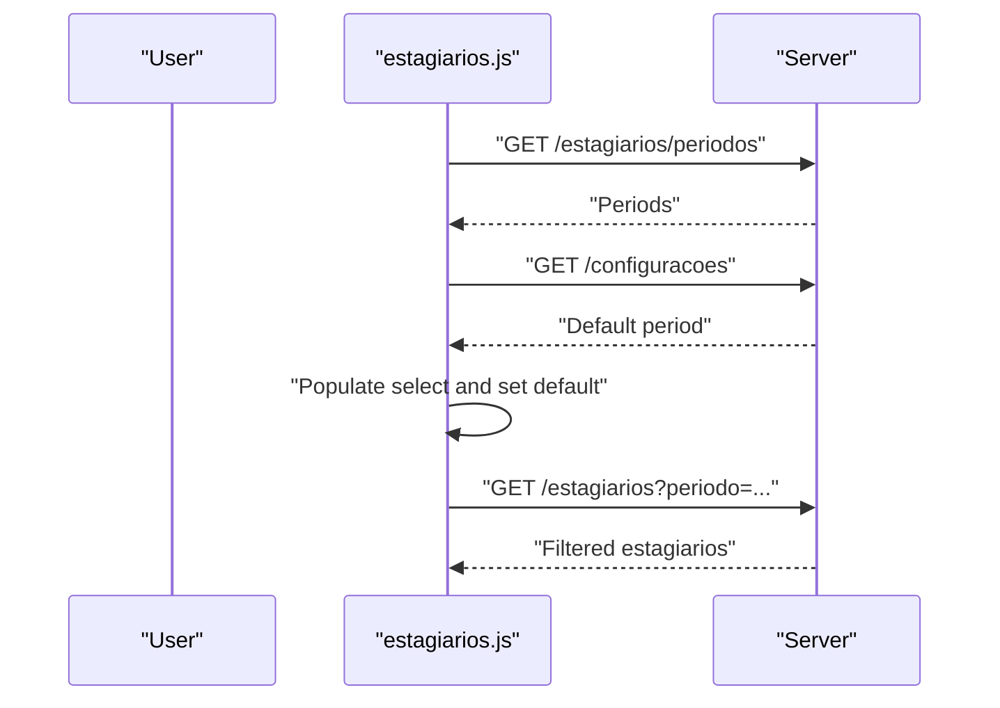
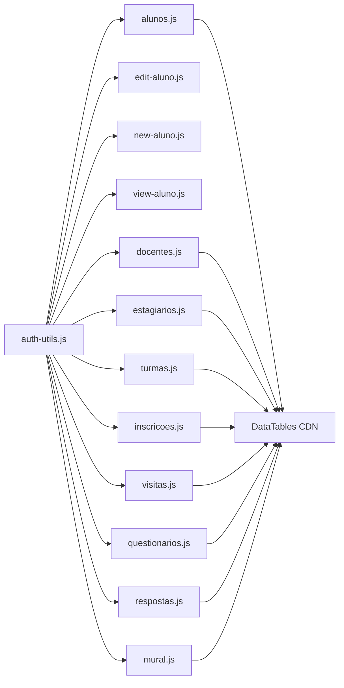

# Entity Management Interfaces

<cite>
**Referenced Files in This Document**
- [public/alunos.js](file://public/alunos.js)
- [public/docentes.js](file://public/docentes.js)
- [public/estagiarios.js](file://public/estagiarios.js)
- [public/turmas.js](file://public/turmas.js)
- [public/inscricoes.js](file://public/inscricoes.js)
- [public/visitas.js](file://public/visitas.js)
- [public/questionarios.js](file://public/questionarios.js)
- [public/respostas.js](file://public/respostas.js)
- [public/mural.js](file://public/mural.js)
- [public/auth-utils.js](file://public/auth-utils.js)
- [public/new-aluno.js](file://public/new-aluno.js)
- [public/edit-aluno.js](file://public/edit-aluno.js)
- [public/view-aluno.js](file://public/view-aluno.js)
- [src/controllers/alunoController.js](file://src/controllers/alunoController.js)
- [src/controllers/estagiarioController.js](file://src/controllers/estagiarioController.js)
- [src/routers/alunoRoutes.js](file://src/routers/alunoRoutes.js)
</cite>

## Table of Contents
1. [Introduction](#introduction)
2. [Project Structure](#project-structure)
3. [Core Components](#core-components)
4. [Architecture Overview](#architecture-overview)
5. [Detailed Component Analysis](#detailed-component-analysis)
6. [Dependency Analysis](#dependency-analysis)
7. [Performance Considerations](#performance-considerations)
8. [Troubleshooting Guide](#troubleshooting-guide)
9. [Conclusion](#conclusion)
10. [Appendices](#appendices)

## Introduction
This document describes the JavaScript architecture for NodeMural’s entity management interfaces. It focuses on how client-side pages implement CRUD operations, form handling, validation, and table management for entities such as alunos, docentes, estagiarios, turmas, inscricoes, visitas, questionarios, respostas, and mural. It also documents shared patterns across interfaces, including AJAX and fetch usage, authentication and authorization checks, error handling, user feedback, and DataTables integration for filtering, sorting, and pagination. Finally, it provides guidelines for adding new entity interfaces while maintaining consistency and optimizing performance for large datasets.

## Project Structure
The entity management interfaces are organized into pairs of HTML pages and corresponding JavaScript files under public/. Each pair typically consists of:
- A listing page (e.g., alunos.html with alunos.js) that renders a DataTable and handles bulk actions.
- An edit/new page (e.g., edit-aluno.html with edit-aluno.js and new-aluno.html with new-aluno.js) that manage creation and updates via forms.
- A view page (e.g., view-aluno.html with view-aluno.js) that displays entity details and related records.

Common utilities reside in public/auth-utils.js, providing authentication helpers and an authenticated fetch wrapper.

**Diagram sources**
- [public/alunos.js](file://public/alunos.js#L1-L70)
- [public/edit-aluno.js](file://public/edit-aluno.js#L1-L194)
- [public/new-aluno.js](file://public/new-aluno.js#L1-L136)
- [public/view-aluno.js](file://public/view-aluno.js#L1-L192)
- [public/docentes.js](file://public/docentes.js#L1-L59)
- [public/estagiarios.js](file://public/estagiarios.js#L1-L142)
- [public/turmas.js](file://public/turmas.js#L1-L56)
- [public/inscricoes.js](file://public/inscricoes.js#L1-L100)
- [public/visitas.js](file://public/visitas.js#L1-L59)
- [public/questionarios.js](file://public/questionarios.js#L1-L65)
- [public/respostas.js](file://public/respostas.js#L1-L122)
- [public/mural.js](file://public/mural.js#L1-L157)
- [public/auth-utils.js](file://public/auth-utils.js#L1-L88)

**Section sources**
- [public/alunos.js](file://public/alunos.js#L1-L70)
- [public/auth-utils.js](file://public/auth-utils.js#L1-L88)

## Core Components
- Authentication utilities: centralized helpers for login state, tokens, roles, and authenticated fetch requests.
- DataTables integration: responsive, searchable, sortable, and paginated tables with localized labels.
- Form handling: input masks, custom validation, serialization, and submission via fetch.
- CRUD orchestration: listing pages trigger DELETE actions; edit/new pages submit CREATE/UPDATE; view pages show related records.

Key patterns:
- Access control: pages check token and roles before rendering or performing operations.
- Authorization: edit/update/delete often restrict to admins or owners.
- Data loading: fetch or AJAX endpoints supply JSON; DataTables renders rows.
- User feedback: alerts and console logs; confirm dialogs for destructive actions.

**Section sources**
- [public/auth-utils.js](file://public/auth-utils.js#L1-L88)
- [public/alunos.js](file://public/alunos.js#L1-L70)
- [public/docentes.js](file://public/docentes.js#L1-L59)
- [public/estagiarios.js](file://public/estagiarios.js#L1-L142)
- [public/turmas.js](file://public/turmas.js#L1-L56)
- [public/inscricoes.js](file://public/inscricoes.js#L1-L100)
- [public/visitas.js](file://public/visitas.js#L1-L59)
- [public/questionarios.js](file://public/questionarios.js#L1-L65)
- [public/respostas.js](file://public/respostas.js#L1-L122)
- [public/mural.js](file://public/mural.js#L1-L157)
- [public/new-aluno.js](file://public/new-aluno.js#L1-L136)
- [public/edit-aluno.js](file://public/edit-aluno.js#L1-L194)
- [public/view-aluno.js](file://public/view-aluno.js#L1-L192)

## Architecture Overview
The frontend follows a consistent pattern:
- On load, pages validate authentication and roles.
- DataTables initializes with an ajax source pointing to server endpoints.
- Columns may include action buttons (Edit/Delete) and links to view pages.
- Filtering and sorting are handled client-side by DataTables; server endpoints support query parameters for advanced filtering.
- Forms use input masks and custom validators; submissions leverage authenticated fetch.

**Diagram sources**
- [public/alunos.js](file://public/alunos.js#L20-L70)
- [public/auth-utils.js](file://public/auth-utils.js#L1-L88)

**Section sources**
- [public/alunos.js](file://public/alunos.js#L1-L70)
- [public/auth-utils.js](file://public/auth-utils.js#L1-L88)

## Detailed Component Analysis

### Alunos Interface
- Listing: alunos.js initializes a DataTable, sets ordering, and loads data from /alunos. It adds action buttons to edit or delete entries and uses confirm dialogs for deletions. Authorization checks ensure only authorized users can access and modify.
- Editing/New: edit-aluno.js supports both create and update modes based on presence of id; it loads existing data, applies input masks, validates, and submits via authenticated fetch.
- Creation: new-aluno.js provides similar validation and submission flow for creating new alunos.
- Viewing: view-aluno.js enforces role-based visibility of actions and loads related inscricoes and estagiarios.

**Diagram sources**
- [public/edit-aluno.js](file://public/edit-aluno.js#L32-L67)
- [public/auth-utils.js](file://public/auth-utils.js#L45-L54)

**Section sources**
- [public/alunos.js](file://public/alunos.js#L1-L70)
- [public/edit-aluno.js](file://public/edit-aluno.js#L1-L194)
- [public/new-aluno.js](file://public/new-aluno.js#L1-L136)
- [public/view-aluno.js](file://public/view-aluno.js#L1-L192)

### Docentes Interface
- Listing: docentes.js initializes a DataTable with columns for name, siape, email, phone, department, and actions. Deletion uses fetch with error handling and reloads the table.
- Access control: requires token and role admin or docente.

**Diagram sources**
- [public/docentes.js](file://public/docentes.js#L44-L57)

**Section sources**
- [public/docentes.js](file://public/docentes.js#L1-L59)

### Estagiarios Interface
- Advanced filtering: estagiarios.js adds per-column search inputs and a period filter. It loads distinct periods and default period from configuration, then reloads the table accordingly.
- Listing: initializes DataTable with columns for aluno, professor, institution, supervisor, period, level, and actions.
- Deletion: uses fetch with error handling and reloads the table.

**Diagram sources**
- [public/estagiarios.js](file://public/estagiarios.js#L76-L121)

**Section sources**
- [public/estagiarios.js](file://public/estagiarios.js#L1-L142)

### Turmas Interface
- Listing: turmas.js initializes a DataTable for areas and exposes Edit/Delete actions. Access restricted to admin.

**Section sources**
- [public/turmas.js](file://public/turmas.js#L1-L56)

### Inscricoes Interface
- Filtering: inscricoes.js loads distinct periods and applies a default period from configuration. It reloads the table when the filter changes.
- Listing: renders inscricoes with formatted dates and action buttons.

**Section sources**
- [public/inscricoes.js](file://public/inscricoes.js#L1-L100)

### Visitas Interface
- Listing: visitas.js supports optional institution filtering via query parameter and renders a responsive table with action buttons.

**Section sources**
- [public/visitas.js](file://public/visitas.js#L1-L59)

### Questionarios Interface
- Listing: questionarios.js renders a table of questionarios with action buttons including viewing questions and answers, editing, and deleting. Deletion uses jQuery AJAX with success/error callbacks.

**Section sources**
- [public/questionarios.js](file://public/questionarios.js#L1-L65)

### Respostas Interface
- Filtering and listing: respostas.js loads supervisors for filtering, supports optional questionario-specific queries, and renders a table of responses with counts and dates. Deletion uses jQuery AJAX with feedback.

**Section sources**
- [public/respostas.js](file://public/respostas.js#L1-L122)

### Mural Interface
- Filtering and permissions: mural.js loads periods and a default period, hides admin-only controls for non-admins, and reloads the table on filter change. Deletion uses fetch with error handling.

**Section sources**
- [public/mural.js](file://public/mural.js#L1-L157)

### Backend Controllers and Routes (Context)
- alunoController.js defines endpoints for creating, retrieving, updating, and deleting alunos, including related endpoints for inscricoes and estagiarios.
- estagiarioController.js provides endpoints for listing estagiarios with filters, retrieving distinct periods, and managing estagiario records.
- alunoRoutes.js defines route protection and ownership checks for aluno endpoints.

**Section sources**
- [src/controllers/alunoController.js](file://src/controllers/alunoController.js#L1-L114)
- [src/controllers/estagiarioController.js](file://src/controllers/estagiarioController.js#L1-L133)
- [src/routers/alunoRoutes.js](file://src/routers/alunoRoutes.js#L1-L25)

## Dependency Analysis
The client-side scripts depend on:
- auth-utils.js for authentication and authorization checks and for authenticated fetch.
- DataTables CDN for UI and interaction features.
- Server endpoints returning JSON arrays or objects for table rendering and form operations.

**Diagram sources**
- [public/auth-utils.js](file://public/auth-utils.js#L1-L88)
- [public/alunos.js](file://public/alunos.js#L1-L70)
- [public/edit-aluno.js](file://public/edit-aluno.js#L1-L194)
- [public/new-aluno.js](file://public/new-aluno.js#L1-L136)
- [public/view-aluno.js](file://public/view-aluno.js#L1-L192)
- [public/docentes.js](file://public/docentes.js#L1-L59)
- [public/estagiarios.js](file://public/estagiarios.js#L1-L142)
- [public/turmas.js](file://public/turmas.js#L1-L56)
- [public/inscricoes.js](file://public/inscricoes.js#L1-L100)
- [public/visitas.js](file://public/visitas.js#L1-L59)
- [public/questionarios.js](file://public/questionarios.js#L1-L65)
- [public/respostas.js](file://public/respostas.js#L1-L122)
- [public/mural.js](file://public/mural.js#L1-L157)

**Section sources**
- [public/auth-utils.js](file://public/auth-utils.js#L1-L88)
- [public/alunos.js](file://public/alunos.js#L1-L70)
- [public/docentes.js](file://public/docentes.js#L1-L59)
- [public/estagiarios.js](file://public/estagiarios.js#L1-L142)
- [public/turmas.js](file://public/turmas.js#L1-L56)
- [public/inscricoes.js](file://public/inscricoes.js#L1-L100)
- [public/visitas.js](file://public/visitas.js#L1-L59)
- [public/questionarios.js](file://public/questionarios.js#L1-L65)
- [public/respostas.js](file://public/respostas.js#L1-L122)
- [public/mural.js](file://public/mural.js#L1-L157)

## Performance Considerations
- Prefer server-side filtering and pagination: pass query parameters (e.g., periodo) to reduce payload sizes.
- Use DataTables’ built-in ordering and searching to minimize client-side work; avoid unnecessary DOM manipulations.
- Minimize repeated fetches: reuse authenticatedFetch and avoid redundant reloads.
- Optimize images and assets; defer non-critical resources.
- For large datasets, consider virtual scrolling or server-side processing in DataTables if needed.
- Cache small, static dropdowns (e.g., periods) locally to avoid repeated network calls.

[No sources needed since this section provides general guidance]

## Troubleshooting Guide
Common issues and resolutions:
- Unauthorized access: ensure token and role checks are in place; redirect to login when missing.
- CORS and auth headers: use authenticatedFetch to attach Authorization headers automatically.
- Form validation failures: inspect console logs and ensure masks and regex validations are applied before submission.
- Deletion errors: confirm dialog precedes AJAX/fetch; handle non-OK responses with alerts and reload the table.
- DataTables not rendering: verify ajax url, dataSrc, and language settings; ensure DataTables CDN is loaded.

**Section sources**
- [public/auth-utils.js](file://public/auth-utils.js#L1-L88)
- [public/alunos.js](file://public/alunos.js#L52-L68)
- [public/docentes.js](file://public/docentes.js#L44-L57)
- [public/estagiarios.js](file://public/estagiarios.js#L123-L140)
- [public/turmas.js](file://public/turmas.js#L41-L54)
- [public/inscricoes.js](file://public/inscricoes.js#L92-L98)
- [public/visitas.js](file://public/visitas.js#L52-L57)
- [public/questionarios.js](file://public/questionarios.js#L49-L63)
- [public/respostas.js](file://public/respostas.js#L104-L120)
- [public/mural.js](file://public/mural.js#L142-L155)

## Conclusion
NodeMural’s entity management interfaces follow a consistent, modular architecture. Authentication utilities centralize access control, DataTables provide robust UI, and form handlers encapsulate validation and submission. By adhering to these patterns—role checks, authenticated requests, consistent CRUD flows, and user feedback—you can reliably extend the system with new entities while maintaining performance and usability.

[No sources needed since this section summarizes without analyzing specific files]

## Appendices

### Adding a New Entity Interface: Step-by-Step
- Create HTML pages:
  - listing.html with a table element and a script tag linking to listing.js.
  - edit-entity.html with a form and edit-entity.js.
  - view-entity.html with view-entity.js if needed.
- Implement listing.js:
  - Require token and roles.
  - Initialize DataTable with ajax pointing to the entity endpoint.
  - Add action buttons (Edit/Delete) and links to view pages.
  - Apply filters if applicable (e.g., select-based period filter).
- Implement edit-entity.js:
  - Require token and roles.
  - Apply input masks and custom validation.
  - Serialize form data and submit via authenticatedFetch (POST/PUT).
  - Redirect to view or listing on success.
- Implement view-entity.js (optional):
  - Enforce role-based visibility of actions.
  - Load related records and render them.
- Backend alignment:
  - Ensure server routes exist and apply appropriate middleware (verifyToken, checkRole, checkOwnership).
  - Controllers expose endpoints for listing, retrieval, creation, update, and deletion.
- Testing:
  - Verify access control, filtering, sorting, and deletion flows.
  - Test error scenarios and user feedback.

**Section sources**
- [public/auth-utils.js](file://public/auth-utils.js#L1-L88)
- [public/alunos.js](file://public/alunos.js#L1-L70)
- [public/edit-aluno.js](file://public/edit-aluno.js#L1-L194)
- [public/new-aluno.js](file://public/new-aluno.js#L1-L136)
- [public/view-aluno.js](file://public/view-aluno.js#L1-L192)
- [src/routers/alunoRoutes.js](file://src/routers/alunoRoutes.js#L1-L25)
- [src/controllers/alunoController.js](file://src/controllers/alunoController.js#L1-L114)