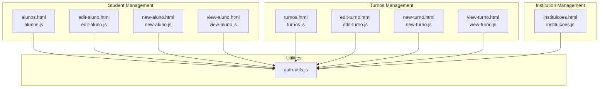
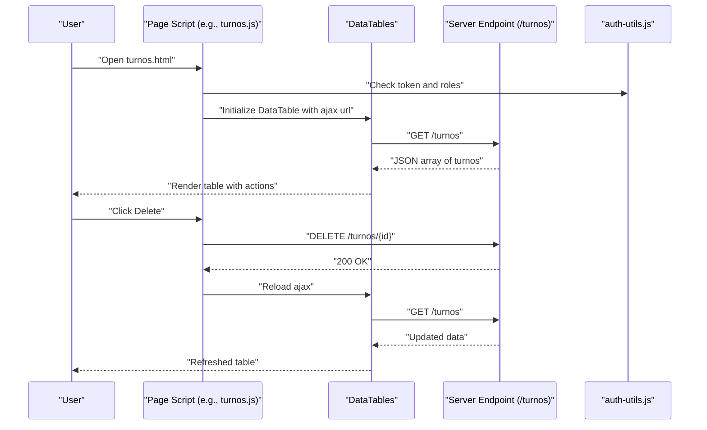
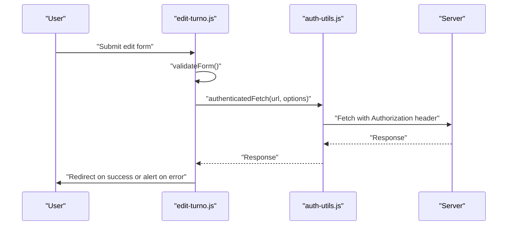
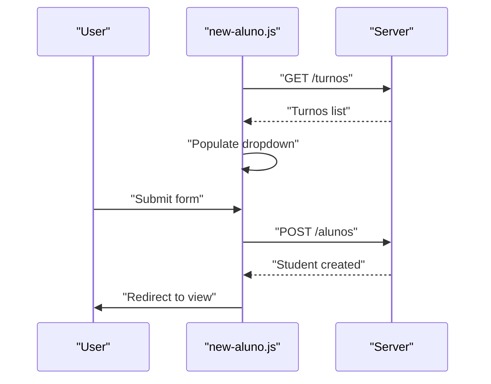
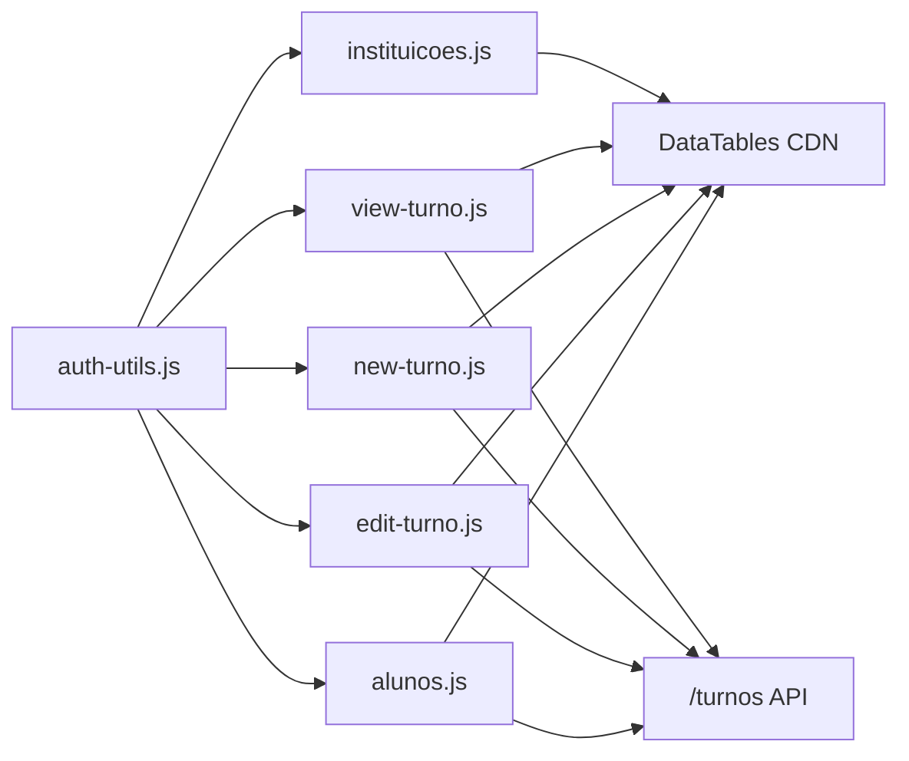

# Entity Management Interfaces

<cite>
**Referenced Files in This Document**
- [public/alunos.js](file://public/alunos.js)
- [public/edit-aluno.js](file://public/edit-aluno.js)
- [public/new-aluno.js](file://public/new-aluno.js)
- [public/view-aluno.js](file://public/view-aluno.js)
- [public/turnos.js](file://public/turnos.js)
- [public/turnos.html](file://public/turnos.html)
- [public/edit-turno.js](file://public/edit-turno.js)
- [public/edit-turno.html](file://public/edit-turno.html)
- [public/new-turno.js](file://public/new-turno.js)
- [public/new-turno.html](file://public/new-turno.html)
- [public/view-turno.js](file://public/view-turno.js)
- [public/view-turno.html](file://public/view-turno.html)
- [public/instituicoes.js](file://public/instituicoes.js)
- [public/auth-utils.js](file://public/auth-utils.js)
- [src/controllers/turnoController.js](file://src/controllers/turnoController.js)
- [src/models/turno.js](file://src/models/turno.js)
- [src/routers/turnoRoutes.js](file://src/routers/turnoRoutes.js)
</cite>

## Update Summary
**Changes Made**
- Added comprehensive documentation for the new turnos management system
- Updated student management interfaces to integrate turnos functionality
- Enhanced form validation patterns with improved error messaging
- Documented DataTables configurations with better internationalization support
- Added new CRUD operations for turnos entity with proper authentication and authorization

## Table of Contents
1. [Introduction](#introduction)
2. [Project Structure](#project-structure)
3. [Core Components](#core-components)
4. [Architecture Overview](#architecture-overview)
5. [Detailed Component Analysis](#detailed-component-analysis)
6. [Dependency Analysis](#dependency-analysis)
7. [Performance Considerations](#performance-considerations)
8. [Troubleshooting Guide](#troubleshooting-guide)
9. [Conclusion](#conclusion)
10. [Appendices](#appendices)

## Introduction
This document describes the JavaScript architecture for NodeMural's entity management interfaces. It focuses on how client-side pages implement CRUD operations, form handling, validation, and table management for entities such as alunos, docentes, estagiarios, turmas, inscricoes, visitas, questionarios, respostas, mural, and turnos. The turnos management system provides comprehensive scheduling capabilities integrated with student enrollment processes. It also documents shared patterns across interfaces, including AJAX and fetch usage, authentication and authorization checks, error handling, user feedback, and DataTables integration for filtering, sorting, and pagination. Finally, it provides guidelines for adding new entity interfaces while maintaining consistency and optimizing performance for large datasets.

## Project Structure
The entity management interfaces are organized into pairs of HTML pages and corresponding JavaScript files under public/. Each pair typically consists of:
- A listing page (e.g., alunos.html with alunos.js) that renders a DataTable and handles bulk actions.
- An edit/new page (e.g., edit-aluno.html with edit-aluno.js and new-aluno.html with new-aluno.js) that manage creation and updates via forms.
- A view page (e.g., view-aluno.html with view-aluno.js) that displays entity details and related records.
- **New**: Turnos management system with dedicated CRUD interface for shift/scheduling management.

Common utilities reside in public/auth-utils.js, providing authentication helpers and an authenticated fetch wrapper.

```mermaid
graph TB
subgraph "Student Management"
A1["alunos.html<br/>alunos.js"]
A2["edit-aluno.html<br/>edit-aluno.js"]
A3["new-aluno.html<br/>new-aluno.js"]
A4["view-aluno.html<br/>view-aluno.js"]
end
subgraph "Turnos Management"
T1["turnos.html<br/>turnos.js"]
T2["edit-turno.html<br/>edit-turno.js"]
T3["new-turno.html<br/>new-turno.js"]
T4["view-turno.html<br/>view-turno.js"]
end
subgraph "Institution Management"
I1["instituicoes.html<br/>instituicoes.js"]
end
subgraph "Utilities"
U1["auth-utils.js"]
end
A1 --> U1
A2 --> U1
A3 --> U1
A4 --> U1
T1 --> U1
T2 --> U1
T3 --> U1
T4 --> U1
I1 --> U1
```

**Diagram sources**
- [public/alunos.js:1-69](file://public/alunos.js#L1-L69)
- [public/edit-aluno.js:1-270](file://public/edit-aluno.js#L1-L270)
- [public/new-aluno.js:1-212](file://public/new-aluno.js#L1-L212)
- [public/view-aluno.js:1-192](file://public/view-aluno.js#L1-L192)
- [public/turnos.js:1-51](file://public/turnos.js#L1-L51)
- [public/edit-turno.js:1-62](file://public/edit-turno.js#L1-L62)
- [public/new-turno.js:1-38](file://public/new-turno.js#L1-L38)
- [public/view-turno.js:1-54](file://public/view-turno.js#L1-L54)
- [public/instituicoes.js:1-82](file://public/instituicoes.js#L1-L82)
- [public/auth-utils.js:1-88](file://public/auth-utils.js#L1-L88)

**Section sources**
- [public/alunos.js:1-69](file://public/alunos.js#L1-L69)
- [public/turnos.js:1-51](file://public/turnos.js#L1-L51)
- [public/auth-utils.js:1-88](file://public/auth-utils.js#L1-L88)

## Core Components
- Authentication utilities: centralized helpers for login state, tokens, roles, and authenticated fetch requests.
- DataTables integration: responsive, searchable, sortable, and paginated tables with localized labels and improved error handling.
- Form handling: input masks, custom validation, serialization, and submission via fetch with comprehensive error messaging.
- CRUD orchestration: listing pages trigger DELETE actions; edit/new pages submit CREATE/UPDATE; view pages show related records.
- **New**: Turnos integration: students can now be associated with specific shifts during enrollment and management.

Key patterns:
- Access control: pages check token and roles before rendering or performing operations.
- Authorization: edit/update/delete often restrict to admins or owners.
- Data loading: fetch or AJAX endpoints supply JSON; DataTables renders rows.
- User feedback: enhanced alerts and console logs with specific error messages; confirm dialogs for destructive actions.
- **Enhanced**: Form validation now includes turnos selection with proper dropdown population and validation.

**Section sources**
- [public/auth-utils.js:1-88](file://public/auth-utils.js#L1-L88)
- [public/alunos.js:1-69](file://public/alunos.js#L1-L69)
- [public/turnos.js:1-51](file://public/turnos.js#L1-L51)
- [public/edit-aluno.js:152-168](file://public/edit-aluno.js#L152-L168)
- [public/new-aluno.js:42-62](file://public/new-aluno.js#L42-L62)

## Architecture Overview
The frontend follows a consistent pattern with enhanced error handling and validation:
- On load, pages validate authentication and roles.
- DataTables initializes with an ajax source pointing to server endpoints.
- Columns may include action buttons (Edit/Delete) and links to view pages.
- Filtering and sorting are handled client-side by DataTables; server endpoints support query parameters for advanced filtering.
- Forms use input masks and custom validators; submissions leverage authenticated fetch with comprehensive error handling.
- **New**: Turnos management provides dedicated CRUD operations with proper internationalization support.

```mermaid
sequenceDiagram
participant U as "User"
participant P as "Page Script (e.g., turnos.js)"
participant DT as "DataTables"
participant S as "Server Endpoint (/turnos)"
participant AU as "auth-utils.js"
U->>P : "Open turnos.html"
P->>AU : "Check token and roles"
P->>DT : "Initialize DataTable with ajax url"
DT->>S : "GET /turnos"
S-->>DT : "JSON array of turnos"
DT-->>U : "Render table with actions"
U->>P : "Click Delete"
P->>S : "DELETE /turnos/{id}"
S-->>P : "200 OK"
P->>DT : "Reload ajax"
DT->>S : "GET /turnos"
S-->>DT : "Updated data"
DT-->>U : "Refreshed table"
```

**Diagram sources**
- [public/turnos.js:3-34](file://public/turnos.js#L3-L34)
- [public/auth-utils.js:1-88](file://public/auth-utils.js#L1-L88)

**Section sources**
- [public/turnos.js:1-51](file://public/turnos.js#L1-L51)
- [public/auth-utils.js:1-88](file://public/auth-utils.js#L1-L88)

## Detailed Component Analysis

### Turnos Management System
The turnos management system provides comprehensive shift/scheduling capabilities integrated with student enrollment processes.

#### Turnos Listing Interface
- **Enhanced**: turnos.js initializes a DataTable with improved internationalization support using Brazilian Portuguese localization.
- **New**: Supports admin-only access with proper role checking.
- **Enhanced**: Includes action buttons for edit and delete operations with proper confirmation dialogs.
- **Improved**: Uses authenticatedFetch for all operations with comprehensive error handling.

#### Turnos CRUD Operations
- **New**: edit-turno.js supports update mode with form validation and error handling.
- **New**: new-turno.js provides creation functionality with proper validation.
- **New**: view-turno.js displays turnos details with edit and delete capabilities.

```mermaid
sequenceDiagram
participant U as "User"
participant ET as "edit-turno.js"
participant AU as "auth-utils.js"
participant API as "Server"
U->>ET : "Submit edit form"
ET->>ET : "validateForm()"
ET->>AU : "authenticatedFetch(url, options)"
AU->>API : "Fetch with Authorization header"
API-->>AU : "Response"
AU-->>ET : "Response"
ET->>U : "Redirect on success or alert on error"
```

**Diagram sources**
- [public/edit-turno.js:19-46](file://public/edit-turno.js#L19-L46)
- [public/auth-utils.js:45-54](file://public/auth-utils.js#L45-L54)

**Section sources**
- [public/turnos.js:1-51](file://public/turnos.js#L1-L51)
- [public/edit-turno.js:1-62](file://public/edit-turno.js#L1-L62)
- [public/new-turno.js:1-38](file://public/new-turno.js#L1-L38)
- [public/view-turno.js:1-54](file://public/view-turno.js#L1-L54)

### Student Management Integration
Student management interfaces have been enhanced to integrate with the turnos system.

#### Enhanced Form Handling
- **Updated**: edit-aluno.js now includes turnos dropdown population with proper error handling.
- **Updated**: new-aluno.js includes turnos dropdown population using fetch with authentication.
- **Enhanced**: Form validation includes turnos selection validation.

#### Turnos Integration Features
- **New**: Students can be associated with specific turns during enrollment.
- **Enhanced**: Turnos dropdown is populated dynamically from server endpoints.
- **Improved**: Error handling for turnos loading failures.

```mermaid
sequenceDiagram
participant U as "User"
participant NA as "new-aluno.js"
participant API as "Server"
NA->>API : "GET /turnos"
API-->>NA : "Turnos list"
NA->>NA : "Populate dropdown"
U->>NA : "Submit form"
NA->>API : "POST /alunos"
API-->>NA : "Student created"
NA->>U : "Redirect to view"
```

**Diagram sources**
- [public/new-aluno.js:42-62](file://public/new-aluno.js#L42-L62)
- [public/edit-aluno.js:152-168](file://public/edit-aluno.js#L152-L168)

**Section sources**
- [public/edit-aluno.js:152-168](file://public/edit-aluno.js#L152-L168)
- [public/new-aluno.js:42-62](file://public/new-aluno.js#L42-L62)
- [public/view-aluno.js:1-192](file://public/view-aluno.js#L1-L192)

### Institutional Management
Institution management continues to provide comprehensive CRUD operations with enhanced DataTables integration.

#### Enhanced DataTables Configuration
- **Updated**: instituicoes.js includes improved column rendering with better data formatting.
- **Enhanced**: Support for boolean values display (sim/não) and date formatting.
- **Improved**: Better error handling and user feedback mechanisms.

**Section sources**
- [public/instituicoes.js:1-82](file://public/instituicoes.js#L1-L82)

### Backend Integration (Context)
The turnos management system includes comprehensive backend support:

#### Controller Implementation
- **New**: turnoController.js provides full CRUD operations for turnos management.
- **Enhanced**: Proper error handling and validation for all operations.
- **Improved**: Support for complex queries and data manipulation.

#### Model Layer
- **New**: turno.js implements database operations with proper SQL injection prevention.
- **Enhanced**: Support for ordering and filtering operations.

#### Route Protection
- **New**: turnoRoutes.js provides secure routing with proper middleware.
- **Enhanced**: Role-based access control for administrative operations.

**Section sources**
- [src/controllers/turnoController.js:1-72](file://src/controllers/turnoController.js#L1-L72)
- [src/models/turno.js:1-45](file://src/models/turno.js#L1-L45)
- [src/routers/turnoRoutes.js:1-16](file://src/routers/turnoRoutes.js#L1-L16)

## Dependency Analysis
The client-side scripts depend on:
- auth-utils.js for authentication and authorization checks and for authenticated fetch.
- DataTables CDN for UI and interaction features with enhanced internationalization.
- Server endpoints returning JSON arrays or objects for table rendering and form operations.
- **New**: Turnos API endpoints for shift/scheduling management.

```mermaid
graph LR
AU["auth-utils.js"] --> AL["alunos.js"]
AU --> ET["edit-turno.js"]
AU --> NT["new-turno.js"]
AU --> VT["view-turno.js"]
AU --> IN["instituicoes.js"]
AL --> DT["DataTables CDN"]
ET --> DT
NT --> DT
VT --> DT
IN --> DT
AL --> TURNOS["/turnos API"]
ET --> TURNOS
NT --> TURNOS
VT --> TURNOS
```

**Diagram sources**
- [public/auth-utils.js:1-88](file://public/auth-utils.js#L1-L88)
- [public/alunos.js:1-69](file://public/alunos.js#L1-L69)
- [public/edit-turno.js:1-62](file://public/edit-turno.js#L1-L62)
- [public/new-turno.js:1-38](file://public/new-turno.js#L1-L38)
- [public/view-turno.js:1-54](file://public/view-turno.js#L1-L54)
- [public/instituicoes.js:1-82](file://public/instituicoes.js#L1-L82)

**Section sources**
- [public/auth-utils.js:1-88](file://public/auth-utils.js#L1-L88)
- [public/alunos.js:1-69](file://public/alunos.js#L1-L69)
- [public/turnos.js:1-51](file://public/turnos.js#L1-L51)
- [public/instituicoes.js:1-82](file://public/instituicoes.js#L1-L82)

## Performance Considerations
- Prefer server-side filtering and pagination: pass query parameters (e.g., periodo) to reduce payload sizes.
- Use DataTables' built-in ordering and searching to minimize client-side work; avoid unnecessary DOM manipulations.
- Minimize repeated fetches: reuse authenticatedFetch and avoid redundant reloads.
- **Enhanced**: Implement caching strategies for frequently accessed turnos data.
- Optimize images and assets; defer non-critical resources.
- For large datasets, consider virtual scrolling or server-side processing in DataTables if needed.
- Cache small, static dropdowns (e.g., periods, turnos) locally to avoid repeated network calls.
- **New**: Implement lazy loading for turnos dropdowns to improve initial page load performance.

## Troubleshooting Guide
Common issues and resolutions:
- Unauthorized access: ensure token and role checks are in place; redirect to login when missing.
- CORS and auth headers: use authenticatedFetch to attach Authorization headers automatically.
- Form validation failures: inspect console logs and ensure masks and regex validations are applied before submission.
- Deletion errors: confirm dialog precedes AJAX/fetch; handle non-OK responses with alerts and reload the table.
- DataTables not rendering: verify ajax url, dataSrc, and language settings; ensure DataTables CDN is loaded.
- **New**: Turnos loading failures: check network connectivity and server availability for /turnos endpoint.
- **New**: Authentication errors with turnos: verify token validity and admin role assignment.
- **Enhanced**: Improved error messages: turnos-related errors now provide more specific feedback for debugging.

**Section sources**
- [public/auth-utils.js:1-88](file://public/auth-utils.js#L1-L88)
- [public/turnos.js:36-49](file://public/turnos.js#L36-L49)
- [public/edit-turno.js:42-46](file://public/edit-turno.js#L42-L46)
- [public/new-turno.js:32-36](file://public/new-turno.js#L32-L36)
- [public/view-turno.js:35-52](file://public/view-turno.js#L35-L52)

## Conclusion
NodeMural's entity management interfaces follow a consistent, modular architecture with enhanced functionality through the new turnos management system. Authentication utilities centralize access control, DataTables provide robust UI with improved internationalization, and form handlers encapsulate validation and submission with comprehensive error handling. The integration of turnos functionality enhances student management capabilities while maintaining performance and usability. By adhering to these patterns—role checks, authenticated requests, consistent CRUD flows, and user feedback—you can reliably extend the system with new entities while maintaining performance and usability.

## Appendices

### Adding a New Entity Interface: Step-by-Step
- Create HTML pages:
  - listing.html with a table element and a script tag linking to listing.js.
  - edit-entity.html with a form and edit-entity.js.
  - view-entity.html with view-entity.js if needed.
- Implement listing.js:
  - Require token and roles.
  - Initialize DataTable with ajax pointing to the entity endpoint.
  - Add action buttons (Edit/Delete) and links to view pages.
  - Apply filters if applicable (e.g., select-based period filter).
  - **Enhanced**: Include proper internationalization support for DataTables.
- Implement edit-entity.js:
  - Require token and roles.
  - Apply input masks and custom validation.
  - Serialize form data and submit via authenticatedFetch (POST/PUT).
  - Redirect to view or listing on success.
  - **Enhanced**: Implement comprehensive error handling and user feedback.
- Implement view-entity.js (optional):
  - Enforce role-based visibility of actions.
  - Load related records and render them.
- Backend alignment:
  - Ensure server routes exist and apply appropriate middleware (verifyToken, checkRole, checkOwnership).
  - Controllers expose endpoints for listing, retrieval, creation, update, and deletion.
  - **New**: Implement proper validation and error handling for new endpoints.
- Testing:
  - Verify access control, filtering, sorting, and deletion flows.
  - Test error scenarios and user feedback.
  - **Enhanced**: Test internationalization and error message clarity.

**Section sources**
- [public/auth-utils.js:1-88](file://public/auth-utils.js#L1-L88)
- [public/turnos.js:1-51](file://public/turnos.js#L1-L51)
- [public/edit-turno.js:1-62](file://public/edit-turno.js#L1-L62)
- [public/new-turno.js:1-38](file://public/new-turno.js#L1-L38)
- [public/view-turno.js:1-54](file://public/view-turno.js#L1-L54)
- [src/routers/turnoRoutes.js:1-16](file://src/routers/turnoRoutes.js#L1-L16)
- [src/controllers/turnoController.js:1-72](file://src/controllers/turnoController.js#L1-L72)