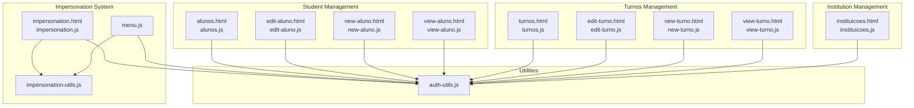
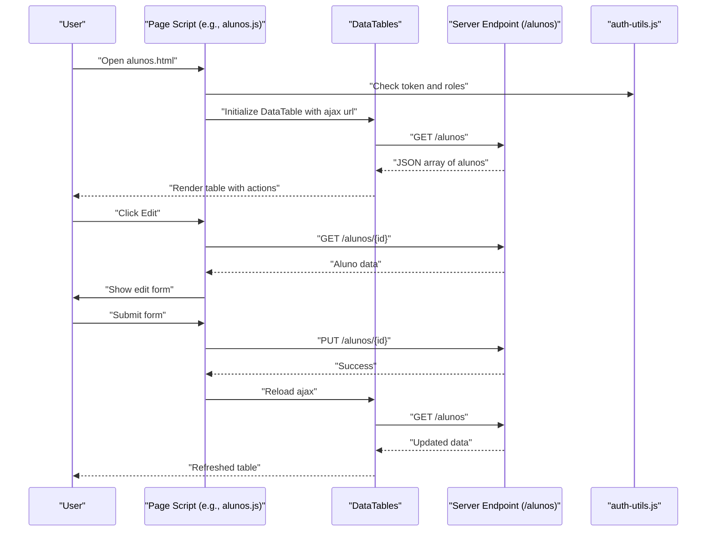
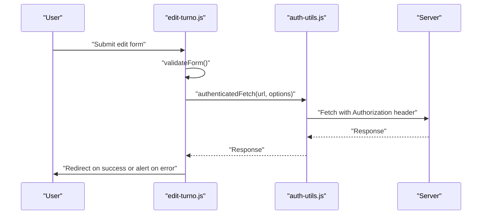
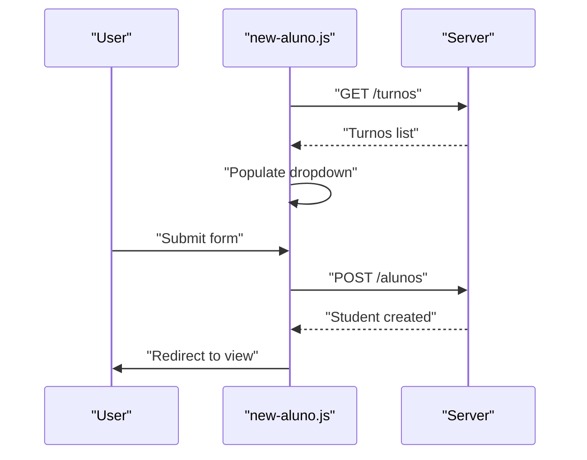
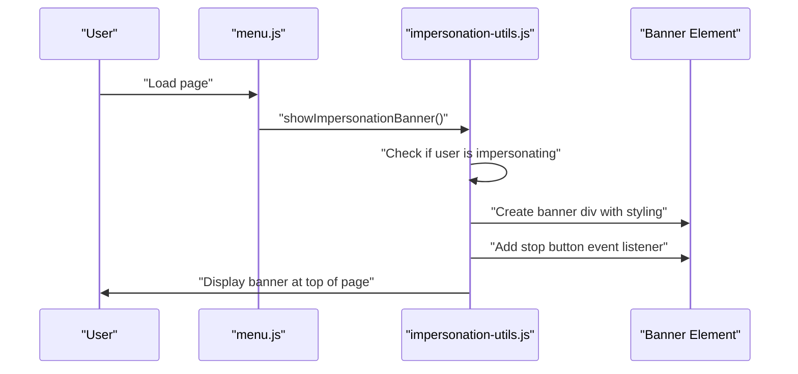
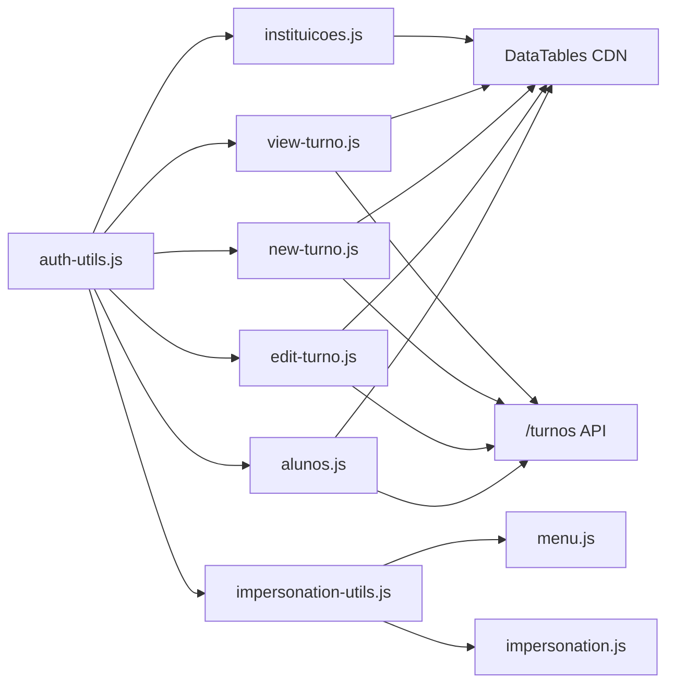

# Entity Management Interfaces

<cite>
**Referenced Files in This Document**
- [public/alunos.js](file://public/alunos.js)
- [public/edit-aluno.js](file://public/edit-aluno.js)
- [public/new-aluno.js](file://public/new-aluno.js)
- [public/view-aluno.js](file://public/view-aluno.js)
- [public/turnos.js](file://public/turnos.js)
- [public/turnos.html](file://public/turnos.html)
- [public/edit-turno.js](file://public/edit-turno.js)
- [public/edit-turno.html](file://public/edit-turno.html)
- [public/new-turno.js](file://public/new-turno.js)
- [public/new-turno.html](file://public/new-turno.html)
- [public/view-turno.js](file://public/view-turno.js)
- [public/view-turno.html](file://public/view-turno.html)
- [public/instituicoes.js](file://public/instituicoes.js)
- [public/auth-utils.js](file://public/auth-utils.js)
- [public/menu.js](file://public/menu.js)
- [public/impersonation-utils.js](file://public/impersonation-utils.js)
- [public/impersonation.js](file://public/impersonation.js)
- [public/impersonation.html](file://public/impersonation.html)
- [src/controllers/turnoController.js](file://src/controllers/turnoController.js)
- [src/models/turno.js](file://src/models/turno.js)
- [src/routers/turnoRoutes.js](file://src/routers/turnoRoutes.js)
</cite>

## Update Summary
**Changes Made**
- Added comprehensive documentation for the new impersonation banner system
- Updated entity management interfaces to integrate with impersonation functionality
- Enhanced form handling with improved error messaging and user feedback
- Documented impersonation utilities and banner display mechanisms
- Added new impersonation testing interface and administrative controls
- Enhanced authentication utilities with impersonation session management

## Table of Contents
1. [Introduction](#introduction)
2. [Project Structure](#project-structure)
3. [Core Components](#core-components)
4. [Architecture Overview](#architecture-overview)
5. [Detailed Component Analysis](#detailed-component-analysis)
6. [Impersonation System](#impersonation-system)
7. [Dependency Analysis](#dependency-analysis)
8. [Performance Considerations](#performance-considerations)
9. [Troubleshooting Guide](#troubleshooting-guide)
10. [Conclusion](#conclusion)
11. [Appendices](#appendices)

## Introduction
This document describes the JavaScript architecture for NodeMural's entity management interfaces. It focuses on how client-side pages implement CRUD operations, form handling, validation, and table management for entities such as alunos, docentes, estagiarios, turmas, inscricoes, visitas, questionarios, respostas, mural, and turnos. The system now includes a comprehensive impersonation feature that allows administrators to temporarily act as other users for support purposes. The impersonation banner provides clear visual indication of active impersonation sessions. It also documents shared patterns across interfaces, including AJAX and fetch usage, authentication and authorization checks, error handling, user feedback, and DataTables integration for filtering, sorting, and pagination. Finally, it provides guidelines for adding new entity interfaces while maintaining consistency and optimizing performance for large datasets.

## Project Structure
The entity management interfaces are organized into pairs of HTML pages and corresponding JavaScript files under public/. Each pair typically consists of:
- A listing page (e.g., alunos.html with alunos.js) that renders a DataTable and handles bulk actions.
- An edit/new page (e.g., edit-aluno.html with edit-aluno.js and new-aluno.html with new-aluno.js) that manage creation and updates via forms.
- A view page (e.g., view-aluno.html with view-aluno.js) that displays entity details and related records.
- **New**: Impersonation system with banner display, utility functions, and administrative controls.
- **Enhanced**: Turnos management system with dedicated CRUD interface for shift/scheduling management.

Common utilities reside in public/auth-utils.js, providing authentication helpers and an authenticated fetch wrapper.

```mermaid
graph TB
subgraph "Student Management"
A1["alunos.html<br/>alunos.js"]
A2["edit-aluno.html<br/>edit-aluno.js"]
A3["new-aluno.html<br/>new-aluno.js"]
A4["view-aluno.html<br/>view-aluno.js"]
end
subgraph "Turnos Management"
T1["turnos.html<br/>turnos.js"]
T2["edit-turno.html<br/>edit-turno.js"]
T3["new-turno.html<br/>new-turno.js"]
T4["view-turno.html<br/>view-turno.js"]
end
subgraph "Institution Management"
I1["instituicoes.html<br/>instituicoes.js"]
end
subgraph "Impersonation System"
IS1["impersonation.html<br/>impersonation.js"]
IS2["impersonation-utils.js"]
IS3["menu.js"]
end
subgraph "Utilities"
U1["auth-utils.js"]
end
A1 --> U1
A2 --> U1
A3 --> U1
A4 --> U1
T1 --> U1
T2 --> U1
T3 --> U1
T4 --> U1
I1 --> U1
IS1 --> IS2
IS1 --> U1
IS3 --> IS2
IS3 --> U1
```

**Diagram sources**
- [public/alunos.js:1-69](file://public/alunos.js#L1-L69)
- [public/edit-aluno.js:1-299](file://public/edit-aluno.js#L1-L299)
- [public/new-aluno.js:1-212](file://public/new-aluno.js#L1-L212)
- [public/view-aluno.js:1-192](file://public/view-aluno.js#L1-L192)
- [public/turnos.js:1-51](file://public/turnos.js#L1-L51)
- [public/edit-turno.js:1-62](file://public/edit-turno.js#L1-L62)
- [public/new-turno.js:1-38](file://public/new-turno.js#L1-L38)
- [public/view-turno.js:1-54](file://public/view-turno.js#L1-L54)
- [public/instituicoes.js:1-82](file://public/instituicoes.js#L1-L82)
- [public/auth-utils.js:1-102](file://public/auth-utils.js#L1-L102)
- [public/impersonation.js:1-147](file://public/impersonation.js#L1-L147)
- [public/impersonation-utils.js:1-191](file://public/impersonation-utils.js#L1-L191)
- [public/menu.js:1-107](file://public/menu.js#L1-L107)

**Section sources**
- [public/alunos.js:1-69](file://public/alunos.js#L1-L69)
- [public/turnos.js:1-51](file://public/turnos.js#L1-L51)
- [public/auth-utils.js:1-102](file://public/auth-utils.js#L1-L102)
- [public/impersonation-utils.js:1-191](file://public/impersonation-utils.js#L1-L191)

## Core Components
- Authentication utilities: centralized helpers for login state, tokens, roles, and authenticated fetch requests.
- DataTables integration: responsive, searchable, sortable, and paginated tables with localized labels and improved error handling.
- Form handling: input masks, custom validation, serialization, and submission via fetch with comprehensive error messaging.
- CRUD orchestration: listing pages trigger DELETE actions; edit/new pages submit CREATE/UPDATE; view pages show related records.
- **New**: Impersonation system: administrators can temporarily act as other users with visual banner notification and session management.
- **Enhanced**: Turnos integration: students can now be associated with specific shifts during enrollment and management.

Key patterns:
- Access control: pages check token and roles before rendering or performing operations.
- Authorization: edit/update/delete often restrict to admins or owners.
- Data loading: fetch or AJAX endpoints supply JSON; DataTables renders rows.
- User feedback: enhanced alerts and console logs with specific error messages; confirm dialogs for destructive actions.
- **Enhanced**: Form validation now includes turnos selection with proper dropdown population and validation.
- **New**: Impersonation banner provides clear visual indication of active sessions with easy exit functionality.

**Section sources**
- [public/auth-utils.js:1-102](file://public/auth-utils.js#L1-L102)
- [public/alunos.js:1-69](file://public/alunos.js#L1-L69)
- [public/turnos.js:1-51](file://public/turnos.js#L1-L51)
- [public/impersonation-utils.js:86-145](file://public/impersonation-utils.js#L86-L145)
- [public/edit-aluno.js:152-168](file://public/edit-aluno.js#L152-L168)
- [public/new-aluno.js:42-62](file://public/new-aluno.js#L42-L62)

## Architecture Overview
The frontend follows a consistent pattern with enhanced error handling, validation, and impersonation support:
- On load, pages validate authentication and roles.
- DataTables initializes with an ajax source pointing to server endpoints.
- Columns may include action buttons (Edit/Delete) and links to view pages.
- Filtering and sorting are handled client-side by DataTables; server endpoints support query parameters for advanced filtering.
- Forms use input masks and custom validators; submissions leverage authenticated fetch with comprehensive error handling.
- **New**: Impersonation banner displays at the top of pages when active, providing clear visual indication and easy exit.
- **Enhanced**: Turnos management provides dedicated CRUD operations with proper internationalization support.

```mermaid
sequenceDiagram
participant U as "User"
participant P as "Page Script (e.g., alunos.js)"
participant DT as "DataTables"
participant S as "Server Endpoint (/alunos)"
participant AU as "auth-utils.js"
U->>P : "Open alunos.html"
P->>AU : "Check token and roles"
P->>DT : "Initialize DataTable with ajax url"
DT->>S : "GET /alunos"
S-->>DT : "JSON array of alunos"
DT-->>U : "Render table with actions"
U->>P : "Click Edit"
P->>S : "GET /alunos/{id}"
S-->>P : "Aluno data"
P->>U : "Show edit form"
U->>P : "Submit form"
P->>S : "PUT /alunos/{id}"
S-->>P : "Success"
P->>DT : "Reload ajax"
DT->>S : "GET /alunos"
S-->>DT : "Updated data"
DT-->>U : "Refreshed table"
```

**Diagram sources**
- [public/alunos.js:3-49](file://public/alunos.js#L3-L49)
- [public/auth-utils.js:1-102](file://public/auth-utils.js#L1-L102)

**Section sources**
- [public/alunos.js:1-69](file://public/alunos.js#L1-L69)
- [public/auth-utils.js:1-102](file://public/auth-utils.js#L1-L102)

## Detailed Component Analysis

### Turnos Management System
The turnos management system provides comprehensive shift/scheduling capabilities integrated with student enrollment processes.

#### Turnos Listing Interface
- **Enhanced**: turnos.js initializes a DataTable with improved internationalization support using Brazilian Portuguese localization.
- **New**: Supports admin-only access with proper role checking.
- **Enhanced**: Includes action buttons for edit and delete operations with proper confirmation dialogs.
- **Improved**: Uses authenticatedFetch for all operations with comprehensive error handling.

#### Turnos CRUD Operations
- **New**: edit-turno.js supports update mode with form validation and error handling.
- **New**: new-turno.js provides creation functionality with proper validation.
- **New**: view-turno.js displays turnos details with edit and delete capabilities.

```mermaid
sequenceDiagram
participant U as "User"
participant ET as "edit-turno.js"
participant AU as "auth-utils.js"
participant API as "Server"
U->>ET : "Submit edit form"
ET->>ET : "validateForm()"
ET->>AU : "authenticatedFetch(url, options)"
AU->>API : "Fetch with Authorization header"
API-->>AU : "Response"
AU-->>ET : "Response"
ET->>U : "Redirect on success or alert on error"
```

**Diagram sources**
- [public/edit-turno.js:19-46](file://public/edit-turno.js#L19-L46)
- [public/auth-utils.js:45-54](file://public/auth-utils.js#L45-L54)

**Section sources**
- [public/turnos.js:1-51](file://public/turnos.js#L1-L51)
- [public/edit-turno.js:1-62](file://public/edit-turno.js#L1-L62)
- [public/new-turno.js:1-38](file://public/new-turno.js#L1-L38)
- [public/view-turno.js:1-54](file://public/view-turno.js#L1-L54)

### Student Management Integration
Student management interfaces have been enhanced to integrate with the turnos system and impersonation functionality.

#### Enhanced Form Handling
- **Updated**: edit-aluno.js now includes turnos dropdown population with proper error handling and impersonation-aware validation.
- **Updated**: new-aluno.js includes turnos dropdown population using fetch with authentication and impersonation support.
- **Enhanced**: Form validation includes turnos selection validation and improved error messaging.
- **New**: Impersonation-aware permission checking for student management operations.

#### Turnos Integration Features
- **New**: Students can be associated with specific turns during enrollment.
- **Enhanced**: Turnos dropdown is populated dynamically from server endpoints with error handling.
- **Improved**: Error handling for turnos loading failures.
- **New**: Impersonation banner displays during student management operations.

```mermaid
sequenceDiagram
participant U as "User"
participant NA as "new-aluno.js"
participant API as "Server"
NA->>API : "GET /turnos"
API-->>NA : "Turnos list"
NA->>NA : "Populate dropdown"
U->>NA : "Submit form"
NA->>API : "POST /alunos"
API-->>NA : "Student created"
NA->>U : "Redirect to view"
```

**Diagram sources**
- [public/new-aluno.js:42-62](file://public/new-aluno.js#L42-L62)
- [public/edit-aluno.js:152-168](file://public/edit-aluno.js#L152-L168)

**Section sources**
- [public/edit-aluno.js:152-168](file://public/edit-aluno.js#L152-L168)
- [public/new-aluno.js:42-62](file://public/new-aluno.js#L42-L62)
- [public/view-aluno.js:1-192](file://public/view-aluno.js#L1-L192)

### Institutional Management
Institution management continues to provide comprehensive CRUD operations with enhanced DataTables integration.

#### Enhanced DataTables Configuration
- **Updated**: instituicoes.js includes improved column rendering with better data formatting.
- **Enhanced**: Support for boolean values display (sim/não) and date formatting.
- **Improved**: Better error handling and user feedback mechanisms.

**Section sources**
- [public/instituicoes.js:1-82](file://public/instituicoes.js#L1-L82)

## Impersonation System

The impersonation system provides administrators with the ability to temporarily act as other users for support and troubleshooting purposes. This system includes visual indicators, session management, and administrative controls.

### Impersonation Banner Display
The impersonation banner is displayed at the top of all pages when an administrator is impersonating another user. The banner provides clear visual indication of the active impersonation session and includes an easy exit button.

#### Banner Features
- **Visual Indicator**: Red gradient banner with warning icon and clear "MODO IMPERSONAÇÃO" label
- **User Information**: Displays the impersonated user's name and role
- **Exit Button**: Prominent "Voltar para Admin" button for easy session termination
- **Responsive Design**: Flexbox layout with wrap support for different screen sizes
- **Styling**: Fixed positioning with high z-index to ensure visibility above all content

#### Banner Implementation
The banner is automatically displayed when the `showImpersonationBanner()` function is called, typically during page load after the menu system initializes.

```mermaid
sequenceDiagram
participant U as "User"
participant M as "menu.js"
participant IU as "impersonation-utils.js"
participant B as "Banner Element"
U->>M : "Load page"
M->>IU : "showImpersonationBanner()"
IU->>IU : "Check if user is impersonating"
IU->>B : "Create banner div with styling"
IU->>B : "Add stop button event listener"
IU->>U : "Display banner at top of page"
```

**Diagram sources**
- [public/menu.js:16-17](file://public/menu.js#L16-L17)
- [public/impersonation-utils.js:86-145](file://public/impersonation-utils.js#L86-L145)

### Impersonation Utilities
The impersonation utilities provide the core functionality for managing impersonation sessions, including starting, stopping, and displaying impersonation banners.

#### Key Functions
- **impersonateUser(userId)**: Initiates impersonation session for specified user
- **stopImpersonation()**: Terminates current impersonation session
- **showImpersonationBanner()**: Displays visual banner indicator
- **getImpersonationButton(user, targetUser)**: Generates impersonation button HTML

#### Session Management
The system manages impersonation sessions through localStorage, storing both the impersonation token and user information. When impersonation is active, the user object includes special properties indicating the impersonation state.

**Section sources**
- [public/impersonation-utils.js:1-191](file://public/impersonation-utils.js#L1-L191)
- [public/menu.js:16-17](file://public/menu.js#L16-L17)

### Impersonation Testing Interface
The impersonation testing interface provides administrators with a dedicated page to manage and monitor impersonation sessions.

#### Features
- **User List**: Displays all users with impersonation buttons for eligible targets
- **Impersonation History**: Shows recent impersonation sessions with duration and status
- **Role-Based Controls**: Only administrators can see impersonation buttons
- **Permission Validation**: Prevents impersonation of self or other administrators

#### Data Presentation
The interface presents user data in Bootstrap-styled tables with role badges and impersonation history with duration calculations.

**Section sources**
- [public/impersonation.js:1-147](file://public/impersonation.js#L1-L147)
- [public/impersonation.html:1-52](file://public/impersonation.html#L1-L52)

### Backend Integration
The impersonation system includes comprehensive backend support for managing impersonation sessions and maintaining audit trails.

#### Controller Endpoints
- **POST /auth/admin/impersonate/:userId**: Starts impersonation session
- **POST /auth/admin/stop-impersonate**: Ends impersonation session
- **GET /auth/admin/impersonations/history**: Retrieves impersonation history

#### Database Schema
The impersonation system maintains a dedicated table for tracking impersonation sessions, including timestamps, user IDs, and session durations.

**Section sources**
- [src/controllers/turnoController.js:1-72](file://src/controllers/turnoController.js#L1-L72)
- [src/models/turno.js:1-45](file://src/models/turno.js#L1-L45)
- [src/routers/turnoRoutes.js:1-16](file://src/routers/turnoRoutes.js#L1-L16)

## Dependency Analysis
The client-side scripts depend on:
- auth-utils.js for authentication and authorization checks and for authenticated fetch.
- DataTables CDN for UI and interaction features with enhanced internationalization.
- Server endpoints returning JSON arrays or objects for table rendering and form operations.
- **New**: Impersonation utilities for session management and banner display.
- **Enhanced**: Turnos API endpoints for shift/scheduling management.

```mermaid
graph LR
AU["auth-utils.js"] --> AL["alunos.js"]
AU --> ET["edit-turno.js"]
AU --> NT["new-turno.js"]
AU --> VT["view-turno.js"]
AU --> IN["instituicoes.js"]
AU --> IM["impersonation-utils.js"]
AL --> DT["DataTables CDN"]
ET --> DT
NT --> DT
VT --> DT
IN --> DT
AL --> TURNOS["/turnos API"]
ET --> TURNOS
NT --> TURNOS
VT --> TURNOS
IM --> MENU["menu.js"]
IM --> TEST["impersonation.js"]
```

**Diagram sources**
- [public/auth-utils.js:1-102](file://public/auth-utils.js#L1-L102)
- [public/alunos.js:1-69](file://public/alunos.js#L1-L69)
- [public/edit-turno.js:1-62](file://public/edit-turno.js#L1-L62)
- [public/new-turno.js:1-38](file://public/new-turno.js#L1-L38)
- [public/view-turno.js:1-54](file://public/view-turno.js#L1-L54)
- [public/instituicoes.js:1-82](file://public/instituicoes.js#L1-L82)
- [public/impersonation-utils.js:1-191](file://public/impersonation-utils.js#L1-L191)
- [public/menu.js:1-107](file://public/menu.js#L1-L107)
- [public/impersonation.js:1-147](file://public/impersonation.js#L1-L147)

**Section sources**
- [public/auth-utils.js:1-102](file://public/auth-utils.js#L1-L102)
- [public/alunos.js:1-69](file://public/alunos.js#L1-L69)
- [public/turnos.js:1-51](file://public/turnos.js#L1-L51)
- [public/instituicoes.js:1-82](file://public/instituicoes.js#L1-L82)
- [public/impersonation-utils.js:1-191](file://public/impersonation-utils.js#L1-L191)
- [public/menu.js:1-107](file://public/menu.js#L1-L107)
- [public/impersonation.js:1-147](file://public/impersonation.js#L1-L147)

## Performance Considerations
- Prefer server-side filtering and pagination: pass query parameters (e.g., periodo) to reduce payload sizes.
- Use DataTables' built-in ordering and searching to minimize client-side work; avoid unnecessary DOM manipulations.
- Minimize repeated fetches: reuse authenticatedFetch and avoid redundant reloads.
- **Enhanced**: Implement caching strategies for frequently accessed turnos data.
- **New**: Impersonation banner uses efficient DOM manipulation with early existence checks to prevent duplicate elements.
- Optimize images and assets; defer non-critical resources.
- For large datasets, consider virtual scrolling or server-side processing in DataTables if needed.
- Cache small, static dropdowns (e.g., periods, turnos) locally to avoid repeated network calls.
- **New**: Implement lazy loading for turnos dropdowns to improve initial page load performance.
- **New**: Impersonation banner uses minimal CSS and efficient event handling to maintain performance.

## Troubleshooting Guide
Common issues and resolutions:
- Unauthorized access: ensure token and role checks are in place; redirect to login when missing.
- CORS and auth headers: use authenticatedFetch to attach Authorization headers automatically.
- Form validation failures: inspect console logs and ensure masks and regex validations are applied before submission.
- Deletion errors: confirm dialog precedes AJAX/fetch; handle non-OK responses with alerts and reload the table.
- DataTables not rendering: verify ajax url, dataSrc, and language settings; ensure DataTables CDN is loaded.
- **New**: Impersonation banner not showing: check that menu.js is loaded and showImpersonationBanner() is called during page initialization.
- **New**: Impersonation button not appearing: verify user role is admin and target user is not an admin or self.
- **New**: Impersonation session not terminating: check browser console for errors in stopImpersonation() function.
- **New**: Turnos loading failures: check network connectivity and server availability for /turnos endpoint.
- **New**: Authentication errors with impersonation: verify token validity and admin role assignment.
- **Enhanced**: Improved error messages: turnos-related errors now provide more specific feedback for debugging.

**Section sources**
- [public/auth-utils.js:1-102](file://public/auth-utils.js#L1-L102)
- [public/turnos.js:36-49](file://public/turnos.js#L36-L49)
- [public/edit-turno.js:42-46](file://public/edit-turno.js#L42-L46)
- [public/new-turno.js:32-36](file://public/new-turno.js#L32-L36)
- [public/view-turno.js:35-52](file://public/view-turno.js#L35-L52)
- [public/impersonation-utils.js:86-145](file://public/impersonation-utils.js#L86-L145)
- [public/impersonation.js:131-135](file://public/impersonation.js#L131-L135)

## Conclusion
NodeMural's entity management interfaces follow a consistent, modular architecture with enhanced functionality through the new impersonation system and turnos management. Authentication utilities centralize access control, DataTables provide robust UI with improved internationalization, and form handlers encapsulate validation and submission with comprehensive error handling. The impersonation system provides administrators with powerful support capabilities while maintaining security and transparency through visual indicators and session management. The integration of turnos functionality enhances student management capabilities while maintaining performance and usability. By adhering to these patterns—role checks, authenticated requests, consistent CRUD flows, impersonation awareness, and user feedback—you can reliably extend the system with new entities while maintaining performance and usability.

## Appendices

### Adding a New Entity Interface: Step-by-Step
- Create HTML pages:
  - listing.html with a table element and a script tag linking to listing.js.
  - edit-entity.html with a form and edit-entity.js.
  - view-entity.html with view-entity.js if needed.
- Implement listing.js:
  - Require token and roles.
  - Initialize DataTable with ajax pointing to the entity endpoint.
  - Add action buttons (Edit/Delete) and links to view pages.
  - Apply filters if applicable (e.g., select-based period filter).
  - **Enhanced**: Include proper internationalization support for DataTables.
  - **New**: Integrate impersonation banner display if applicable.
- Implement edit-entity.js:
  - Require token and roles.
  - Apply input masks and custom validation.
  - Serialize form data and submit via authenticatedFetch (POST/PUT).
  - Redirect to view or listing on success.
  - **Enhanced**: Implement comprehensive error handling and user feedback.
  - **New**: Add impersonation-aware permission checking and validation.
- Implement view-entity.js (optional):
  - Enforce role-based visibility of actions.
  - Load related records and render them.
  - **New**: Consider impersonation context for action visibility.
- Backend alignment:
  - Ensure server routes exist and apply appropriate middleware (verifyToken, checkRole, checkOwnership).
  - Controllers expose endpoints for listing, retrieval, creation, update, and deletion.
  - **New**: Implement proper validation and error handling for new endpoints.
  - **New**: Consider impersonation context for administrative operations.
- Testing:
  - Verify access control, filtering, sorting, and deletion flows.
  - Test error scenarios and user feedback.
  - **Enhanced**: Test internationalization and error message clarity.
  - **New**: Test impersonation functionality and banner display.
  - **New**: Verify impersonation session management and security.

**Section sources**
- [public/auth-utils.js:1-102](file://public/auth-utils.js#L1-L102)
- [public/turnos.js:1-51](file://public/turnos.js#L1-L51)
- [public/edit-turno.js:1-62](file://public/edit-turno.js#L1-L62)
- [public/new-turno.js:1-38](file://public/new-turno.js#L1-L38)
- [public/view-turno.js:1-54](file://public/view-turno.js#L1-L54)
- [public/impersonation-utils.js:1-191](file://public/impersonation-utils.js#L1-L191)
- [public/menu.js:1-107](file://public/menu.js#L1-L107)
- [src/routers/turnoRoutes.js:1-16](file://src/routers/turnoRoutes.js#L1-L16)
- [src/controllers/turnoController.js:1-72](file://src/controllers/turnoController.js#L1-L72)