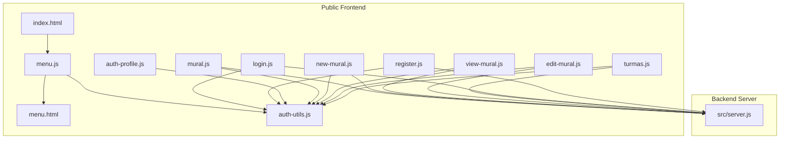
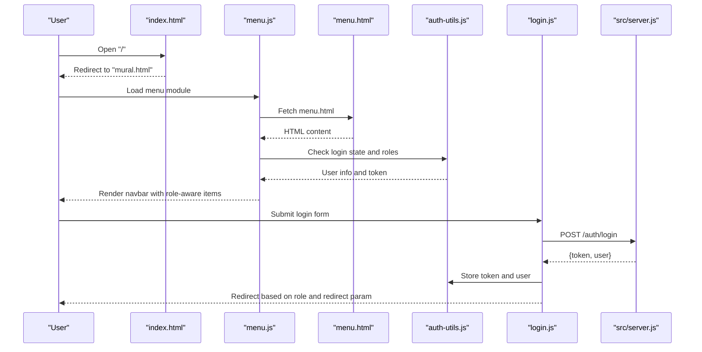
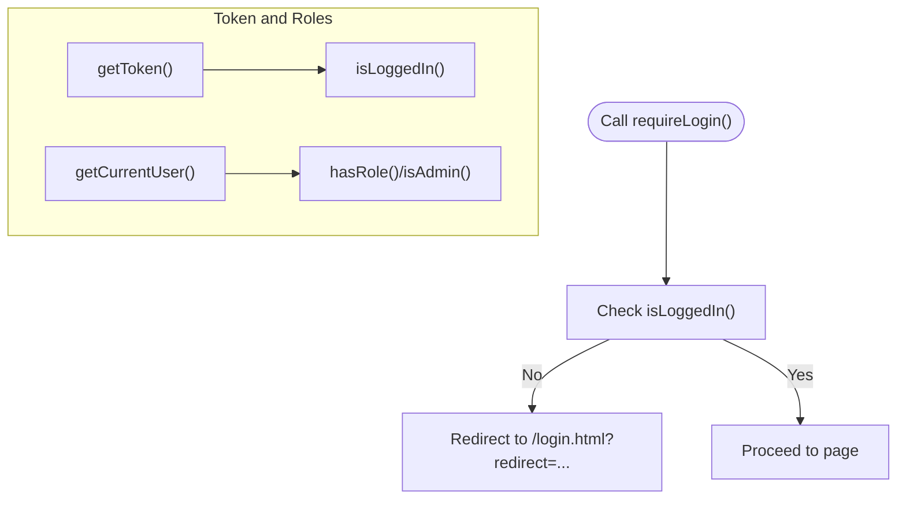
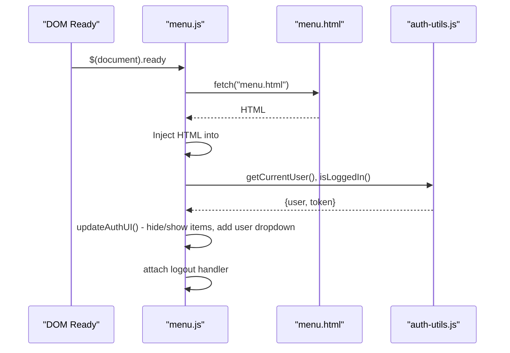
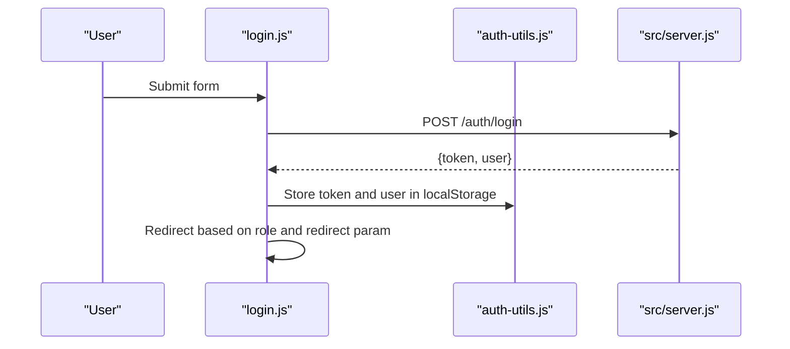
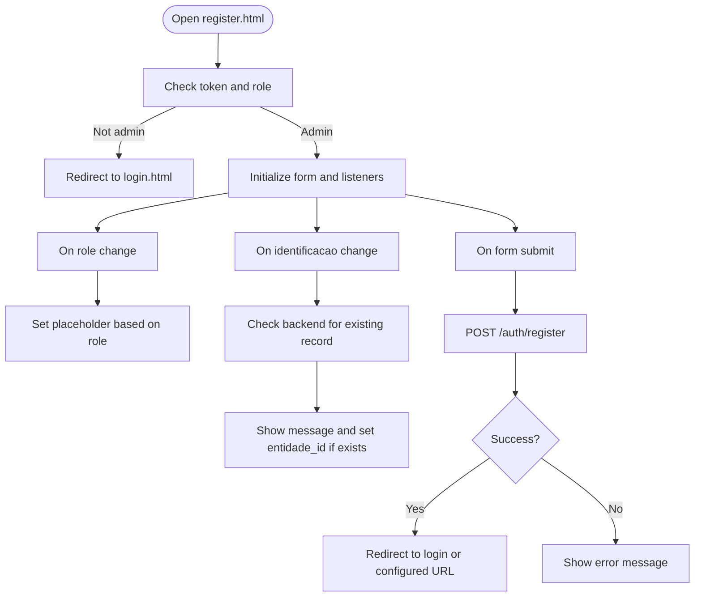
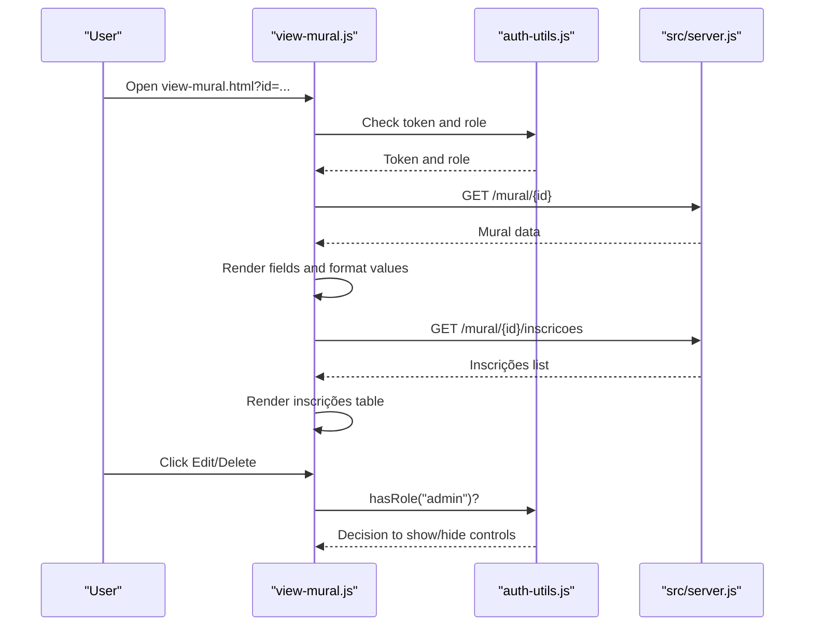
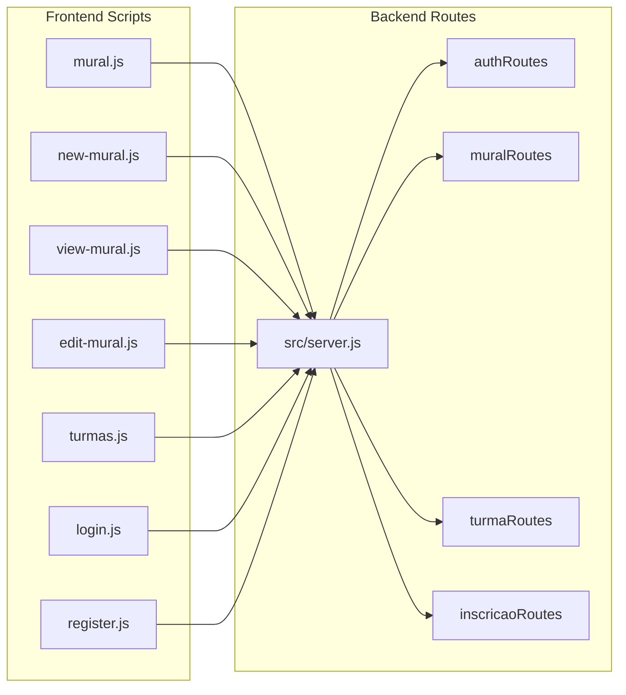
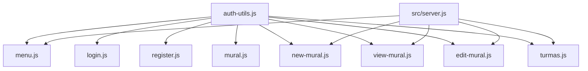

# Frontend Architecture

<cite>
**Referenced Files in This Document**
- [index.html](file://public/index.html)
- [menu.html](file://public/menu.html)
- [menu.js](file://public/menu.js)
- [auth-utils.js](file://public/auth-utils.js)
- [login.js](file://public/login.js)
- [register.js](file://public/register.js)
- [auth-profile.js](file://public/auth-profile.js)
- [mural.js](file://public/mural.js)
- [new-mural.js](file://public/new-mural.js)
- [view-mural.js](file://public/view-mural.js)
- [edit-mural.js](file://public/edit-mural.js)
- [turmas.js](file://public/turmas.js)
- [server.js](file://src/server.js)
- [alunoController.js](file://src/controllers/alunoController.js)
- [muralController.js](file://src/controllers/muralController.js)
- [authController.js](file://src/controllers/authController.js)
- [package.json](file://package.json)
</cite>

## Table of Contents
1. [Introduction](#introduction)
2. [Project Structure](#project-structure)
3. [Core Components](#core-components)
4. [Architecture Overview](#architecture-overview)
5. [Detailed Component Analysis](#detailed-component-analysis)
6. [Dependency Analysis](#dependency-analysis)
7. [Performance Considerations](#performance-considerations)
8. [Troubleshooting Guide](#troubleshooting-guide)
9. [Conclusion](#conclusion)
10. [Appendices](#appendices)

## Introduction
This document describes the frontend architecture of NodeMural’s client-side implementation. It explains the HTML template structure, JavaScript utility functions, and Bootstrap integration patterns. It documents the modular JavaScript architecture with separate files for each entity’s CRUD operations, the authentication utilities, menu system, and responsive design implementation. It also covers client-side state management, form handling, data validation, and user interface patterns. Finally, it details the integration between frontend templates and backend API endpoints via AJAX requests and response handling, along with guidelines for extending the frontend, adding new pages, and maintaining consistency across components. Accessibility and cross-browser compatibility considerations are addressed.

## Project Structure
The frontend is organized around static HTML templates and modular JavaScript files under the public directory. Each page corresponds to a dedicated HTML and JS pair (for example, mural.html with mural.js). Shared UI elements (like the top navigation) are loaded dynamically. The backend server exposes REST endpoints consumed by the frontend.

**Diagram sources**
- [index.html](file://public/index.html#L1-L34)
- [menu.html](file://public/menu.html#L1-L58)
- [menu.js](file://public/menu.js#L1-L78)
- [auth-utils.js](file://public/auth-utils.js#L1-L88)
- [login.js](file://public/login.js#L1-L62)
- [register.js](file://public/register.js#L1-L127)
- [auth-profile.js](file://public/auth-profile.js#L1-L29)
- [mural.js](file://public/mural.js#L1-L157)
- [new-mural.js](file://public/new-mural.js#L1-L108)
- [view-mural.js](file://public/view-mural.js#L1-L143)
- [edit-mural.js](file://public/edit-mural.js#L1-L130)
- [turmas.js](file://public/turmas.js#L1-L56)
- [server.js](file://src/server.js#L1-L73)

**Section sources**
- [index.html](file://public/index.html#L1-L34)
- [menu.html](file://public/menu.html#L1-L58)
- [menu.js](file://public/menu.js#L1-L78)
- [server.js](file://src/server.js#L1-L73)

## Core Components
- Authentication utilities: centralized helpers for login state, tokens, roles, and authenticated fetch.
- Menu system: dynamic navigation bar with role-aware visibility and user actions.
- Entity CRUD pages: modular JavaScript per entity (for example, mural, turmas) handling AJAX, filtering, and rendering.
- Forms: login, registration, and entity-specific forms with validation and submission handling.
- Bootstrap integration: responsive grid, navbars, modals, and DataTables for tables.

Key responsibilities:
- auth-utils.js: token storage, role checks, login requirement enforcement, authenticated fetch wrapper.
- menu.js: loads menu.html, updates UI based on login state, adds user dropdown, handles logout.
- login.js: handles login submission, stores token/user, redirects based on role and optional redirect param.
- register.js: admin-only registration, role-dependent placeholder hints, pre-check against backend entities, submission handling.
- mural.js, new-mural.js, view-mural.js, edit-mural.js: CRUD for mural entries, filtering, permissions, nested inscrições.
- turmas.js: list and delete operation for turmas with admin-only access.

**Section sources**
- [auth-utils.js](file://public/auth-utils.js#L1-L88)
- [menu.js](file://public/menu.js#L1-L78)
- [login.js](file://public/login.js#L1-L62)
- [register.js](file://public/register.js#L1-L127)
- [mural.js](file://public/mural.js#L1-L157)
- [new-mural.js](file://public/new-mural.js#L1-L108)
- [view-mural.js](file://public/view-mural.js#L1-L143)
- [edit-mural.js](file://public/edit-mural.js#L1-L130)
- [turmas.js](file://public/turmas.js#L1-L56)

## Architecture Overview
The frontend follows a modular pattern:
- HTML templates define structure and Bootstrap markup.
- JavaScript modules encapsulate page logic and integrate with shared utilities.
- The server exposes REST endpoints under /{entity}, plus nested routes for related resources.
- Frontend scripts use fetch with Authorization headers for authenticated requests.

**Diagram sources**
- [index.html](file://public/index.html#L1-L34)
- [menu.js](file://public/menu.js#L1-L78)
- [menu.html](file://public/menu.html#L1-L58)
- [auth-utils.js](file://public/auth-utils.js#L1-L88)
- [login.js](file://public/login.js#L1-L62)
- [server.js](file://src/server.js#L1-L73)

## Detailed Component Analysis

### Authentication Utilities
The auth utilities module centralizes authentication concerns:
- Token and user retrieval from localStorage.
- Role checks and admin verification.
- Redirect-if-not-logged-in helper.
- Authenticated fetch wrapper that injects Authorization header.

**Diagram sources**
- [auth-utils.js](file://public/auth-utils.js#L1-L88)

**Section sources**
- [auth-utils.js](file://public/auth-utils.js#L1-L88)

### Menu System
The menu system dynamically loads menu.html and adapts visibility based on login state and role:
- Logged-out users see login/register and selected public links.
- Logged-in users see role-specific restricted links removed and a user dropdown with profile and logout.
- Logout clears localStorage and redirects to login.

**Diagram sources**
- [menu.js](file://public/menu.js#L1-L78)
- [menu.html](file://public/menu.html#L1-L58)
- [auth-utils.js](file://public/auth-utils.js#L1-L88)

**Section sources**
- [menu.js](file://public/menu.js#L1-L78)
- [menu.html](file://public/menu.html#L1-L58)

### Login Page
The login page enforces redirect-if-logged-in, submits credentials to /auth/login, stores token/user, and redirects according to role and optional redirect parameter.

**Diagram sources**
- [login.js](file://public/login.js#L1-L62)
- [auth-utils.js](file://public/auth-utils.js#L1-L88)
- [server.js](file://src/server.js#L1-L73)

**Section sources**
- [login.js](file://public/login.js#L1-L62)

### Registration Page
The registration page is admin-only. It adjusts placeholders based on role, validates uniqueness against backend entities, and submits to /auth/register.

**Diagram sources**
- [register.js](file://public/register.js#L1-L127)
- [auth-utils.js](file://public/auth-utils.js#L1-L88)

**Section sources**
- [register.js](file://public/register.js#L1-L127)

### Profile Page
The profile page requires login and displays user information with role-based styling.

**Section sources**
- [auth-profile.js](file://public/auth-profile.js#L1-L29)

### Mural CRUD Pages
The mural pages demonstrate a consistent pattern:
- mural.js: initializes DataTables, loads periods and default period, applies filters, handles delete, and enforces admin-only editing/deleting.
- new-mural.js: admin-only creation, loads institutions and default period, submits via authenticatedFetch.
- view-mural.js: reads id from URL, loads data, formats values, conditionally hides controls based on role, lists inscrições with nested route.
- edit-mural.js: admin-only editing, preloads form with entity data, submits PUT.

**Diagram sources**
- [view-mural.js](file://public/view-mural.js#L1-L143)
- [auth-utils.js](file://public/auth-utils.js#L1-L88)
- [server.js](file://src/server.js#L1-L73)

**Section sources**
- [mural.js](file://public/mural.js#L1-L157)
- [new-mural.js](file://public/new-mural.js#L1-L108)
- [view-mural.js](file://public/view-mural.js#L1-L143)
- [edit-mural.js](file://public/edit-mural.js#L1-L130)

### Turmas CRUD Page
The turmas page demonstrates admin-only listing and deletion with DataTables.

**Section sources**
- [turmas.js](file://public/turmas.js#L1-L56)

### Backend Integration and Routing
The server exposes REST endpoints and nested routes used by the frontend:
- Static assets served from public.
- REST endpoints under /{entity}.
- Nested routes for related resources (for example, /mural/:id/inscricoes).
- Index route serves index.html.

**Diagram sources**
- [server.js](file://src/server.js#L1-L73)
- [mural.js](file://public/mural.js#L1-L157)
- [new-mural.js](file://public/new-mural.js#L1-L108)
- [view-mural.js](file://public/view-mural.js#L1-L143)
- [edit-mural.js](file://public/edit-mural.js#L1-L130)
- [turmas.js](file://public/turmas.js#L1-L56)
- [login.js](file://public/login.js#L1-L62)
- [register.js](file://public/register.js#L1-L127)

**Section sources**
- [server.js](file://src/server.js#L1-L73)

## Dependency Analysis
- Frontend modules depend on auth-utils.js for authentication and role checks.
- CRUD pages depend on shared utilities and Bootstrap/DataTables for UI and tables.
- Backend depends on Express and routes for serving endpoints and nested routes.

**Diagram sources**
- [auth-utils.js](file://public/auth-utils.js#L1-L88)
- [menu.js](file://public/menu.js#L1-L78)
- [login.js](file://public/login.js#L1-L62)
- [register.js](file://public/register.js#L1-L127)
- [mural.js](file://public/mural.js#L1-L157)
- [new-mural.js](file://public/new-mural.js#L1-L108)
- [view-mural.js](file://public/view-mural.js#L1-L143)
- [edit-mural.js](file://public/edit-mural.js#L1-L130)
- [turmas.js](file://public/turmas.js#L1-L56)
- [server.js](file://src/server.js#L1-L73)

**Section sources**
- [auth-utils.js](file://public/auth-utils.js#L1-L88)
- [server.js](file://src/server.js#L1-L73)

## Performance Considerations
- Lazy loading and minimal DOM manipulation: menu is fetched once and injected; avoid repeated DOM queries.
- Efficient DataTables usage: initialize once per page, reload data via AJAX with minimal payload.
- Local caching: keep token/user in localStorage to avoid re-authentication on each page load.
- Reduce network requests: batch related operations where possible; reuse authenticatedFetch for consistent headers.
- Minimize inline event handlers: prefer delegated events and modular handlers for maintainability.
- Asset delivery: serve static assets efficiently; consider CDN-hosted Bootstrap and DataTables for faster load.

## Troubleshooting Guide
Common issues and resolutions:
- Not logged in: requireLogin redirects to login with redirect param; ensure token is present in localStorage.
- Unauthorized access: hasRole/admin checks hide controls; verify role assignment on backend.
- Network errors: use authenticatedFetch for Authorization header; inspect response.ok and handle status codes.
- DataTables not rendering: ensure dataSrc is empty for arrays; confirm AJAX URL matches backend route.
- CORS and routing: verify server routes and static asset serving; ensure index route serves index.html.

**Section sources**
- [auth-utils.js](file://public/auth-utils.js#L1-L88)
- [mural.js](file://public/mural.js#L1-L157)
- [server.js](file://src/server.js#L1-L73)

## Conclusion
NodeMural’s frontend employs a clean, modular architecture with shared authentication utilities, a dynamic menu system, and entity-specific CRUD pages. Bootstrap and DataTables provide responsive UI and efficient data presentation. The frontend integrates tightly with backend REST endpoints, using authenticated fetch and role-based access control. Following the established patterns ensures consistency and simplifies extension and maintenance.

## Appendices

### Bootstrap Integration Patterns
- Responsive navbar with toggler and dropdown menus.
- DataTables initialization with localized language and column rendering.
- Conditional visibility based on role and login state.

**Section sources**
- [menu.html](file://public/menu.html#L1-L58)
- [mural.js](file://public/mural.js#L1-L157)
- [turmas.js](file://public/turmas.js#L1-L56)

### Cross-Browser Compatibility
- Use modern ES modules with type="module".
- Ensure fetch availability or polyfill for older browsers.
- Validate Bootstrap and DataTables CDN versions for target browsers.
- Test form validation and event handling across supported browsers.

### Accessibility Considerations
- Use semantic HTML and proper labels for forms.
- Ensure sufficient color contrast for messages and buttons.
- Provide keyboard navigation support for dropdowns and tables.
- Add ARIA attributes where necessary (for example, aria-expanded for dropdowns).

### Extending the Frontend
Guidelines for adding new pages and maintaining consistency:
- Create a new HTML template and a paired JavaScript file.
- Import auth-utils.js for authentication and role checks.
- Use authenticatedFetch for all API calls requiring Authorization.
- Initialize DataTables with dataSrc: "" for arrays and configure columns appropriately.
- Respect role-based visibility and hide admin-only controls when not applicable.
- Follow naming conventions for endpoints and nested routes mirroring backend structure.
- Keep shared logic in auth-utils.js and reusable UI patterns in menu.html/menu.js.

**Section sources**
- [auth-utils.js](file://public/auth-utils.js#L1-L88)
- [menu.js](file://public/menu.js#L1-L78)
- [server.js](file://src/server.js#L1-L73)