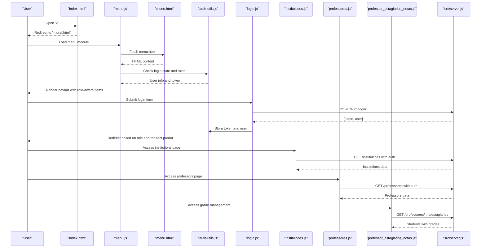
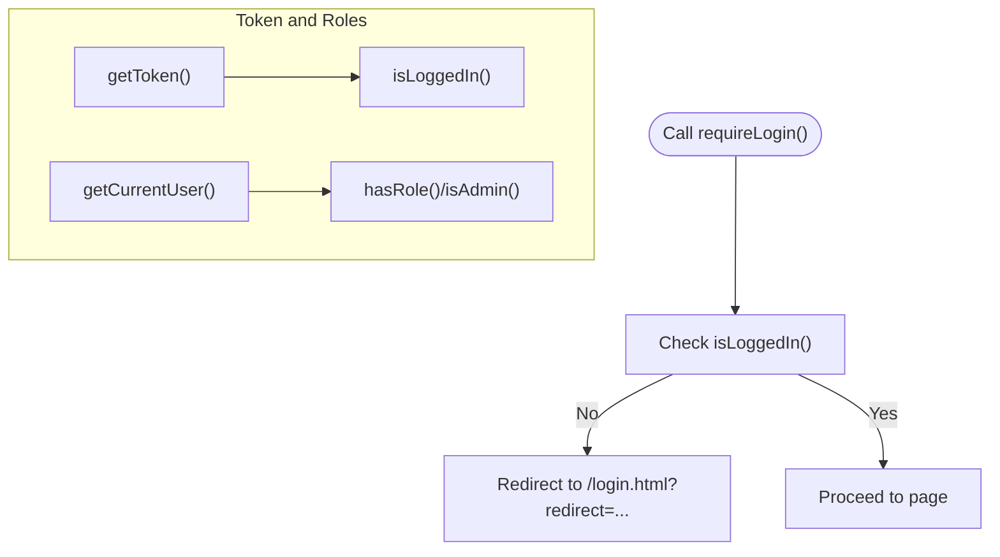
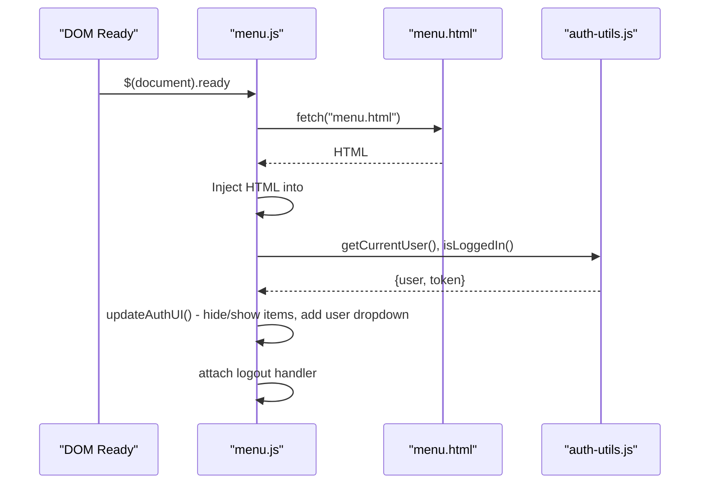
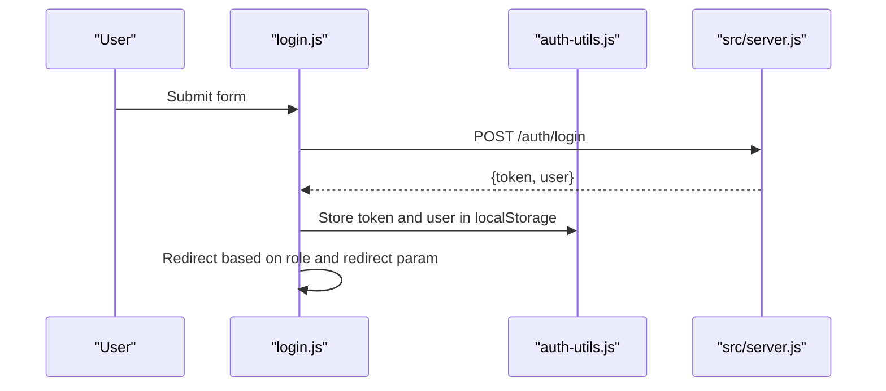
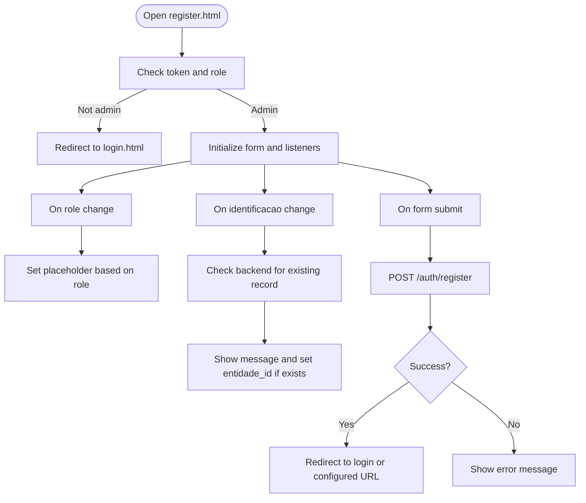
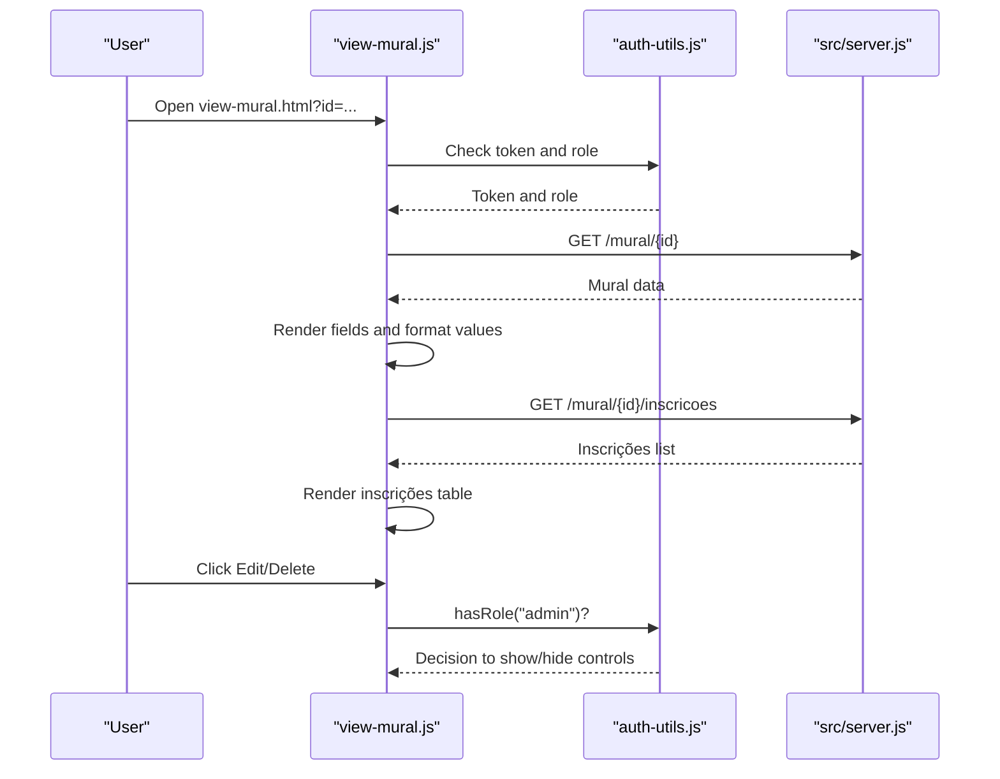
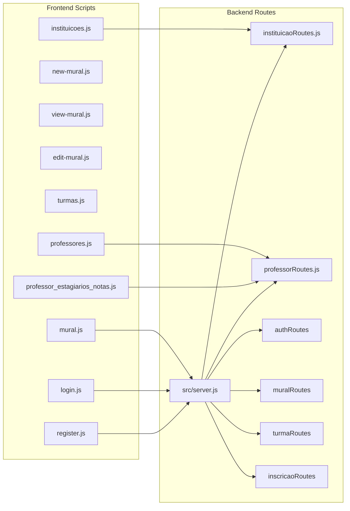
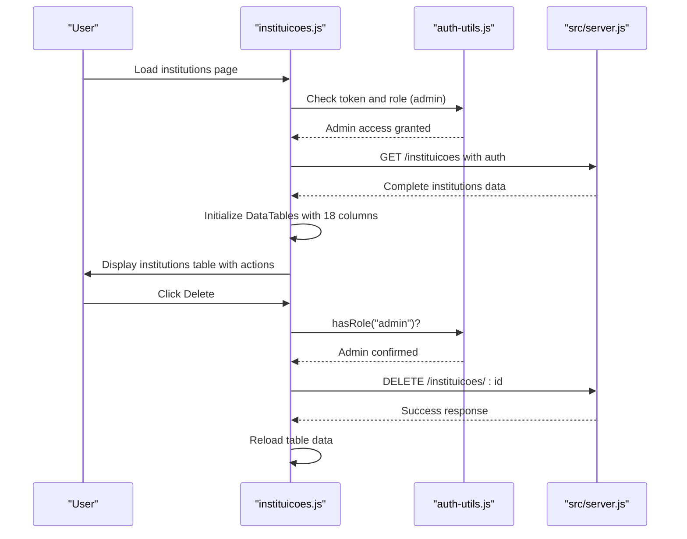
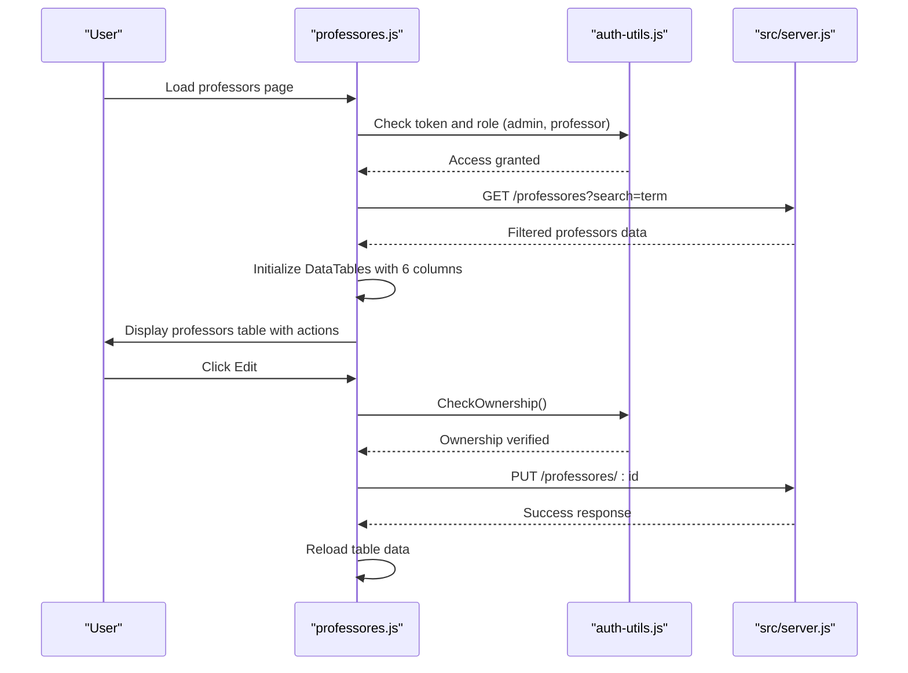
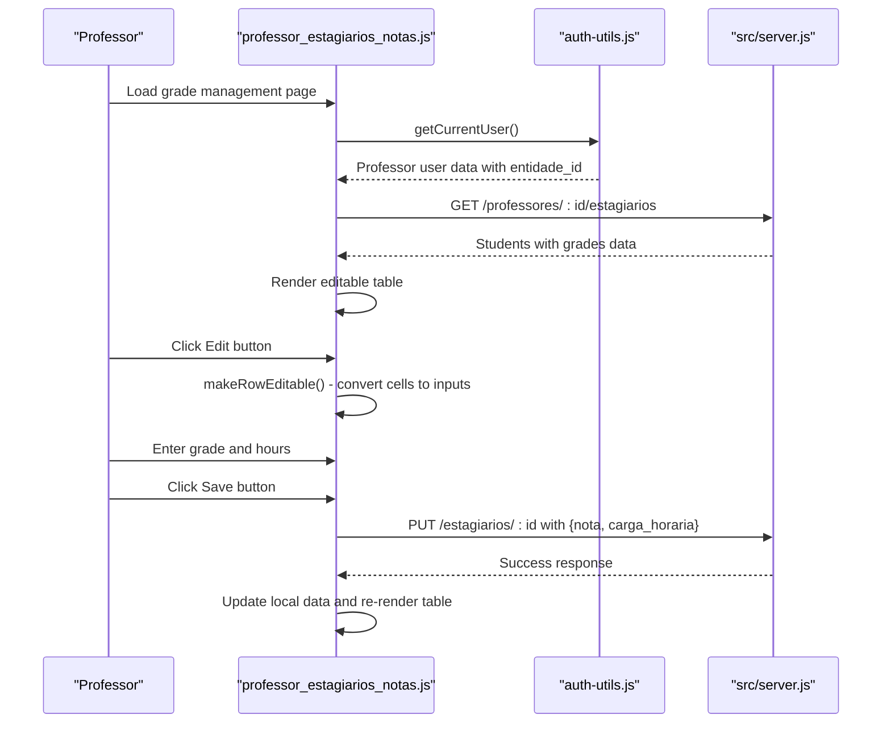

# Frontend Architecture

<cite>
**Referenced Files in This Document**
- [index.html](file://public/index.html)
- [menu.html](file://public/menu.html)
- [menu.js](file://public/menu.js)
- [auth-utils.js](file://public/auth-utils.js)
- [login.js](file://public/login.js)
- [register.js](file://public/register.js)
- [auth-profile.js](file://public/auth-profile.js)
- [mural.js](file://public/mural.js)
- [new-mural.js](file://public/new-mural.js)
- [view-mural.js](file://public/view-mural.js)
- [edit-mural.js](file://public/edit-mural.js)
- [turmas.js](file://public/turmas.js)
- [instituicoes.html](file://public/instituicoes.html)
- [instituicoes.js](file://public/instituicoes.js)
- [new-instituicao.html](file://public/new-instituicao.html)
- [new-instituicao.js](file://public/new-instituicao.js)
- [view-instituicao.html](file://public/view-instituicao.html)
- [view-instituicao.js](file://public/view-instituicao.js)
- [edit-instituicao.html](file://public/edit-instituicao.html)
- [edit-instituicao.js](file://public/edit-instituicao.js)
- [professores.html](file://public/professores.html)
- [professores.js](file://public/professores.js)
- [new-professor.html](file://public/new-professor.html)
- [new-professor.js](file://public/new-professor.js)
- [view-professor.html](file://public/view-professor.html)
- [view-professor.js](file://public/view-professor.js)
- [edit-professor.html](file://public/edit-professor.html)
- [edit-professor.js](file://public/edit-professor.js)
- [professor_estagiarios_notas.html](file://public/professor_estagiarios_notas.html)
- [professor_estagiarios_notas.js](file://public/professor_estagiarios_notas.js)
- [server.js](file://src/server.js)
- [alunoController.js](file://src/controllers/alunoController.js)
- [muralController.js](file://src/controllers/muralController.js)
- [authController.js](file://src/controllers/authController.js)
- [instituicaoController.js](file://src/controllers/instituicaoController.js)
- [professorController.js](file://src/controllers/professorController.js)
- [instituicao.js](file://src/models/instituicao.js)
- [professor.js](file://src/models/professor.js)
- [instituicaoRoutes.js](file://src/routers/instituicaoRoutes.js)
- [professorRoutes.js](file://src/routers/professorRoutes.js)
- [package.json](file://package.json)
</cite>

## Update Summary
**Changes Made**
- Added new Institutional Management System with CRUD operations for institutions
- Added new Professor Management System with CRUD operations and grade management capabilities
- Added new Grade Management System allowing professors to update student grades and hours
- Updated backend integration to support new institutional and professor endpoints
- Enhanced role-based access control with expanded permissions for professors

## Table of Contents
1. [Introduction](#introduction)
2. [Project Structure](#project-structure)
3. [Core Components](#core-components)
4. [Architecture Overview](#architecture-overview)
5. [Detailed Component Analysis](#detailed-component-analysis)
6. [New Institutional Management System](#new-institutional-management-system)
7. [New Professor Management System](#new-professor-management-system)
8. [New Grade Management System](#new-grade-management-system)
9. [Dependency Analysis](#dependency-analysis)
10. [Performance Considerations](#performance-considerations)
11. [Troubleshooting Guide](#troubleshooting-guide)
12. [Conclusion](#conclusion)
13. [Appendices](#appendices)

## Introduction
This document describes the frontend architecture of NodeMural's client-side implementation. It explains the HTML template structure, JavaScript utility functions, and Bootstrap integration patterns. It documents the modular JavaScript architecture with separate files for each entity's CRUD operations, the authentication utilities, menu system, and responsive design implementation. It also covers client-side state management, form handling, data validation, and user interface patterns. Finally, it details the integration between frontend templates and backend API endpoints via AJAX requests and response handling, along with guidelines for extending the frontend, adding new pages, and maintaining consistency across components. Accessibility and cross-browser compatibility considerations are addressed.

**Updated** Added comprehensive coverage of new institutional management, professor management, and grade management systems that provide enhanced educational institution administration capabilities.

## Project Structure
The frontend is organized around static HTML templates and modular JavaScript files under the public directory. Each page corresponds to a dedicated HTML and JS pair (for example, mural.html with mural.js). Shared UI elements (like the top navigation) are loaded dynamically. The backend server exposes REST endpoints consumed by the frontend. New institutional and professor management systems extend the existing architecture with specialized CRUD operations and grade management interfaces.

```mermaid
graph TB
subgraph "Public Frontend"
IDX["index.html"]
MENU["menu.html"]
MJS["menu.js"]
AUTIL["auth-utils.js"]
LOGIN["login.js"]
REG["register.js"]
PROF["auth-profile.js"]
MURAL["mural.js"]
NMURAL["new-mural.js"]
VMURAL["view-mural.js"]
EMURAL["edit-mural.js"]
TURMAS["turmas.js"]
INST["instituicoes.html"]
INSTJS["instituicoes.js"]
NINST["new-instituicao.html"]
NINSTJS["new-instituicao.js"]
VINST["view-instituicao.html"]
VINSTJS["view-instituicao.js"]
EINST["edit-instituicao.html"]
EINSTJS["edit-instituicao.js"]
PROFES["professores.html"]
PROFESJS["professores.js"]
NPROF["new-professor.html"]
NPROFJS["new-professor.js"]
VPROF["view-professor.html"]
VPROFJS["view-professor.js"]
EPROF["edit-professor.html"]
EPROFJS["edit-professor.js"]
GRADES["professor_estagiarios_notas.html"]
GRADESJS["professor_estagiarios_notas.js"]
end
subgraph "Backend Server"
SRV["src/server.js"]
INSTR["instituicaoRoutes.js"]
PRFR["professorRoutes.js"]
end
IDX --> MJS
MJS --> MENU
MJS --> AUTIL
LOGIN --> AUTIL
REG --> AUTIL
PROF --> AUTIL
MURAL --> AUTIL
NMURAL --> AUTIL
VMURAL --> AUTIL
EMURAL --> AUTIL
TURMAS --> AUTIL
INSTJS --> INSTR
NINSTJS --> INSTR
VINSTJS --> INSTR
EINSTJS --> INSTR
PROFESJS --> PRFR
NPROFJS --> PRFR
VPROFJS --> PRFR
EPROFJS --> PRFR
GRADESJS --> PRFR
MURAL --> SRV
INSTJS --> SRV
PROFESJS --> SRV
GRADESJS --> SRV
LOGIN --> SRV
REG --> SRV
```

**Diagram sources**
- [index.html](file://public/index.html#L1-L34)
- [menu.html](file://public/menu.html#L1-L58)
- [menu.js](file://public/menu.js#L1-L78)
- [auth-utils.js](file://public/auth-utils.js#L1-L88)
- [login.js](file://public/login.js#L1-L62)
- [register.js](file://public/register.js#L1-L127)
- [auth-profile.js](file://public/auth-profile.js#L1-L29)
- [mural.js](file://public/mural.js#L1-L157)
- [new-mural.js](file://public/new-mural.js#L1-L108)
- [view-mural.js](file://public/view-mural.js#L1-L143)
- [edit-mural.js](file://public/edit-mural.js#L1-L130)
- [turmas.js](file://public/turmas.js#L1-L56)
- [instituicoes.html](file://public/instituicoes.html#L1-L62)
- [instituicoes.js](file://public/instituicoes.js#L1-L69)
- [new-instituicao.html](file://public/new-instituicao.html#L1-L120)
- [new-instituicao.js](file://public/new-instituicao.js#L1-L100)
- [view-instituicao.html](file://public/view-instituicao.html#L1-L120)
- [view-instituicao.js](file://public/view-instituicao.js#L1-L100)
- [edit-instituicao.html](file://public/edit-instituicao.html#L1-L120)
- [edit-instituicao.js](file://public/edit-instituicao.js#L1-L100)
- [professores.html](file://public/professores.html#L1-L48)
- [professores.js](file://public/professores.js#L1-L62)
- [new-professor.html](file://public/new-professor.html#L1-L120)
- [new-professor.js](file://public/new-professor.js#L1-L100)
- [view-professor.html](file://public/view-professor.html#L1-L120)
- [view-professor.js](file://public/view-professor.js#L1-L100)
- [edit-professor.html](file://public/edit-professor.html#L1-L120)
- [edit-professor.js](file://public/edit-professor.js#L1-L100)
- [professor_estagiarios_notas.html](file://public/professor_estagiarios_notas.html#L1-L44)
- [professor_estagiarios_notas.js](file://public/professor_estagiarios_notas.js#L1-L151)
- [server.js](file://src/server.js#L1-L73)
- [instituicaoRoutes.js](file://src/routers/instituicaoRoutes.js#L1-L21)
- [professorRoutes.js](file://src/routers/professorRoutes.js#L1-L23)

**Section sources**
- [index.html](file://public/index.html#L1-L34)
- [menu.html](file://public/menu.html#L1-L58)
- [menu.js](file://public/menu.js#L1-L78)
- [server.js](file://src/server.js#L1-L73)

## Core Components
- Authentication utilities: centralized helpers for login state, tokens, roles, and authenticated fetch.
- Menu system: dynamic navigation bar with role-aware visibility and user actions.
- Entity CRUD pages: modular JavaScript per entity (for example, mural, turmas, instituicoes, professores) handling AJAX, filtering, and rendering.
- Forms: login, registration, and entity-specific forms with validation and submission handling.
- Bootstrap integration: responsive grid, navbars, modals, and DataTables for tables.
- Grade management: specialized interface for professors to update student grades and working hours.

**Updated** Enhanced with new institutional and professor management systems that provide comprehensive administrative capabilities.

Key responsibilities:
- auth-utils.js: token storage, role checks, login requirement enforcement, authenticated fetch wrapper.
- menu.js: loads menu.html, updates UI based on login state, adds user dropdown, handles logout.
- login.js: handles login submission, stores token/user, redirects based on role and optional redirect param.
- register.js: admin-only registration, role-dependent placeholder hints, pre-check against backend entities, submission handling.
- mural.js, new-mural.js, view-mural.js, edit-mural.js: CRUD for mural entries, filtering, permissions, nested inscrições.
- turmas.js: list and delete operation for turmas with admin-only access.
- instituicoes.js: comprehensive CRUD for institutions with advanced filtering and role-based access.
- professores.js: professor management with search capabilities and role-based permissions.
- professor_estagiarios_notas.js: specialized grade management interface for professors.

**Section sources**
- [auth-utils.js](file://public/auth-utils.js#L1-L88)
- [menu.js](file://public/menu.js#L1-L78)
- [login.js](file://public/login.js#L1-L62)
- [register.js](file://public/register.js#L1-L127)
- [mural.js](file://public/mural.js#L1-L157)
- [new-mural.js](file://public/new-mural.js#L1-L108)
- [view-mural.js](file://public/view-mural.js#L1-L143)
- [edit-mural.js](file://public/edit-mural.js#L1-L130)
- [turmas.js](file://public/turmas.js#L1-L56)
- [instituicoes.js](file://public/instituicoes.js#L1-L69)
- [professores.js](file://public/professores.js#L1-L62)
- [professor_estagiarios_notas.js](file://public/professor_estagiarios_notas.js#L1-L151)

## Architecture Overview
The frontend follows a modular pattern:
- HTML templates define structure and Bootstrap markup.
- JavaScript modules encapsulate page logic and integrate with shared utilities.
- The server exposes REST endpoints under /{entity}, plus nested routes for related resources.
- Frontend scripts use fetch with Authorization headers for authenticated requests.
- New institutional and professor management systems extend the architecture with specialized CRUD operations and grade management capabilities.

```mermaid
sequenceDiagram
participant U as "User"
participant IDX as "index.html"
participant MJS as "menu.js"
participant MENU as "menu.html"
participant A as "auth-utils.js"
participant L as "login.js"
participant INST as "instituicoes.js"
participant PROF as "professores.js"
participant GRADES as "professor_estagiarios_notas.js"
participant S as "src/server.js"
U->>IDX : Open "/"
IDX-->>U : Redirect to "mural.html"
U->>MJS : Load menu module
MJS->>MENU : Fetch menu.html
MENU-->>MJS : HTML content
MJS->>A : Check login state and roles
A-->>MJS : User info and token
MJS-->>U : Render navbar with role-aware items
U->>L : Submit login form
L->>S : POST /auth/login
S-->>L : {token, user}
L->>A : Store token and user
L-->>U : Redirect based on role and redirect param
U->>INST : Access institutions page
INST->>S : GET /instituicoes with auth
S-->>INST : Institutions data
U->>PROF : Access professors page
PROF->>S : GET /professores with auth
S-->>PROF : Professors data
U->>GRADES : Access grade management
GRADES->>S : GET /professores/ : id/estagiarios
S-->>GRADES : Students with grades
```

**Diagram sources**
- [index.html](file://public/index.html#L1-L34)
- [menu.js](file://public/menu.js#L1-L78)
- [menu.html](file://public/menu.html#L1-L58)
- [auth-utils.js](file://public/auth-utils.js#L1-L88)
- [login.js](file://public/login.js#L1-L62)
- [instituicoes.js](file://public/instituicoes.js#L1-L69)
- [professores.js](file://public/professores.js#L1-L62)
- [professor_estagiarios_notas.js](file://public/professor_estagiarios_notas.js#L1-L151)
- [server.js](file://src/server.js#L1-L73)

## Detailed Component Analysis

### Authentication Utilities
The auth utilities module centralizes authentication concerns:
- Token and user retrieval from localStorage.
- Role checks and admin verification.
- Redirect-if-not-logged-in helper.
- Authenticated fetch wrapper that injects Authorization header.

```mermaid
flowchart TD
Start(["Call requireLogin()"]) --> Check["Check isLoggedIn()"]
Check --> |No| Redirect["Redirect to /login.html?redirect=..."]
Check --> |Yes| Allow["Proceed to page"]
subgraph "Token and Roles"
T1["getToken()"] --> T2["isLoggedIn()"]
R1["getCurrentUser()"] --> R2["hasRole()/isAdmin()"]
end
```

**Diagram sources**
- [auth-utils.js](file://public/auth-utils.js#L1-L88)

**Section sources**
- [auth-utils.js](file://public/auth-utils.js#L1-L88)

### Menu System
The menu system dynamically loads menu.html and adapts visibility based on login state and role:
- Logged-out users see login/register and selected public links.
- Logged-in users see role-specific restricted links removed and a user dropdown with profile and logout.
- Logout clears localStorage and redirects to login.

```mermaid
sequenceDiagram
participant D as "DOM Ready"
participant MJ as "menu.js"
participant MH as "menu.html"
participant AU as "auth-utils.js"
D->>MJ : $(document).ready
MJ->>MH : fetch("menu.html")
MH-->>MJ : HTML
MJ->>MJ : Inject HTML into #menu-container
MJ->>AU : getCurrentUser(), isLoggedIn()
AU-->>MJ : {user, token}
MJ->>MJ : updateAuthUI() - hide/show items, add user dropdown
MJ->>MJ : attach logout handler
```

**Diagram sources**
- [menu.js](file://public/menu.js#L1-L78)
- [menu.html](file://public/menu.html#L1-L58)
- [auth-utils.js](file://public/auth-utils.js#L1-L88)

**Section sources**
- [menu.js](file://public/menu.js#L1-L78)
- [menu.html](file://public/menu.html#L1-L58)

### Login Page
The login page enforces redirect-if-logged-in, submits credentials to /auth/login, stores token/user, and redirects according to role and optional redirect parameter.

```mermaid
sequenceDiagram
participant U as "User"
participant LG as "login.js"
participant AU as "auth-utils.js"
participant S as "src/server.js"
U->>LG : Submit form
LG->>S : POST /auth/login
S-->>LG : {token, user}
LG->>AU : Store token and user in localStorage
LG->>LG : Redirect based on role and redirect param
```

**Diagram sources**
- [login.js](file://public/login.js#L1-L62)
- [auth-utils.js](file://public/auth-utils.js#L1-L88)
- [server.js](file://src/server.js#L1-L73)

**Section sources**
- [login.js](file://public/login.js#L1-L62)

### Registration Page
The registration page is admin-only. It adjusts placeholders based on role, validates uniqueness against backend entities, and submits to /auth/register.

```mermaid
flowchart TD
Start(["Open register.html"]) --> CheckRole["Check token and role"]
CheckRole --> |Not admin| GoLogin["Redirect to login.html"]
CheckRole --> |Admin| Init["Initialize form and listeners"]
Init --> RoleChange["On role change"]
RoleChange --> SetPlaceholder["Set placeholder based on role"]
Init --> IdentChange["On identificacao change"]
IdentChange --> CheckEntity["Check backend for existing record"]
CheckEntity --> ShowMsg["Show message and set entidade_id if exists"]
Init --> Submit["On form submit"]
Submit --> PostReg["POST /auth/register"]
PostReg --> Success{"Success?"}
Success --> |Yes| Redirect["Redirect to login or configured URL"]
Success --> |No| ShowError["Show error message"]
```

**Diagram sources**
- [register.js](file://public/register.js#L1-L127)
- [auth-utils.js](file://public/auth-utils.js#L1-L88)

**Section sources**
- [register.js](file://public/register.js#L1-L127)

### Profile Page
The profile page requires login and displays user information with role-based styling.

**Section sources**
- [auth-profile.js](file://public/auth-profile.js#L1-L29)

### Mural CRUD Pages
The mural pages demonstrate a consistent pattern:
- mural.js: initializes DataTables, loads periods and default period, applies filters, handles delete, and enforces admin-only editing/deleting.
- new-mural.js: admin-only creation, loads institutions and default period, submits via authenticatedFetch.
- view-mural.js: reads id from URL, loads data, formats values, conditionally hides controls based on role, lists inscrições with nested route.
- edit-mural.js: admin-only editing, preloads form with entity data, submits PUT.

```mermaid
sequenceDiagram
participant U as "User"
participant V as "view-mural.js"
participant AU as "auth-utils.js"
participant S as "src/server.js"
U->>V : Open view-mural.html?id=...
V->>AU : Check token and role
AU-->>V : Token and role
V->>S : GET /mural/{id}
S-->>V : Mural data
V->>V : Render fields and format values
V->>S : GET /mural/{id}/inscricoes
S-->>V : Inscrições list
V->>V : Render inscrições table
U->>V : Click Edit/Delete
V->>AU : hasRole("admin")?
AU-->>V : Decision to show/hide controls
```

**Diagram sources**
- [view-mural.js](file://public/view-mural.js#L1-L143)
- [auth-utils.js](file://public/auth-utils.js#L1-L88)
- [server.js](file://src/server.js#L1-L73)

**Section sources**
- [mural.js](file://public/mural.js#L1-L157)
- [new-mural.js](file://public/new-mural.js#L1-L108)
- [view-mural.js](file://public/view-mural.js#L1-L143)
- [edit-mural.js](file://public/edit-mural.js#L1-L130)

### Turmas CRUD Page
The turmas page demonstrates admin-only listing and deletion with DataTables.

**Section sources**
- [turmas.js](file://public/turmas.js#L1-L56)

### Backend Integration and Routing
The server exposes REST endpoints and nested routes used by the frontend:
- Static assets served from public.
- REST endpoints under /{entity}.
- Nested routes for related resources (for example, /mural/:id/inscricoes, /professores/:id/estagiarios).
- Index route serves index.html.

```mermaid
graph LR
subgraph "Frontend Scripts"
MJS["mural.js"]
NMJS["new-mural.js"]
VMJS["view-mural.js"]
EMJS["edit-mural.js"]
TJMS["turmas.js"]
INSTJS["instituicoes.js"]
PROFESJS["professores.js"]
GRADESJS["professor_estagiarios_notas.js"]
LJS["login.js"]
RJS["register.js"]
end
subgraph "Backend Routes"
SRV["src/server.js"]
INSTR["instituicaoRoutes.js"]
PRFR["professorRoutes.js"]
AR["authRoutes"]
MR["muralRoutes"]
TR["turmaRoutes"]
IR["inscricaoRoutes"]
end
MJS --> SRV
INSTJS --> INSTR
PROFESJS --> PRFR
GRADESJS --> PRFR
LJS --> SRV
RJS --> SRV
SRV --> AR
SRV --> MR
SRV --> TR
SRV --> IR
SRV --> INSTR
SRV --> PRFR
```

**Diagram sources**
- [server.js](file://src/server.js#L1-L73)
- [mural.js](file://public/mural.js#L1-L157)
- [new-mural.js](file://public/new-mural.js#L1-L108)
- [view-mural.js](file://public/view-mural.js#L1-L143)
- [edit-mural.js](file://public/edit-mural.js#L1-L130)
- [turmas.js](file://public/turmas.js#L1-L56)
- [instituicoes.js](file://public/instituicoes.js#L1-L69)
- [professores.js](file://public/professores.js#L1-L62)
- [professor_estagiarios_notas.js](file://public/professor_estagiarios_notas.js#L1-L151)
- [login.js](file://public/login.js#L1-L62)
- [register.js](file://public/register.js#L1-L127)
- [instituicaoRoutes.js](file://src/routers/instituicaoRoutes.js#L1-L21)
- [professorRoutes.js](file://src/routers/professorRoutes.js#L1-L23)

**Section sources**
- [server.js](file://src/server.js#L1-L73)

## New Institutional Management System

### Institutional CRUD Pages
The institutional management system provides comprehensive CRUD operations for educational institutions with advanced filtering and role-based access control:

- instituicoes.js: initializes DataTables with comprehensive column rendering, handles delete operations, and enforces admin-only access.
- new-instituicao.js: admin-only creation with form validation and submission handling.
- view-instituicao.js: detailed view with formatted display and conditional controls.
- edit-instituicao.js: admin-only editing with preloaded form data and validation.

```mermaid
sequenceDiagram
participant U as "User"
participant INST as "instituicoes.js"
participant AU as "auth-utils.js"
participant S as "src/server.js"
U->>INST : Load institutions page
INST->>AU : Check token and role (admin)
AU-->>INST : Admin access granted
INST->>S : GET /instituicoes with auth
S-->>INST : Complete institutions data
INST->>INST : Initialize DataTables with 18 columns
INST->>U : Display institutions table with actions
U->>INST : Click Delete
INST->>AU : hasRole("admin")?
AU-->>INST : Admin confirmed
INST->>S : DELETE /instituicoes/ : id
S-->>INST : Success response
INST->>INST : Reload table data
```

**Diagram sources**
- [instituicoes.js](file://public/instituicoes.js#L1-L69)
- [auth-utils.js](file://public/auth-utils.js#L1-L88)
- [server.js](file://src/server.js#L1-L73)

**Section sources**
- [instituicoes.html](file://public/instituicoes.html#L1-L62)
- [instituicoes.js](file://public/instituicoes.js#L1-L69)
- [new-instituicao.html](file://public/new-instituicao.html#L1-L120)
- [new-instituicao.js](file://public/new-instituicao.js#L1-L100)
- [view-instituicao.html](file://public/view-instituicao.html#L1-L120)
- [view-instituicao.js](file://public/view-instituicao.js#L1-L100)
- [edit-instituicao.html](file://public/edit-instituicao.html#L1-L120)
- [edit-instituicao.js](file://public/edit-instituicao.js#L1-L100)

### Backend Integration for Institutions
The institutional management system integrates with backend controllers and models:

- instituicaoController.js: provides CRUD operations, supervisores lookup, and mural data retrieval.
- instituicao.js: database model with comprehensive institution data including area joins.
- instituicaoRoutes.js: protected routes with role-based access control for admin users.

**Section sources**
- [instituicaoController.js](file://src/controllers/instituicaoController.js#L1-L95)
- [instituicao.js](file://src/models/instituicao.js#L1-L66)
- [instituicaoRoutes.js](file://src/routers/instituicaoRoutes.js#L1-L21)

## New Professor Management System

### Professor CRUD and Search Pages
The professor management system provides comprehensive academic staff administration with search capabilities and role-based access:

- professores.js: initializes DataTables with search functionality, handles delete operations, and supports both admin and professor roles.
- new-professor.js: admin-only creation with form validation and submission handling.
- view-professor.js: detailed view with formatted display and conditional controls.
- edit-professor.js: role-based editing with ownership verification.

```mermaid
sequenceDiagram
participant U as "User"
participant PROF as "professores.js"
participant AU as "auth-utils.js"
participant S as "src/server.js"
U->>PROF : Load professors page
PROF->>AU : Check token and role (admin, professor)
AU-->>PROF : Access granted
PROF->>S : GET /professores?search=term
S-->>PROF : Filtered professors data
PROF->>PROF : Initialize DataTables with 6 columns
PROF->>U : Display professors table with actions
U->>PROF : Click Edit
PROF->>AU : CheckOwnership()
AU-->>PROF : Ownership verified
PROF->>S : PUT /professores/ : id
S-->>PROF : Success response
PROF->>PROF : Reload table data
```

**Diagram sources**
- [professores.js](file://public/professores.js#L1-L62)
- [auth-utils.js](file://public/auth-utils.js#L1-L88)
- [server.js](file://src/server.js#L1-L73)

**Section sources**
- [professores.html](file://public/professores.html#L1-L48)
- [professores.js](file://public/professores.js#L1-L62)
- [new-professor.html](file://public/new-professor.html#L1-L120)
- [new-professor.js](file://public/new-professor.js#L1-L100)
- [view-professor.html](file://public/view-professor.html#L1-L120)
- [view-professor.js](file://public/view-professor.js#L1-L100)
- [edit-professor.html](file://public/edit-professor.html#L1-L120)
- [edit-professor.js](file://public/edit-professor.js#L1-L100)

### Backend Integration for Professors
The professor management system integrates with backend controllers and models:

- professorController.js: provides CRUD operations, search functionality, and estagiarios lookup with ownership verification.
- professor.js: database model with comprehensive professor data including search capabilities.
- professorRoutes.js: protected routes with role-based access control supporting admin and professor roles.

**Section sources**
- [professorController.js](file://src/controllers/professorController.js#L1-L100)
- [professor.js](file://src/models/professor.js#L1-L86)
- [professorRoutes.js](file://src/routers/professorRoutes.js#L1-L23)

## New Grade Management System

### Professor Student Grade Interface
The grade management system provides professors with a specialized interface for updating student grades and working hours:

- professor_estagiarios_notas.js: implements editable table functionality with inline editing, real-time updates, and comprehensive error handling.
- Supports professor-specific access control and ownership verification.
- Provides real-time grade and hour updates with immediate feedback.

```mermaid
sequenceDiagram
participant P as "Professor"
participant G as "professor_estagiarios_notas.js"
participant AU as "auth-utils.js"
participant S as "src/server.js"
P->>G : Load grade management page
G->>AU : getCurrentUser()
AU-->>G : Professor user data with entidade_id
G->>S : GET /professores/ : id/estagiarios
S-->>G : Students with grades data
G->>G : Render editable table
P->>G : Click Edit button
G->>G : makeRowEditable() - convert cells to inputs
P->>G : Enter grade and hours
P->>G : Click Save button
G->>S : PUT /estagiarios/ : id with {nota, carga_horaria}
S-->>G : Success response
G->>G : Update local data and re-render table
```

**Diagram sources**
- [professor_estagiarios_notas.js](file://public/professor_estagiarios_notas.js#L1-L151)
- [auth-utils.js](file://public/auth-utils.js#L1-L88)
- [server.js](file://src/server.js#L1-L73)

**Section sources**
- [professor_estagiarios_notas.html](file://public/professor_estagiarios_notas.html#L1-L44)
- [professor_estagiarios_notas.js](file://public/professor_estagiarios_notas.js#L1-L151)

### Advanced Features of Grade Management
The grade management system includes sophisticated features:
- Inline editing with input validation
- Real-time data synchronization
- Comprehensive error handling and user feedback
- Responsive table design with Bootstrap integration
- Event delegation for efficient DOM manipulation
- Local state management for improved user experience

**Section sources**
- [professor_estagiarios_notas.js](file://public/professor_estagiarios_notas.js#L1-L151)

## Dependency Analysis
- Frontend modules depend on auth-utils.js for authentication and role checks.
- CRUD pages depend on shared utilities and Bootstrap/DataTables for UI and tables.
- Institutional and professor management systems extend the existing architecture with specialized controllers and models.
- Backend depends on Express and routes for serving endpoints, nested routes, and role-based access control.

**Updated** Enhanced dependency graph to include new institutional and professor management systems.

```mermaid
graph TB
A["auth-utils.js"] --> M["menu.js"]
A --> L["login.js"]
A --> R["register.js"]
A --> MV["mural.js"]
A --> NM["new-mural.js"]
A --> V["view-mural.js"]
A --> E["edit-mural.js"]
A --> T["turmas.js"]
A --> INST["instituicoes.js"]
A --> NINST["new-instituicao.js"]
A --> VINST["view-instituicao.js"]
A --> EINST["edit-instituicao.js"]
A --> PROF["professores.js"]
A --> NPROF["new-professor.js"]
A --> VPROF["view-professor.js"]
A --> EPROF["edit-professor.js"]
A --> GRADES["professor_estagiarios_notas.js"]
S["src/server.js"] --> M
S --> NM
S --> V
S --> E
S --> T
S --> INST
S --> NINST
S --> VINST
S --> EINST
S --> PROF
S --> NPROF
S --> VPROF
S --> EPROF
S --> GRADES
IC["instituicaoController.js"] --> INST
IC --> NINST
IC --> VINST
IC --> EINST
PC["professorController.js"] --> PROF
PC --> NPROF
PC --> VPROF
PC --> EPROF
PC --> GRADES
IM["instituicao.js"] --> IC
PM["professor.js"] --> PC
IR["instituicaoRoutes.js"] --> IC
PR["professorRoutes.js"] --> PC
```

**Diagram sources**
- [auth-utils.js](file://public/auth-utils.js#L1-L88)
- [menu.js](file://public/menu.js#L1-L78)
- [login.js](file://public/login.js#L1-L62)
- [register.js](file://public/register.js#L1-L127)
- [mural.js](file://public/mural.js#L1-L157)
- [new-mural.js](file://public/new-mural.js#L1-L108)
- [view-mural.js](file://public/view-mural.js#L1-L143)
- [edit-mural.js](file://public/edit-mural.js#L1-L130)
- [turmas.js](file://public/turmas.js#L1-L56)
- [instituicoes.js](file://public/instituicoes.js#L1-L69)
- [new-instituicao.js](file://public/new-instituicao.js#L1-L100)
- [view-instituicao.js](file://public/view-instituicao.js#L1-L100)
- [edit-instituicao.js](file://public/edit-instituicao.js#L1-L100)
- [professores.js](file://public/professores.js#L1-L62)
- [new-professor.js](file://public/new-professor.js#L1-L100)
- [view-professor.js](file://public/view-professor.js#L1-L100)
- [edit-professor.js](file://public/edit-professor.js#L1-L100)
- [professor_estagiarios_notas.js](file://public/professor_estagiarios_notas.js#L1-L151)
- [server.js](file://src/server.js#L1-L73)
- [instituicaoController.js](file://src/controllers/instituicaoController.js#L1-L95)
- [professorController.js](file://src/controllers/professorController.js#L1-L100)
- [instituicao.js](file://src/models/instituicao.js#L1-L66)
- [professor.js](file://src/models/professor.js#L1-L86)
- [instituicaoRoutes.js](file://src/routers/instituicaoRoutes.js#L1-L21)
- [professorRoutes.js](file://src/routers/professorRoutes.js#L1-L23)

**Section sources**
- [auth-utils.js](file://public/auth-utils.js#L1-L88)
- [server.js](file://src/server.js#L1-L73)

## Performance Considerations
- Lazy loading and minimal DOM manipulation: menu is fetched once and injected; avoid repeated DOM queries.
- Efficient DataTables usage: initialize once per page, reload data via AJAX with minimal payload.
- Local caching: keep token/user in localStorage to avoid re-authentication on each page load.
- Reduce network requests: batch related operations where possible; reuse authenticatedFetch for consistent headers.
- Minimize inline event handlers: prefer delegated events and modular handlers for maintainability.
- Asset delivery: serve static assets efficiently; consider CDN-hosted Bootstrap and DataTables for faster load.
- **Updated** Optimized grade management interface with efficient event delegation and minimal DOM manipulation for better performance.

## Troubleshooting Guide
Common issues and resolutions:
- Not logged in: requireLogin redirects to login with redirect param; ensure token is present in localStorage.
- Unauthorized access: hasRole/admin checks hide controls; verify role assignment on backend.
- Network errors: use authenticatedFetch for Authorization header; inspect response.ok and handle status codes.
- DataTables not rendering: ensure dataSrc is empty for arrays; confirm AJAX URL matches backend route.
- CORS and routing: verify server routes and static asset serving; ensure index route serves index.html.
- **Updated** Institutional and professor management: verify role-based access control and ensure proper endpoint permissions.
- **Updated** Grade management: check professor ownership verification and ensure estagiarios endpoint returns expected data structure.

**Section sources**
- [auth-utils.js](file://public/auth-utils.js#L1-L88)
- [mural.js](file://public/mural.js#L1-L157)
- [server.js](file://src/server.js#L1-L73)

## Conclusion
NodeMural's frontend employs a clean, modular architecture with shared authentication utilities, a dynamic menu system, and entity-specific CRUD pages. Bootstrap and DataTables provide responsive UI and efficient data presentation. The frontend integrates tightly with backend REST endpoints, using authenticated fetch and role-based access control. The addition of institutional management, professor management, and grade management systems significantly enhances the platform's educational institution administration capabilities. Following the established patterns ensures consistency and simplifies extension and maintenance.

**Updated** Enhanced conclusion reflecting the expanded functionality with comprehensive institutional and professor management systems that provide robust administrative capabilities for educational institutions.

## Appendices

### Bootstrap Integration Patterns
- Responsive navbar with toggler and dropdown menus.
- DataTables initialization with localized language and column rendering.
- Conditional visibility based on role and login state.
- **Updated** Enhanced form layouts and validation patterns for institutional and professor management forms.

**Section sources**
- [menu.html](file://public/menu.html#L1-L58)
- [mural.js](file://public/mural.js#L1-L157)
- [turmas.js](file://public/turmas.js#L1-L56)
- [instituicoes.js](file://public/instituicoes.js#L1-L69)
- [professores.js](file://public/professores.js#L1-L62)

### Cross-Browser Compatibility
- Use modern ES modules with type="module".
- Ensure fetch availability or polyfill for older browsers.
- Validate Bootstrap and DataTables CDN versions for target browsers.
- Test form validation and event handling across supported browsers.
- **Updated** Verify grade management interface compatibility across different browser versions.

### Accessibility Considerations
- Use semantic HTML and proper labels for forms.
- Ensure sufficient color contrast for messages and buttons.
- Provide keyboard navigation support for dropdowns and tables.
- Add ARIA attributes where necessary (for example, aria-expanded for dropdowns).
- **Updated** Implement proper table accessibility for grade management interface.

### Extending the Frontend
Guidelines for adding new pages and maintaining consistency:
- Create a new HTML template and a paired JavaScript file.
- Import auth-utils.js for authentication and role checks.
- Use authenticatedFetch for all API calls requiring Authorization.
- Initialize DataTables with dataSrc: "" for arrays and configure columns appropriately.
- Respect role-based visibility and hide admin-only controls when not applicable.
- Follow naming conventions for endpoints and nested routes mirroring backend structure.
- Keep shared logic in auth-utils.js and reusable UI patterns in menu.html/menu.js.
- **Updated** For institutional and professor management systems, implement comprehensive CRUD operations with proper validation and error handling.
- **Updated** For grade management systems, implement specialized interfaces with inline editing capabilities and real-time data synchronization.

**Section sources**
- [auth-utils.js](file://public/auth-utils.js#L1-L88)
- [menu.js](file://public/menu.js#L1-L78)
- [server.js](file://src/server.js#L1-L73)