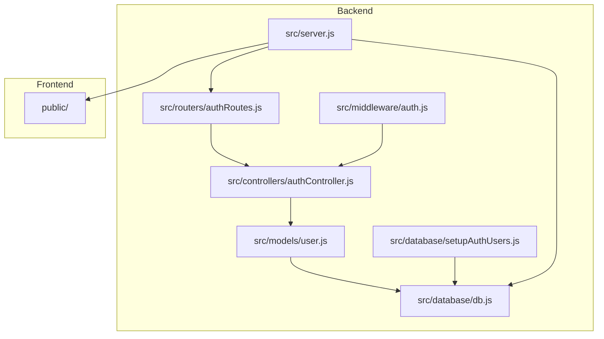
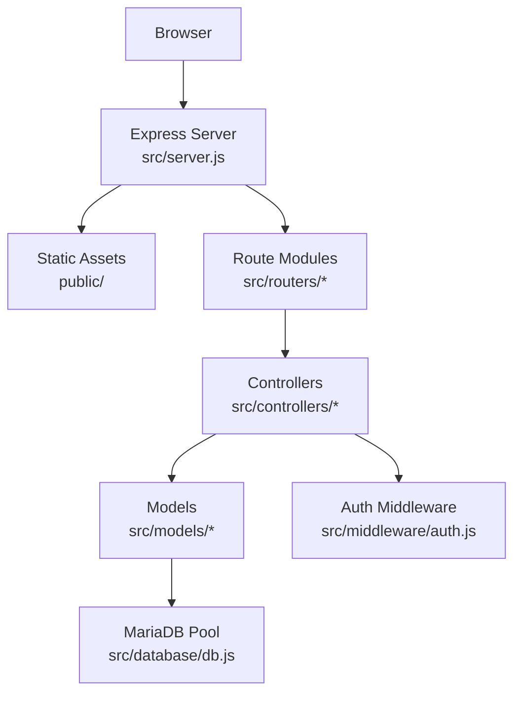
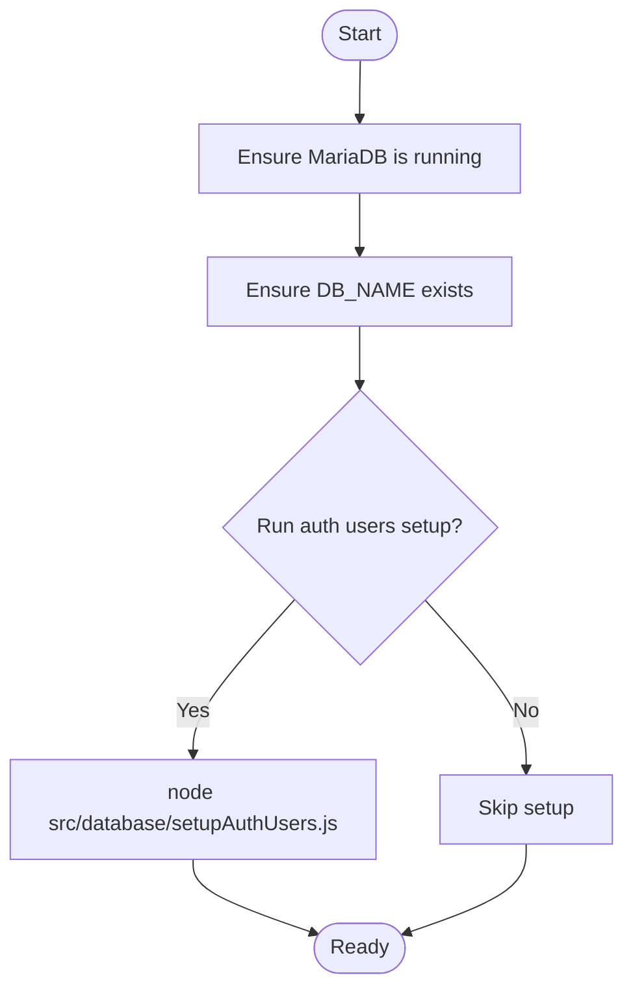
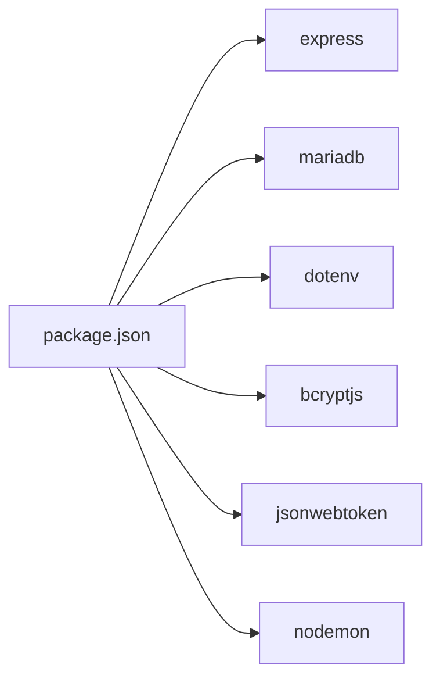
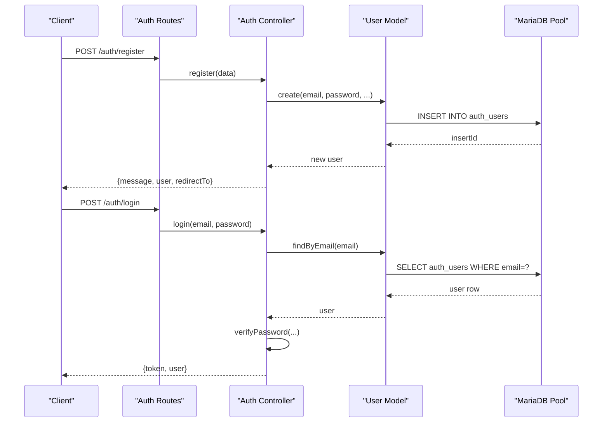

# Getting Started

<cite>
**Referenced Files in This Document**
- [README.md](file://README.md)
- [package.json](file://package.json)
- [src/server.js](file://src/server.js)
- [src/database/db.js](file://src/database/db.js)
- [src/database/setupAuthUsers.js](file://src/database/setupAuthUsers.js)
- [AUTH_GUIDE.md](file://AUTH_GUIDE.md)
- [src/middleware/auth.js](file://src/middleware/auth.js)
- [src/routers/authRoutes.js](file://src/routers/authRoutes.js)
- [src/controllers/authController.js](file://src/controllers/authController.js)
- [src/models/user.js](file://src/models/user.js)
</cite>

## Table of Contents
1. [Introduction](#introduction)
2. [Project Structure](#project-structure)
3. [Core Components](#core-components)
4. [Architecture Overview](#architecture-overview)
5. [Detailed Component Analysis](#detailed-component-analysis)
6. [Dependency Analysis](#dependency-analysis)
7. [Performance Considerations](#performance-considerations)
8. [Troubleshooting Guide](#troubleshooting-guide)
9. [Conclusion](#conclusion)
10. [Appendices](#appendices)

## Introduction
This guide helps you install, configure, and run NodeMural quickly. It covers prerequisites, environment setup, database preparation, application startup in production and development modes, and verification steps to confirm a successful installation.

## Project Structure
NodeMural is a Node.js application using Express and MariaDB. The backend is organized into modular folders:
- src/server.js: Entry point that initializes Express, middleware, static serving, routes, and port binding
- src/database/: Database connection pool and initialization scripts
- src/routers/: Route groups for features (e.g., auth, alunos, docentes, estagios)
- src/controllers/: Business logic for each route group
- src/middleware/: Shared middleware for authentication and authorization
- src/models/: Data access logic and ORM-like functions
- public/: Static frontend HTML and JS assets served by Express

**Diagram sources**
- [src/server.js](file://src/server.js#L1-L73)
- [src/database/db.js](file://src/database/db.js#L1-L15)
- [src/database/setupAuthUsers.js](file://src/database/setupAuthUsers.js#L1-L38)
- [src/middleware/auth.js](file://src/middleware/auth.js#L1-L137)
- [src/routers/authRoutes.js](file://src/routers/authRoutes.js#L1-L20)
- [src/controllers/authController.js](file://src/controllers/authController.js#L1-L157)
- [src/models/user.js](file://src/models/user.js#L1-L146)

**Section sources**
- [README.md](file://README.md#L1-L61)
- [src/server.js](file://src/server.js#L1-L73)

## Core Components
- Express server and routing: Initializes the server, registers routes, serves static files, and binds to a configurable port
- Database connection pool: Configured via environment variables for host, user, password, database, and pool limits
- Authentication and authorization: JWT-based authentication, role checks, ownership checks, and protected endpoints
- User model: Handles user creation, lookup, password hashing, and soft-deletion
- Auth routes and controller: Public endpoints for registration and login, protected endpoints for profile and admin-only user listing

**Section sources**
- [src/server.js](file://src/server.js#L1-L73)
- [src/database/db.js](file://src/database/db.js#L1-L15)
- [src/middleware/auth.js](file://src/middleware/auth.js#L1-L137)
- [src/models/user.js](file://src/models/user.js#L1-L146)
- [src/routers/authRoutes.js](file://src/routers/authRoutes.js#L1-L20)
- [src/controllers/authController.js](file://src/controllers/authController.js#L1-L157)

## Architecture Overview
The application follows a layered architecture:
- Presentation: Static HTML/JS under public/ served by Express
- Routing: Route modules under src/routers/
- Controllers: Business logic under src/controllers/
- Models: Data access and transformations under src/models/
- Middleware: Authentication and authorization under src/middleware/
- Persistence: MariaDB via a connection pool under src/database/

**Diagram sources**
- [src/server.js](file://src/server.js#L1-L73)
- [src/routers/authRoutes.js](file://src/routers/authRoutes.js#L1-L20)
- [src/controllers/authController.js](file://src/controllers/authController.js#L1-L157)
- [src/models/user.js](file://src/models/user.js#L1-L146)
- [src/middleware/auth.js](file://src/middleware/auth.js#L1-L137)
- [src/database/db.js](file://src/database/db.js#L1-L15)

## Detailed Component Analysis

### Prerequisites
- Node.js: Version 18 or higher
- MariaDB server: Must be installed and running locally
- Operating system: Linux/macOS/Windows with a terminal/shell

**Section sources**
- [README.md](file://README.md#L5-L8)

### Environment Setup (.env)
Create a .env file in the project root with the following variables:
- DB_HOST: MariaDB host (default localhost)
- DB_USER: MariaDB user (default root)
- DB_PASSWORD: MariaDB password (default root)
- DB_NAME: Database name (default tccess)
- DB_POOL_LIMIT: Connection pool limit (default 10)
- JWT_SECRET: Secret for signing JWT tokens (change in production)
- JWT_EXPIRY: Token expiry (default 7d)
- PORT: Server port (default 3333)

These variables are consumed by the server and database modules.

**Section sources**
- [README.md](file://README.md#L18-L28)
- [src/server.js](file://src/server.js#L71-L72)
- [src/database/db.js](file://src/database/db.js#L5-L13)

### Installation Steps
1. Clone the repository
2. Install dependencies
   - Run: npm install
3. Configure environment variables
   - Create .env with the variables listed above
4. Prepare the database
   - Ensure MariaDB is running
   - Ensure the database specified in DB_NAME exists
   - Optionally run the auth users table setup script once

**Section sources**
- [README.md](file://README.md#L10-L28)
- [src/database/setupAuthUsers.js](file://src/database/setupAuthUsers.js#L1-L38)

### Database Setup Procedures
- Confirm MariaDB is running locally
- Ensure DB_NAME exists in your MariaDB instance
- Optionally initialize the auth_users table by running the setup script:
  - node src/database/setupAuthUsers.js
- The user model and controllers rely on the auth_users table for authentication and authorization

**Diagram sources**
- [src/database/setupAuthUsers.js](file://src/database/setupAuthUsers.js#L1-L38)
- [src/database/db.js](file://src/database/db.js#L1-L15)

**Section sources**
- [README.md](file://README.md#L44-L46)
- [src/database/setupAuthUsers.js](file://src/database/setupAuthUsers.js#L1-L38)

### Application Startup
- Production mode
  - Command: npm start
  - Behavior: Starts the server with Node.js using src/server.js
- Development mode
  - Command: npm run dev
  - Behavior: Starts the server with nodemon for auto-reload during development

The server listens on the port configured by PORT (default 3333) and serves static files from public/.

**Section sources**
- [README.md](file://README.md#L30-L42)
- [package.json](file://package.json#L10-L13)
- [src/server.js](file://src/server.js#L71-L72)

### Initial Access Instructions
- After starting the server, open your browser to http://localhost:3333
- The server serves index.html from public/ as the root endpoint
- Use the authentication endpoints to log in and obtain a JWT token

**Section sources**
- [README.md](file://README.md#L42-L42)
- [src/server.js](file://src/server.js#L67-L69)

### Verification Steps
- Confirm server startup logs show the bound port
- Navigate to http://localhost:3333 and verify the home page loads
- Use the authentication endpoints to test login and profile access
- For JWT usage, include Authorization: Bearer <token> in requests

**Section sources**
- [src/server.js](file://src/server.js#L71-L72)
- [AUTH_GUIDE.md](file://AUTH_GUIDE.md#L164-L190)

## Dependency Analysis
Key runtime dependencies:
- express: Web framework
- mariadb: MariaDB client and connection pooling
- dotenv: Environment variable loading
- bcryptjs: Password hashing
- jsonwebtoken: JWT signing and verification
- nodemon: Development auto-reload (dev only)

**Diagram sources**
- [package.json](file://package.json#L22-L29)

**Section sources**
- [package.json](file://package.json#L1-L32)

## Performance Considerations
- Connection pool sizing: Adjust DB_POOL_LIMIT in .env to match expected concurrency
- JWT expiry: Tune JWT_EXPIRY for session length
- Static asset caching: Configure at the web server/proxy level for production deployments

[No sources needed since this section provides general guidance]

## Troubleshooting Guide
Common issues and resolutions:
- Port conflicts
  - Symptom: Server fails to start or logs indicate port already in use
  - Fix: Change PORT in .env to another available port
- MariaDB connectivity
  - Symptom: Connection errors when starting the server
  - Fix: Verify DB_HOST, DB_USER, DB_PASSWORD, and DB_NAME; ensure MariaDB is running
- Missing database
  - Symptom: Queries fail due to unknown database
  - Fix: Create DB_NAME in MariaDB before running the app
- Authentication failures
  - Symptom: 401 errors on protected endpoints
  - Fix: Ensure JWT_SECRET is set in .env; verify token format and expiry
- CORS and static files
  - Symptom: Frontend cannot load assets
  - Fix: Confirm Express static path is configured and public/ contains required files

**Section sources**
- [src/server.js](file://src/server.js#L71-L72)
- [src/database/db.js](file://src/database/db.js#L5-L13)
- [src/middleware/auth.js](file://src/middleware/auth.js#L1-L137)
- [AUTH_GUIDE.md](file://AUTH_GUIDE.md#L289-L299)

## Conclusion
You now have the essentials to install, configure, and run NodeMural. Confirm prerequisites, set up .env, prepare MariaDB, start the server, and verify access. Use the provided endpoints and middleware patterns to integrate authentication and protect your routes.

[No sources needed since this section summarizes without analyzing specific files]

## Appendices

### Appendix A: Environment Variables Reference
- DB_HOST: MariaDB host
- DB_USER: MariaDB user
- DB_PASSWORD: MariaDB password
- DB_NAME: Database name
- DB_POOL_LIMIT: Connection pool limit
- JWT_SECRET: JWT signing secret
- JWT_EXPIRY: Token expiry
- PORT: Server port

**Section sources**
- [README.md](file://README.md#L18-L28)
- [src/database/db.js](file://src/database/db.js#L5-L13)
- [src/server.js](file://src/server.js#L71-L72)

### Appendix B: Authentication Workflow

**Diagram sources**
- [src/routers/authRoutes.js](file://src/routers/authRoutes.js#L1-L20)
- [src/controllers/authController.js](file://src/controllers/authController.js#L1-L157)
- [src/models/user.js](file://src/models/user.js#L1-L146)
- [src/database/db.js](file://src/database/db.js#L1-L15)