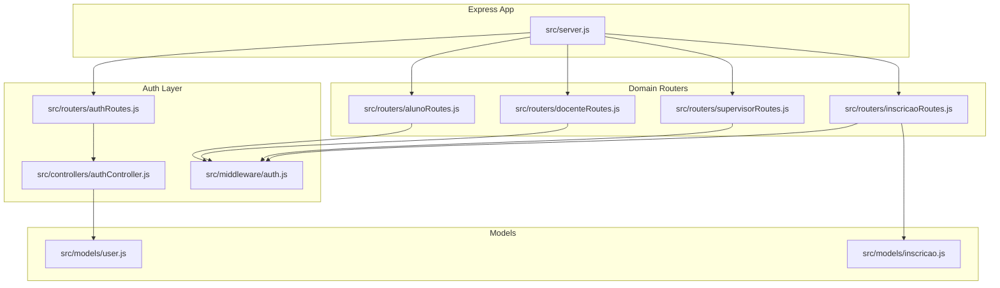
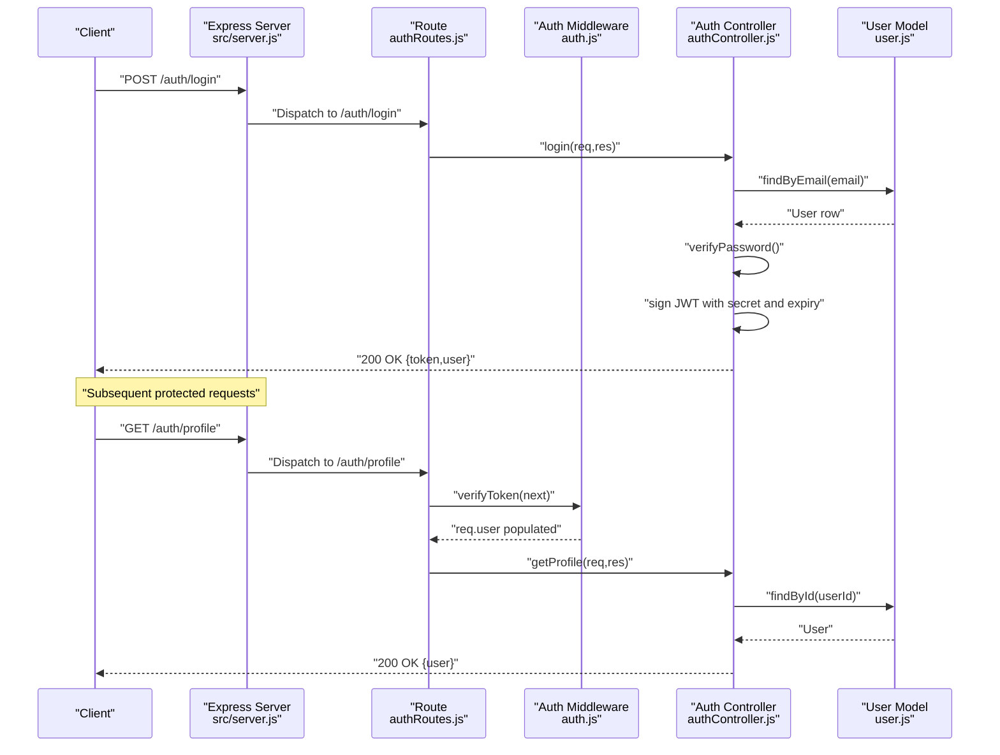
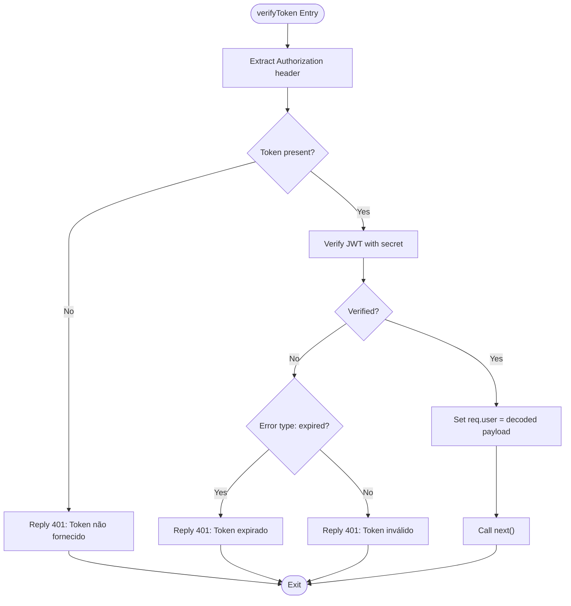
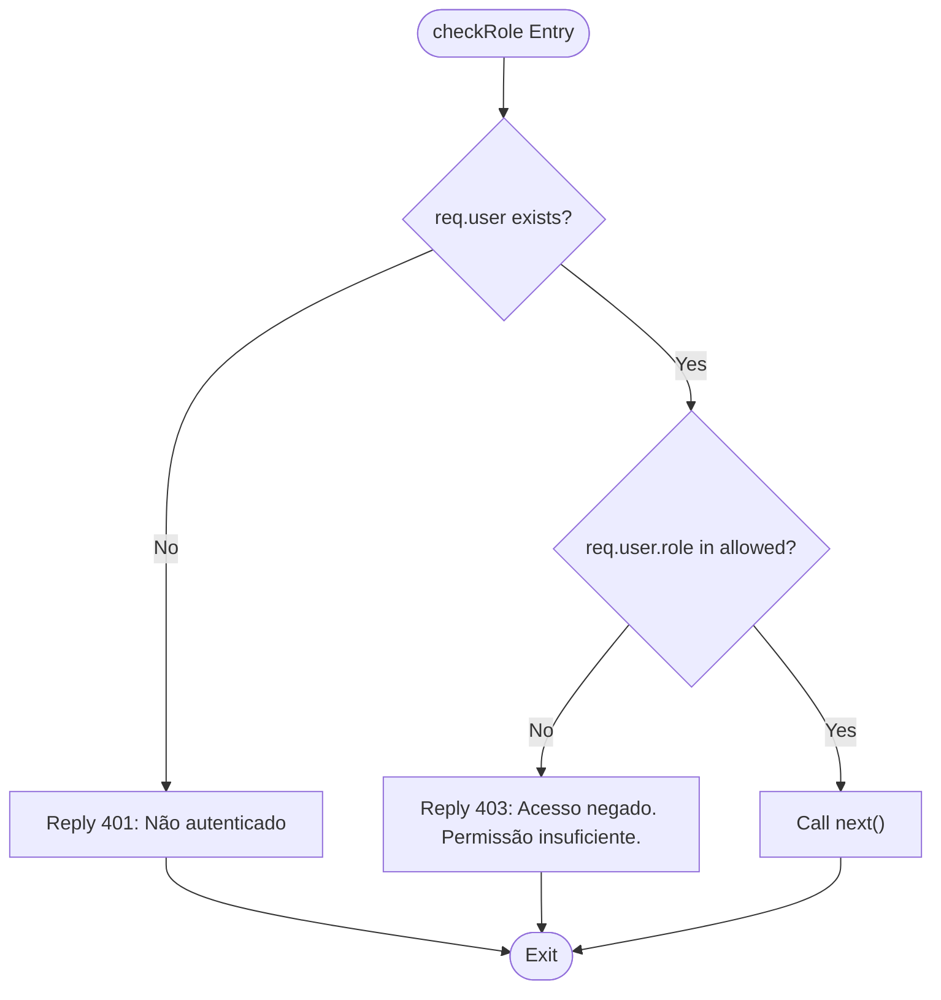
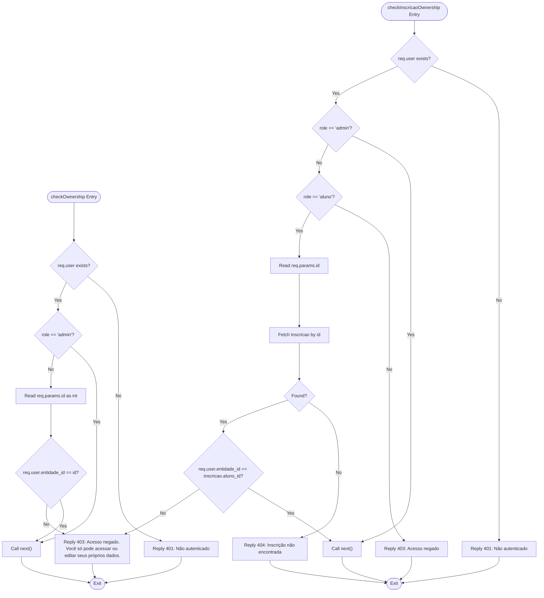
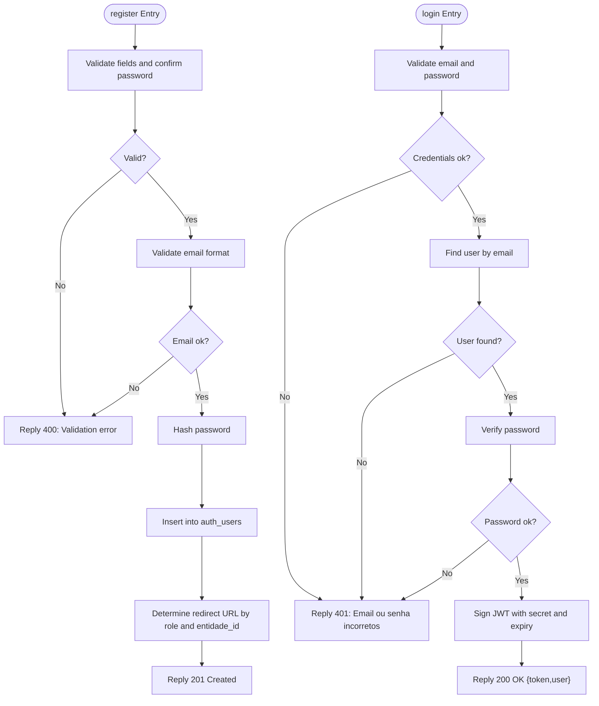
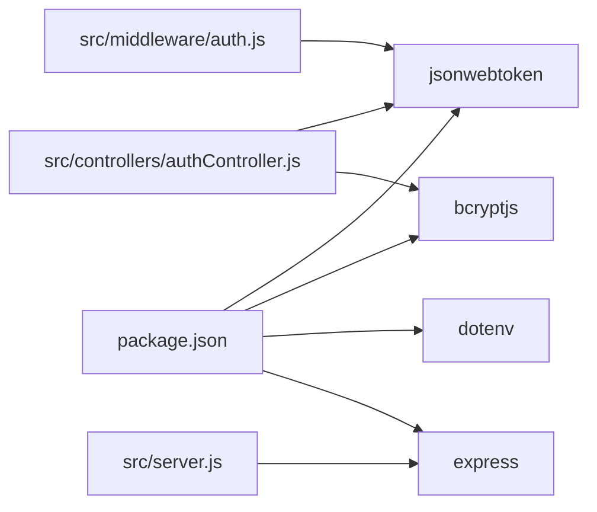

# Middleware & Security

<cite>
**Referenced Files in This Document**
- [src/server.js](file://src/server.js)
- [src/middleware/auth.js](file://src/middleware/auth.js)
- [src/controllers/authController.js](file://src/controllers/authController.js)
- [src/routers/authRoutes.js](file://src/routers/authRoutes.js)
- [src/routers/alunoRoutes.js](file://src/routers/alunoRoutes.js)
- [src/routers/inscricaoRoutes.js](file://src/routers/inscricaoRoutes.js)
- [src/routers/docenteRoutes.js](file://src/routers/docenteRoutes.js)
- [src/routers/supervisorRoutes.js](file://src/routers/supervisorRoutes.js)
- [src/models/user.js](file://src/models/user.js)
- [src/models/inscricao.js](file://src/models/inscricao.js)
- [AUTH_GUIDE.md](file://AUTH_GUIDE.md)
- [src/database/setupAuthUsers.js](file://src/database/setupAuthUsers.js)
- [package.json](file://package.json)
</cite>

## Table of Contents
1. [Introduction](#introduction)
2. [Project Structure](#project-structure)
3. [Core Components](#core-components)
4. [Architecture Overview](#architecture-overview)
5. [Detailed Component Analysis](#detailed-component-analysis)
6. [Dependency Analysis](#dependency-analysis)
7. [Performance Considerations](#performance-considerations)
8. [Troubleshooting Guide](#troubleshooting-guide)
9. [Conclusion](#conclusion)
10. [Appendices](#appendices)

## Introduction
This document provides comprehensive middleware and security documentation for NodeMural’s authentication and authorization implementation. It explains JWT token verification, user authorization, role-based access control (RBAC), middleware composition, and integration points across the request processing pipeline. It also covers input validation, protection against common vulnerabilities, best practices, threat mitigations, compliance considerations, custom middleware development, error handling, security logging, performance implications, caching strategies for authenticated requests, and monitoring security events.

## Project Structure
Security-related components are organized by concerns:
- Middleware: centralized JWT verification, role checks, ownership checks
- Controllers: authentication business logic and protected endpoints
- Routers: route definitions with middleware applied
- Models: user and registration data access with validation and soft-delete semantics
- Server: Express application bootstrap and middleware ordering

**Diagram sources**
- [src/server.js](file://src/server.js#L31-L54)
- [src/routers/authRoutes.js](file://src/routers/authRoutes.js#L1-L20)
- [src/middleware/auth.js](file://src/middleware/auth.js#L1-L137)
- [src/controllers/authController.js](file://src/controllers/authController.js#L1-L157)
- [src/routers/alunoRoutes.js](file://src/routers/alunoRoutes.js#L1-L25)
- [src/routers/docenteRoutes.js](file://src/routers/docenteRoutes.js#L1-L20)
- [src/routers/supervisorRoutes.js](file://src/routers/supervisorRoutes.js#L1-L27)
- [src/routers/inscricaoRoutes.js](file://src/routers/inscricaoRoutes.js#L1-L21)
- [src/models/user.js](file://src/models/user.js#L1-L146)
- [src/models/inscricao.js](file://src/models/inscricao.js#L1-L104)

**Section sources**
- [src/server.js](file://src/server.js#L31-L54)
- [AUTH_GUIDE.md](file://AUTH_GUIDE.md#L1-L312)

## Core Components
- JWT Verification Middleware: extracts and validates the Authorization header token, populates req.user, and handles token expiration and invalid token errors.
- Role-Based Access Control: enforces allowed roles for protected endpoints.
- Ownership Checks: ensures users can only access or modify their own records or their related registrations.
- Authentication Controller: handles registration, login, profile retrieval, and admin-only user listing with input validation and password hashing.
- User Model: encapsulates user creation, lookup, password verification, and soft-deletion.
- Inscricao Model: encapsulates registration queries and business validations around uniqueness and updates.

Key implementation references:
- JWT verification and RBAC: [src/middleware/auth.js](file://src/middleware/auth.js#L5-L48)
- Ownership checks: [src/middleware/auth.js](file://src/middleware/auth.js#L76-L98), [src/middleware/auth.js](file://src/middleware/auth.js#L100-L136)
- Authentication controller: [src/controllers/authController.js](file://src/controllers/authController.js#L5-L74), [src/controllers/authController.js](file://src/controllers/authController.js#L76-L127), [src/controllers/authController.js](file://src/controllers/authController.js#L129-L157)
- User model: [src/models/user.js](file://src/models/user.js#L7-L34), [src/models/user.js](file://src/models/user.js#L36-L60), [src/models/user.js](file://src/models/user.js#L101-L104), [src/models/user.js](file://src/models/user.js#L106-L142)
- Inscricao model: [src/models/inscricao.js](file://src/models/inscricao.js#L58-L74), [src/models/inscricao.js](file://src/models/inscricao.js#L76-L92)

**Section sources**
- [src/middleware/auth.js](file://src/middleware/auth.js#L5-L136)
- [src/controllers/authController.js](file://src/controllers/authController.js#L5-L157)
- [src/models/user.js](file://src/models/user.js#L1-L146)
- [src/models/inscricao.js](file://src/models/inscricao.js#L1-L104)

## Architecture Overview
The security architecture follows a layered middleware pattern:
- Global middleware: JSON body parsing and static serving
- Route-specific middleware: JWT verification, role checks, and ownership checks
- Controller logic: business operations with validation and error handling
- Model layer: data access with validation and soft-delete semantics

**Diagram sources**
- [src/server.js](file://src/server.js#L31-L54)
- [src/routers/authRoutes.js](file://src/routers/authRoutes.js#L1-L20)
- [src/middleware/auth.js](file://src/middleware/auth.js#L5-L29)
- [src/controllers/authController.js](file://src/controllers/authController.js#L76-L127)
- [src/models/user.js](file://src/models/user.js#L36-L60)

**Section sources**
- [src/server.js](file://src/server.js#L31-L54)
- [src/routers/authRoutes.js](file://src/routers/authRoutes.js#L1-L20)
- [src/middleware/auth.js](file://src/middleware/auth.js#L5-L29)
- [src/controllers/authController.js](file://src/controllers/authController.js#L76-L127)
- [src/models/user.js](file://src/models/user.js#L36-L60)

## Detailed Component Analysis

### JWT Authentication Middleware
Responsibilities:
- Extracts the Bearer token from the Authorization header
- Verifies the token using the configured secret
- Populates req.user with decoded claims
- Handles missing token, expired token, and invalid token scenarios

**Diagram sources**
- [src/middleware/auth.js](file://src/middleware/auth.js#L5-L29)

**Section sources**
- [src/middleware/auth.js](file://src/middleware/auth.js#L5-L29)

### Role-Based Access Control (RBAC)
Responsibilities:
- Enforces allowed roles for protected endpoints
- Returns structured error response with required roles and user role for diagnostics

**Diagram sources**
- [src/middleware/auth.js](file://src/middleware/auth.js#L31-L48)

**Section sources**
- [src/middleware/auth.js](file://src/middleware/auth.js#L31-L48)

### Ownership Enforcement
Responsibilities:
- Admin bypass: admins can access any resource
- Entity ownership: users can only access or modify records where their entidade_id matches the target record id
- Registration ownership: users can only access or modify inscricoes linked to their aluno_id

**Diagram sources**
- [src/middleware/auth.js](file://src/middleware/auth.js#L76-L98)
- [src/middleware/auth.js](file://src/middleware/auth.js#L100-L136)
- [src/models/inscricao.js](file://src/models/inscricao.js#L30-L38)

**Section sources**
- [src/middleware/auth.js](file://src/middleware/auth.js#L76-L98)
- [src/middleware/auth.js](file://src/middleware/auth.js#L100-L136)
- [src/models/inscricao.js](file://src/models/inscricao.js#L30-L38)

### Authentication Controller and Input Validation
Responsibilities:
- Registration: validates presence of required fields, password confirmation, minimum length, and email format; hashes passwords; creates user; redirects based on role and entidade_id
- Login: validates credentials, verifies password, signs JWT with secure secret and expiry; returns token and user claims
- Profile and admin user listing: protected endpoints guarded by verifyToken and checkRole

**Diagram sources**
- [src/controllers/authController.js](file://src/controllers/authController.js#L5-L74)
- [src/controllers/authController.js](file://src/controllers/authController.js#L76-L127)
- [src/models/user.js](file://src/models/user.js#L101-L104)

**Section sources**
- [src/controllers/authController.js](file://src/controllers/authController.js#L5-L74)
- [src/controllers/authController.js](file://src/controllers/authController.js#L76-L127)
- [src/models/user.js](file://src/models/user.js#L101-L104)

### Route-Level Security Patterns
Patterns demonstrated across routers:
- Public endpoints: registration and login
- Protected endpoints: require verifyToken
- Role-scoped endpoints: require verifyToken plus checkRole
- Ownership-scoped endpoints: require verifyToken, checkRole, and checkOwnership or checkInscricaoOwnership

Examples:
- Auth routes: [src/routers/authRoutes.js](file://src/routers/authRoutes.js#L8-L17)
- Aluno routes: [src/routers/alunoRoutes.js](file://src/routers/alunoRoutes.js#L11-L23)
- Docente routes: [src/routers/docenteRoutes.js](file://src/routers/docenteRoutes.js#L11-L17)
- Supervisor routes: [src/routers/supervisorRoutes.js](file://src/routers/supervisorRoutes.js#L12-L24)
- Inscricao routes: [src/routers/inscricaoRoutes.js](file://src/routers/inscricaoRoutes.js#L11-L18)

**Section sources**
- [src/routers/authRoutes.js](file://src/routers/authRoutes.js#L8-L17)
- [src/routers/alunoRoutes.js](file://src/routers/alunoRoutes.js#L11-L23)
- [src/routers/docenteRoutes.js](file://src/routers/docenteRoutes.js#L11-L17)
- [src/routers/supervisorRoutes.js](file://src/routers/supervisorRoutes.js#L12-L24)
- [src/routers/inscricaoRoutes.js](file://src/routers/inscricaoRoutes.js#L11-L18)

### Database Schema and Initialization
- auth_users table supports unique email, hashed password storage, role enumeration, soft delete flag, and timestamps
- Initialization script creates the table if it does not exist

References:
- Table definition and initialization: [src/database/setupAuthUsers.js](file://src/database/setupAuthUsers.js#L11-L22)
- Roles and permissions overview: [AUTH_GUIDE.md](file://AUTH_GUIDE.md#L194-L202)

**Section sources**
- [src/database/setupAuthUsers.js](file://src/database/setupAuthUsers.js#L11-L22)
- [AUTH_GUIDE.md](file://AUTH_GUIDE.md#L194-L202)

## Dependency Analysis
External dependencies relevant to security:
- jsonwebtoken: JWT signing and verification
- bcryptjs: password hashing and comparison
- dotenv: environment variable loading for secrets
- express: middleware pipeline and routing

**Diagram sources**
- [package.json](file://package.json#L22-L30)
- [src/middleware/auth.js](file://src/middleware/auth.js#L1-L2)
- [src/controllers/authController.js](file://src/controllers/authController.js#L1-L3)
- [src/server.js](file://src/server.js#L2-L6)

**Section sources**
- [package.json](file://package.json#L22-L30)
- [src/middleware/auth.js](file://src/middleware/auth.js#L1-L2)
- [src/controllers/authController.js](file://src/controllers/authController.js#L1-L3)
- [src/server.js](file://src/server.js#L2-L6)

## Performance Considerations
- Token verification cost: minimal overhead; cache decoded claims in memory for short-lived sessions if needed
- Database lookups: user lookup by email and ID; consider connection pooling and indexing on email and id
- Password hashing: bcrypt cost factor is set to a safe default; avoid lowering it
- Middleware order: keep verifyToken early to fail fast and reduce downstream work
- Caching strategies for authenticated requests:
  - Cache public resources (e.g., static assets) served via Express static middleware
  - For dynamic endpoints, consider caching GET responses keyed by user role and id with appropriate invalidation
- Rate limiting: implement at the Express level to mitigate brute-force login attempts and abuse
- Compression: enable gzip/deflate for API responses to reduce bandwidth

[No sources needed since this section provides general guidance]

## Troubleshooting Guide
Common issues and resolutions:
- Missing Authorization header: ensure clients send “Authorization: Bearer <token>”
- Invalid/expired token: regenerate token after expiration or refresh flow
- Insufficient permissions: verify user role and required roles array
- Ownership violations: ensure entidade_id matches the requested resource
- Database connectivity: verify environment variables and connection pool configuration

Error codes and meanings:
- 400: Validation error (missing/invalid fields)
- 401: Unauthorized (token missing, invalid, or expired; wrong credentials)
- 403: Access denied (role insufficient or ownership mismatch)
- 500: Internal server error (database or server issues)

Operational tips:
- Enable structured logging for authentication failures and permission denials
- Monitor token expiry and implement refresh token strategies if needed
- Audit endpoints for consistent middleware application

**Section sources**
- [AUTH_GUIDE.md](file://AUTH_GUIDE.md#L289-L300)

## Conclusion
NodeMural’s security implementation centers on JWT-based authentication, robust middleware composition, and role-based access control. The design cleanly separates concerns across middleware, controllers, and models, enabling maintainable and extensible security policies. By enforcing ownership checks, validating inputs, and applying middleware consistently across routes, the system achieves strong authorization guarantees. To further harden the platform, consider adding rate limiting, CORS configuration, input sanitization, HTTPS in production, and comprehensive security monitoring.

[No sources needed since this section summarizes without analyzing specific files]

## Appendices

### Security Best Practices Checklist
- Environment variables: store secrets (JWT_SECRET, DB credentials) in environment variables
- Token lifecycle: configure appropriate expiry; implement refresh token strategy if needed
- Input validation: enforce strict validation and sanitization at the controller boundary
- Least privilege: apply RBAC and ownership checks to all sensitive endpoints
- Logging and auditing: log authentication events, permission denials, and suspicious activities
- Transport security: enforce HTTPS in production environments
- Dependency hygiene: keep libraries updated and monitor for security advisories

[No sources needed since this section provides general guidance]

### Compliance Considerations
- Data protection: ensure hashed passwords and minimize retention of sensitive data
- Access logs: maintain audit trails for authentication and authorization events
- Role segregation: align RBAC with organizational access policies
- Token storage: advise frontends to store tokens securely (avoid localStorage when possible; prefer httpOnly cookies if feasible)

[No sources needed since this section provides general guidance]