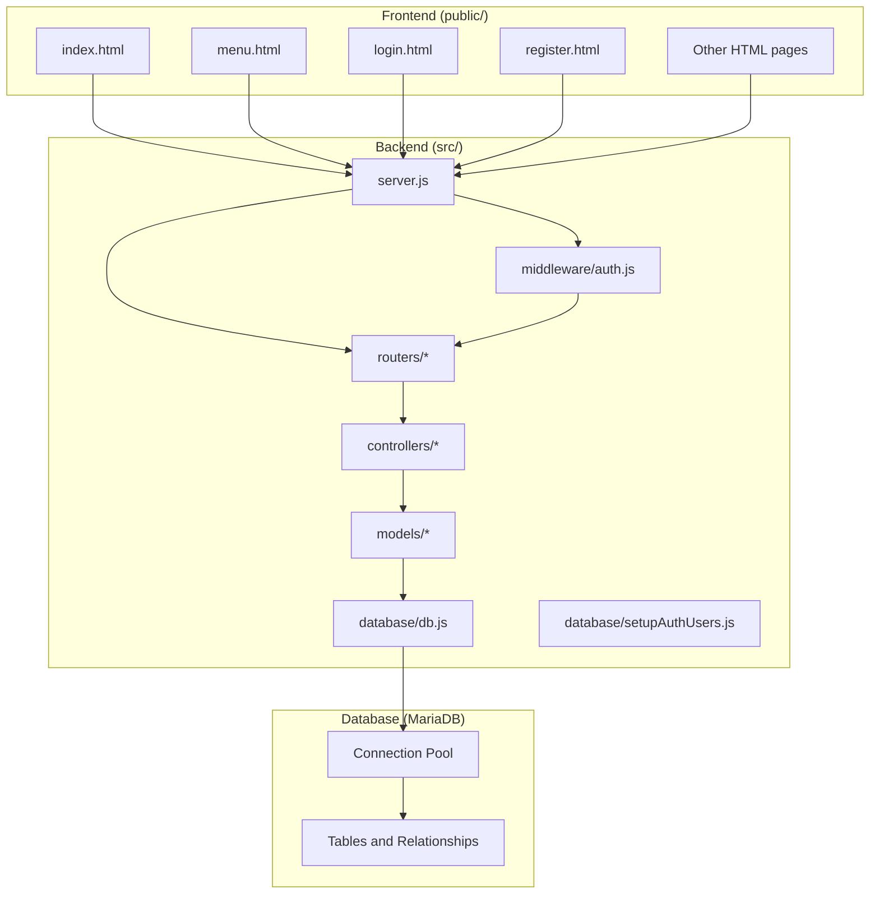
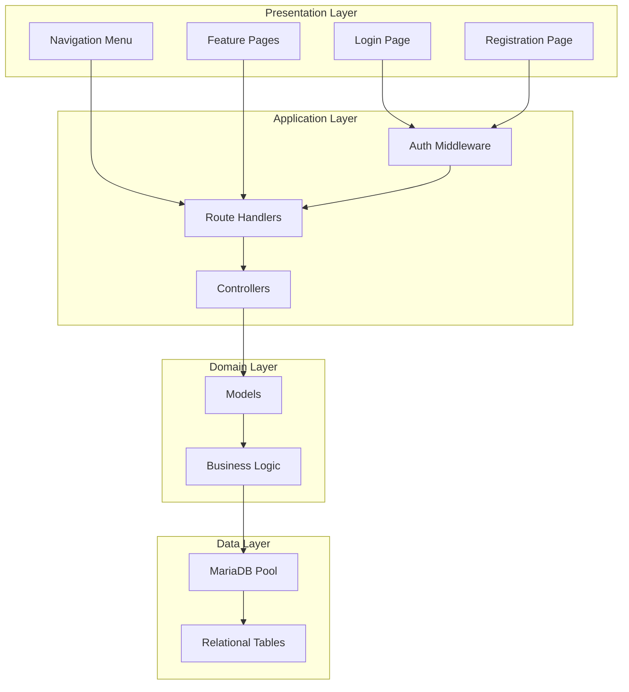
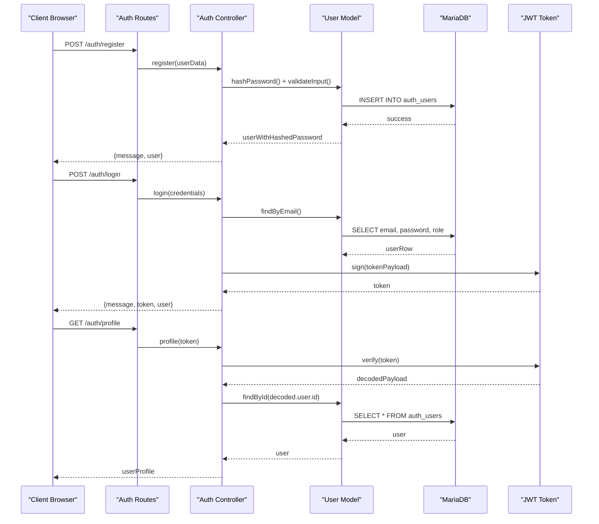
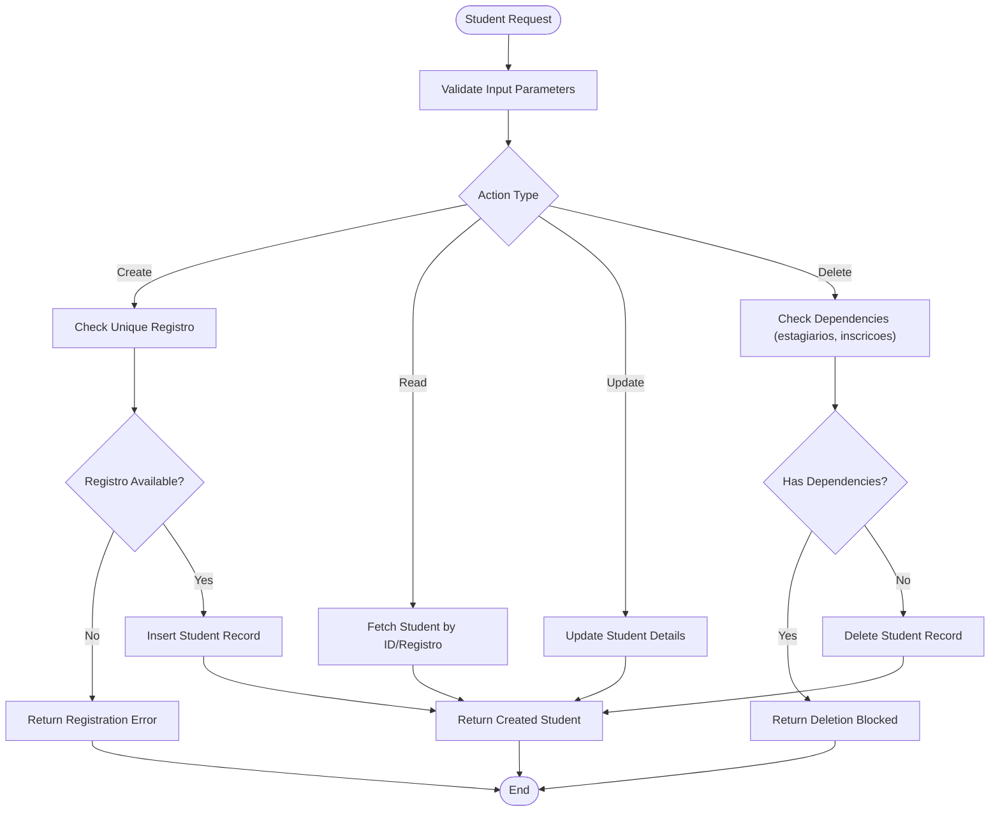
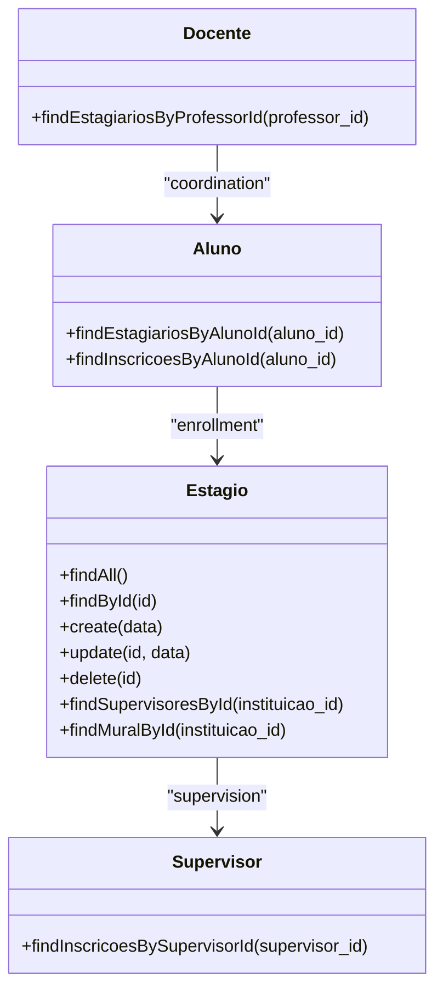
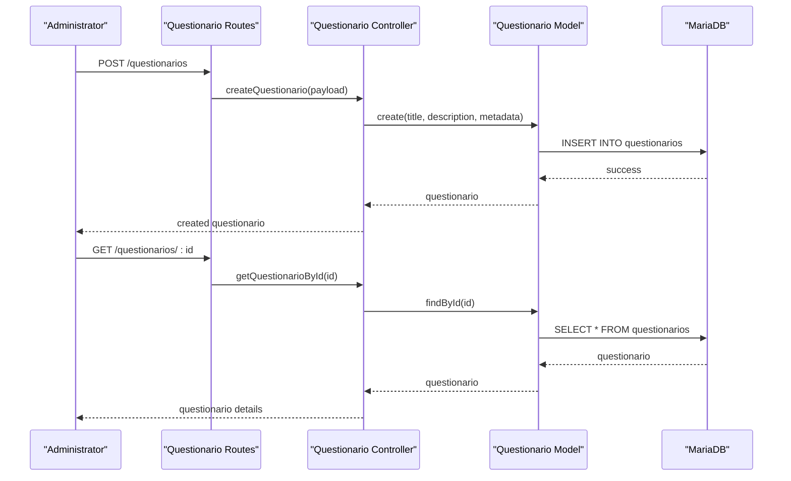
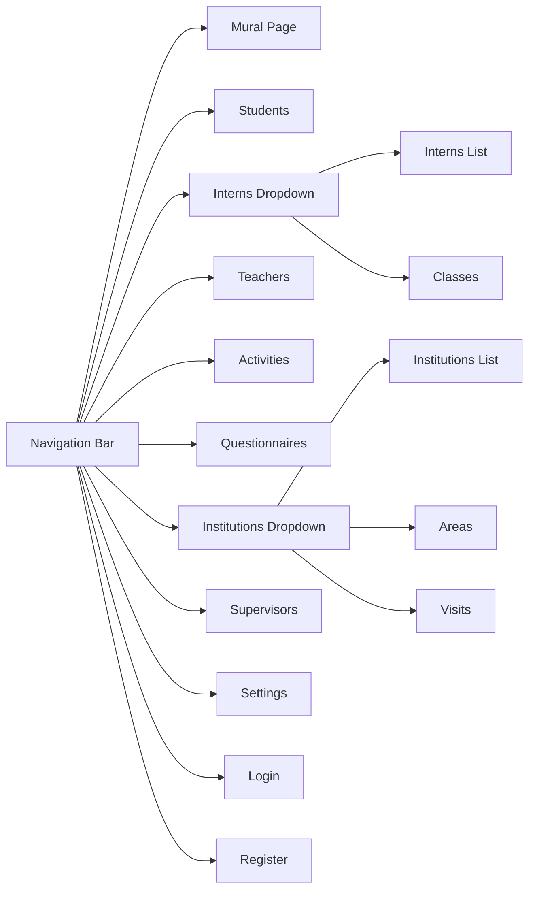
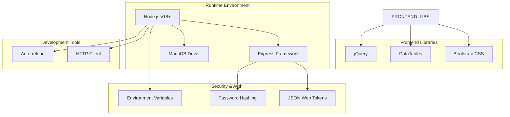

# Project Overview

<cite>
**Referenced Files in This Document**
- [README.md](file://README.md)
- [package.json](file://package.json)
- [src/server.js](file://src/server.js)
- [AUTH_GUIDE.md](file://AUTH_GUIDE.md)
- [src/database/db.js](file://src/database/db.js)
- [src/database/setupAuthUsers.js](file://src/database/setupAuthUsers.js)
- [src/middleware/auth.js](file://src/middleware/auth.js)
- [src/routers/authRoutes.js](file://src/routers/authRoutes.js)
- [src/controllers/alunoController.js](file://src/controllers/alunoController.js)
- [src/models/aluno.js](file://src/models/aluno.js)
- [src/controllers/estagioController.js](file://src/controllers/estagioController.js)
- [src/models/estagio.js](file://src/models/estagio.js)
- [src/controllers/questionarioController.js](file://src/controllers/questionarioController.js)
- [public/index.html](file://public/index.html)
- [public/menu.html](file://public/menu.html)
- [public/login.html](file://public/login.html)
- [public/register.html](file://public/register.html)
</cite>

## Table of Contents
1. [Introduction](#introduction)
2. [Project Structure](#project-structure)
3. [Core Components](#core-components)
4. [Architecture Overview](#architecture-overview)
5. [Detailed Component Analysis](#detailed-component-analysis)
6. [Dependency Analysis](#dependency-analysis)
7. [Performance Considerations](#performance-considerations)
8. [Troubleshooting Guide](#troubleshooting-guide)
9. [Conclusion](#conclusion)

## Introduction
NodeMural is an educational institution management system designed to streamline administrative workflows around internships and student activities. It serves as a centralized platform for managing students, professors, supervisors, internship opportunities, questionnaires, activities, and scheduled visits. The system emphasizes role-based access control and integrates a modern full-stack architecture with a Node.js/Express backend, MariaDB relational database, and a responsive HTML/CSS/JavaScript frontend.

Key capabilities include:
- User authentication and role-based access control
- Student lifecycle management
- Professor coordination and oversight
- Supervisor monitoring of student placements
- Internship opportunity posting and management
- Questionnaire creation and completion
- Activity tracking and reporting
- Visit scheduling and management

Target audiences:
- Educational institutions
- Administrators
- Professors
- Students
- Supervisors

Practical use cases:
- Centralized internship portal for students to browse and apply
- Administrative oversight of student placements and progress
- Questionnaire-driven feedback systems for training programs
- Activity logs and compliance tracking
- Institutional visit planning and documentation

## Project Structure
The project follows a modular, feature-based structure with clear separation of concerns:
- Backend: Express server with organized controllers, models, routers, middleware, and database utilities
- Frontend: Static HTML pages with associated JavaScript modules for UI interactions
- Database: MariaDB with connection pooling and initialization scripts

**Diagram sources**
- [src/server.js](file://src/server.js#L31-L54)
- [src/database/db.js](file://src/database/db.js#L5-L13)
- [src/middleware/auth.js](file://src/middleware/auth.js)

**Section sources**
- [src/server.js](file://src/server.js#L31-L54)
- [package.json](file://package.json#L10-L14)

## Core Components
- Express server: Initializes middleware, static file serving, and routes
- Routing layer: Feature-specific routers under src/routers/*
- Business logic: Controllers under src/controllers/* implementing CRUD operations
- Data access: Models under src/models/* encapsulating SQL queries and relationships
- Authentication: JWT-based middleware and protected endpoints
- Database: MariaDB connection pool with environment-driven configuration
- Frontend: Static HTML pages with modular JavaScript for UI interactions

**Section sources**
- [src/server.js](file://src/server.js#L31-L54)
- [src/database/db.js](file://src/database/db.js#L5-L13)
- [AUTH_GUIDE.md](file://AUTH_GUIDE.md#L44-L54)

## Architecture Overview
The system employs a layered architecture with clear separation between presentation, business logic, and data persistence:

**Diagram sources**
- [src/server.js](file://src/server.js#L33-L54)
- [src/middleware/auth.js](file://src/middleware/auth.js)
- [src/database/db.js](file://src/database/db.js#L5-L13)

## Detailed Component Analysis

### Authentication and Authorization
The system implements JWT-based authentication with role-based access control (RBAC):

**Diagram sources**
- [AUTH_GUIDE.md](file://AUTH_GUIDE.md#L36-L49)
- [src/routers/authRoutes.js](file://src/routers/authRoutes.js)
- [src/controllers/authController.js](file://src/controllers/authController.js)
- [src/middleware/auth.js](file://src/middleware/auth.js)

Key roles and permissions:
- Admin: Full access to all endpoints
- Supervisor: Manages estagiários, views inscriptions
- Docente: Manages alunos, atividades
- Aluno: Views own data, mural

**Section sources**
- [AUTH_GUIDE.md](file://AUTH_GUIDE.md#L194-L202)
- [AUTH_GUIDE.md](file://AUTH_GUIDE.md#L205-L226)

### Student Management
Student records are managed through a dedicated controller and model with comprehensive CRUD operations:

**Diagram sources**
- [src/controllers/alunoController.js](file://src/controllers/alunoController.js#L5-L114)
- [src/models/aluno.js](file://src/models/aluno.js#L10-L143)

**Section sources**
- [src/controllers/alunoController.js](file://src/controllers/alunoController.js#L1-L114)
- [src/models/aluno.js](file://src/models/aluno.js#L1-L146)

### Internship Opportunities
Internship management encompasses institution records, supervision assignments, and mural postings:

**Diagram sources**
- [src/controllers/estagioController.js](file://src/controllers/estagioController.js#L1-L98)
- [src/models/estagio.js](file://src/models/estagio.js#L1-L66)
- [src/controllers/alunoController.js](file://src/controllers/alunoController.js#L58-L83)

**Section sources**
- [src/controllers/estagioController.js](file://src/controllers/estagioController.js#L1-L98)
- [src/models/estagio.js](file://src/models/estagio.js#L1-L66)

### Questionnaire System
The questionnaire module supports creation, management, and completion of surveys:

**Diagram sources**
- [src/controllers/questionarioController.js](file://src/controllers/questionarioController.js#L1-L72)

**Section sources**
- [src/controllers/questionarioController.js](file://src/controllers/questionarioController.js#L1-L72)

### Frontend Navigation and User Interface
The frontend provides a Bootstrap-based navigation system with role-aware access:

**Diagram sources**
- [public/menu.html](file://public/menu.html#L1-L58)
- [public/index.html](file://public/index.html#L14-L20)

**Section sources**
- [public/menu.html](file://public/menu.html#L1-L58)
- [public/index.html](file://public/index.html#L1-L34)

## Dependency Analysis
The system relies on a cohesive set of dependencies that support full-stack functionality:

**Diagram sources**
- [package.json](file://package.json#L22-L30)

**Section sources**
- [package.json](file://package.json#L1-L32)

## Performance Considerations
- Connection pooling: MariaDB connection pool configured with adjustable limits
- JWT caching: Token-based authentication reduces database load
- Frontend optimization: Bootstrap and DataTables for efficient UI rendering
- Modular architecture: Separate concerns enable targeted optimization
- Environment-driven configuration: Flexible deployment settings

## Troubleshooting Guide
Common issues and resolutions:
- Database connectivity: Verify DB_HOST, DB_USER, DB_PASSWORD, DB_NAME in .env
- Authentication failures: Check JWT_SECRET and token expiration
- Permission errors: Confirm user roles and middleware configuration
- CORS issues: Configure appropriate headers for cross-origin requests
- Frontend routing: Ensure static file serving path matches server configuration

**Section sources**
- [AUTH_GUIDE.md](file://AUTH_GUIDE.md#L289-L300)
- [src/database/db.js](file://src/database/db.js#L5-L13)

## Conclusion
NodeMural provides a robust foundation for educational institution management with a focus on internship coordination and student activity tracking. Its full-stack architecture, combined with comprehensive authentication and role-based access control, enables scalable deployment across diverse institutional needs. The modular design facilitates future enhancements while maintaining clean separation between presentation, business logic, and data persistence layers.