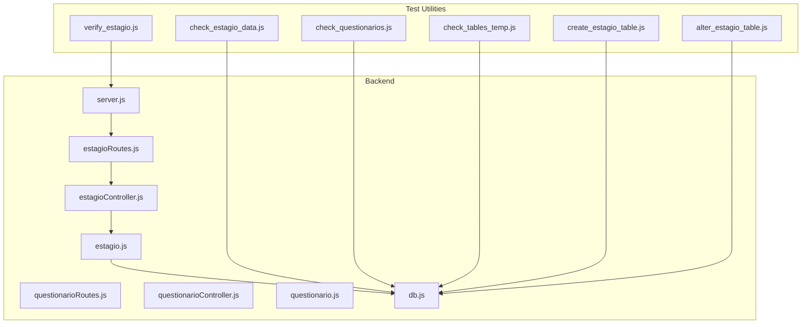
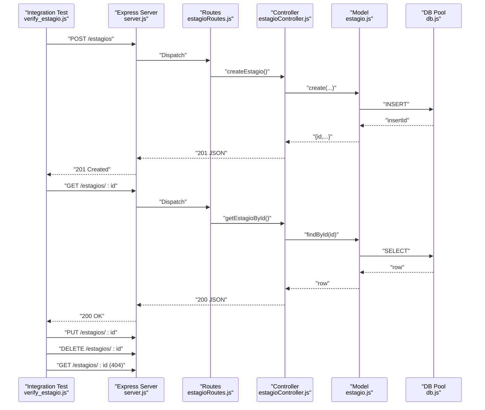
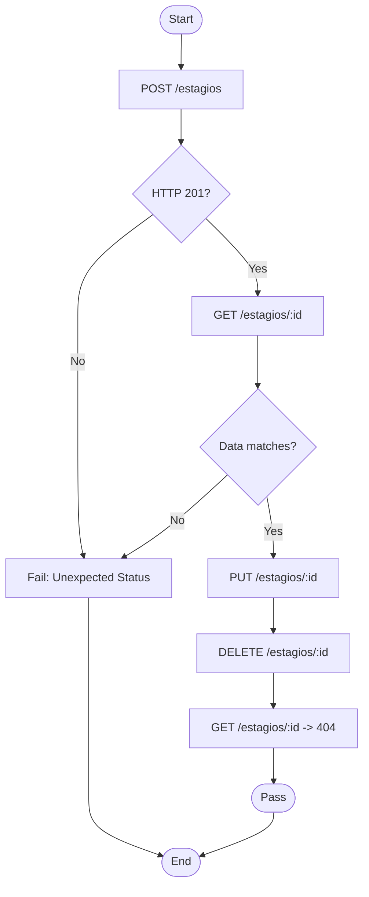
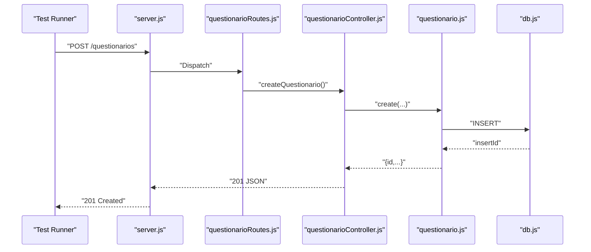
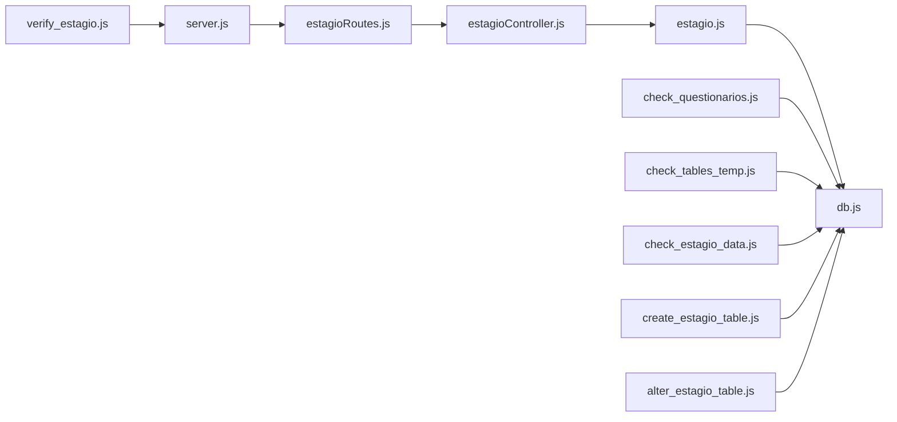

# Testing Strategy

<cite>
**Referenced Files in This Document**
- [test/check_estagio_data.js](file://test/check_estagio_data.js)
- [test/check_questionarios.js](file://test/check_questionarios.js)
- [test/check_tables_temp.js](file://test/check_tables_temp.js)
- [test/create_estagio_table.js](file://test/create_estagio_table.js)
- [test/alter_estagio_table.js](file://test/alter_estagio_table.js)
- [test/verify_estagio.js](file://test/verify_estagio.js)
- [src/database/db.js](file://src/database/db.js)
- [src/server.js](file://src/server.js)
- [src/routers/estagioRoutes.js](file://src/routers/estagioRoutes.js)
- [src/controllers/estagioController.js](file://src/controllers/estagioController.js)
- [src/models/estagio.js](file://src/models/estagio.js)
- [src/routers/questionarioRoutes.js](file://src/routers/questionarioRoutes.js)
- [src/controllers/questionarioController.js](file://src/controllers/questionarioController.js)
- [src/models/questionario.js](file://src/models/questionario.js)
- [package.json](file://package.json)
</cite>

## Table of Contents
1. [Introduction](#introduction)
2. [Project Structure](#project-structure)
3. [Core Components](#core-components)
4. [Architecture Overview](#architecture-overview)
5. [Detailed Component Analysis](#detailed-component-analysis)
6. [Dependency Analysis](#dependency-analysis)
7. [Performance Considerations](#performance-considerations)
8. [Troubleshooting Guide](#troubleshooting-guide)
9. [Conclusion](#conclusion)
10. [Appendices](#appendices)

## Introduction
This document defines a comprehensive testing strategy for NodeMural’s quality assurance approach. It focuses on database testing utilities, validation procedures for critical components, internship data validation, table structure verification, and questionnaire system testing. It also covers automated testing patterns, test data management, database state validation, integration testing approaches, environment setup, continuous testing practices, guidelines for writing new tests, test case organization, debugging failures, performance and load testing considerations, and test automation integration with the development workflow.

## Project Structure
The testing assets are organized under the test directory and complement the backend architecture composed of Express routes, controllers, models, and a MariaDB connection pool. The server exposes endpoints for institutions (estagios), questionnaires, and related resources. Environment variables configure database connectivity and pool limits.

**Diagram sources**
- [test/check_estagio_data.js](file://test/check_estagio_data.js#L1-L26)
- [test/check_questionarios.js](file://test/check_questionarios.js#L1-L29)
- [test/check_tables_temp.js](file://test/check_tables_temp.js#L1-L40)
- [test/create_estagio_table.js](file://test/create_estagio_table.js#L1-L41)
- [test/alter_estagio_table.js](file://test/alter_estagio_table.js#L1-L40)
- [test/verify_estagio.js](file://test/verify_estagio.js#L1-L90)
- [src/server.js](file://src/server.js#L1-L73)
- [src/routers/estagioRoutes.js](file://src/routers/estagioRoutes.js#L1-L20)
- [src/controllers/estagioController.js](file://src/controllers/estagioController.js#L1-L98)
- [src/models/estagio.js](file://src/models/estagio.js#L1-L66)
- [src/routers/questionarioRoutes.js](file://src/routers/questionarioRoutes.js#L1-L16)
- [src/controllers/questionarioController.js](file://src/controllers/questionarioController.js#L1-L72)
- [src/models/questionario.js](file://src/models/questionario.js#L1-L38)
- [src/database/db.js](file://src/database/db.js#L1-L15)

**Section sources**
- [test/check_estagio_data.js](file://test/check_estagio_data.js#L1-L26)
- [test/check_questionarios.js](file://test/check_questionarios.js#L1-L29)
- [test/check_tables_temp.js](file://test/check_tables_temp.js#L1-L40)
- [test/create_estagio_table.js](file://test/create_estagio_table.js#L1-L41)
- [test/alter_estagio_table.js](file://test/alter_estagio_table.js#L1-L40)
- [test/verify_estagio.js](file://test/verify_estagio.js#L1-L90)
- [src/server.js](file://src/server.js#L1-L73)
- [src/database/db.js](file://src/database/db.js#L1-L15)
- [package.json](file://package.json#L1-L32)

## Core Components
- Database connectivity and pooling are centralized via a MariaDB pool configured with environment variables and connection limits.
- The server initializes routes for institutions and questionnaires and exposes nested endpoints for related resources.
- Controllers implement CRUD operations for institutions and questionnaires, delegating persistence to models.
- Models encapsulate SQL queries against the database through the shared pool.

Key responsibilities:
- Database utilities: create, alter, inspect, and validate tables and data.
- Integration tests: verify CRUD flows for institutions and questionnaire records.
- Environment configuration: DB credentials, pool limits, and server port.

**Section sources**
- [src/database/db.js](file://src/database/db.js#L1-L15)
- [src/server.js](file://src/server.js#L1-L73)
- [src/routers/estagioRoutes.js](file://src/routers/estagioRoutes.js#L1-L20)
- [src/controllers/estagioController.js](file://src/controllers/estagioController.js#L1-L98)
- [src/models/estagio.js](file://src/models/estagio.js#L1-L66)
- [src/routers/questionarioRoutes.js](file://src/routers/questionarioRoutes.js#L1-L16)
- [src/controllers/questionarioController.js](file://src/controllers/questionarioController.js#L1-L72)
- [src/models/questionario.js](file://src/models/questionario.js#L1-L38)

## Architecture Overview
The testing architecture leverages:
- Direct database scripts for schema inspection and manipulation.
- HTTP-based integration tests that exercise endpoints for institution and questionnaire resources.
- Centralized database pool for all persistence operations.

**Diagram sources**
- [test/verify_estagio.js](file://test/verify_estagio.js#L1-L90)
- [src/server.js](file://src/server.js#L1-L73)
- [src/routers/estagioRoutes.js](file://src/routers/estagioRoutes.js#L1-L20)
- [src/controllers/estagioController.js](file://src/controllers/estagioController.js#L1-L98)
- [src/models/estagio.js](file://src/models/estagio.js#L1-L66)
- [src/database/db.js](file://src/database/db.js#L1-L15)

## Detailed Component Analysis

### Database Testing Utilities
- Schema inspection: scripts list tables and describe column metadata for key entities.
- Table creation and alteration: scripts define or adjust table schemas for institutions.
- Data validation: scripts count rows and validate presence of records.

Recommended usage:
- Run schema inspection scripts before and after migrations to confirm structural changes.
- Use table creation scripts to bootstrap environments consistently.
- Use data validation scripts to assert baseline counts during CI checks.

Operational notes:
- Scripts connect to the database using environment variables for host, user, password, and database name.
- Scripts manage connections and pools, ensuring proper cleanup.

**Section sources**
- [test/check_tables_temp.js](file://test/check_tables_temp.js#L1-L40)
- [test/check_questionarios.js](file://test/check_questionarios.js#L1-L29)
- [test/create_estagio_table.js](file://test/create_estagio_table.js#L1-L41)
- [test/alter_estagio_table.js](file://test/alter_estagio_table.js#L1-L40)
- [test/check_estagio_data.js](file://test/check_estagio_data.js#L1-L26)
- [src/database/db.js](file://src/database/db.js#L1-L15)

### Institution Data Validation (CRUD)
The integration test validates end-to-end CRUD operations for institutions:
- Creation payload includes required fields mandated by the schema.
- Retrieval verifies field integrity.
- Updates modify attributes and re-validate.
- Deletion ensures subsequent retrieval yields a not-found response.

Validation criteria:
- HTTP status codes reflect operation outcomes.
- Returned data matches expectations.
- Error handling is exercised (e.g., 404 after deletion).

**Diagram sources**
- [test/verify_estagio.js](file://test/verify_estagio.js#L1-L90)
- [src/routers/estagioRoutes.js](file://src/routers/estagioRoutes.js#L1-L20)
- [src/controllers/estagioController.js](file://src/controllers/estagioController.js#L1-L98)
- [src/models/estagio.js](file://src/models/estagio.js#L1-L66)

**Section sources**
- [test/verify_estagio.js](file://test/verify_estagio.js#L1-L90)
- [src/routers/estagioRoutes.js](file://src/routers/estagioRoutes.js#L1-L20)
- [src/controllers/estagioController.js](file://src/controllers/estagioController.js#L1-L98)
- [src/models/estagio.js](file://src/models/estagio.js#L1-L66)

### Questionnaire System Testing
Controllers and models expose full CRUD for questionnaires. Tests should:
- Validate successful creation, retrieval, updates, and deletions.
- Assert correct handling of optional and required fields.
- Confirm endpoint routing and controller delegation.

**Diagram sources**
- [src/server.js](file://src/server.js#L1-L73)
- [src/routers/questionarioRoutes.js](file://src/routers/questionarioRoutes.js#L1-L16)
- [src/controllers/questionarioController.js](file://src/controllers/questionarioController.js#L1-L72)
- [src/models/questionario.js](file://src/models/questionario.js#L1-L38)
- [src/database/db.js](file://src/database/db.js#L1-L15)

**Section sources**
- [src/routers/questionarioRoutes.js](file://src/routers/questionarioRoutes.js#L1-L16)
- [src/controllers/questionarioController.js](file://src/controllers/questionarioController.js#L1-L72)
- [src/models/questionario.js](file://src/models/questionario.js#L1-L38)

### Automated Testing Patterns
- Direct database scripts for schema and data verification.
- HTTP-driven integration tests for resource endpoints.
- Centralized environment configuration via dotenv and process environment.

Patterns to adopt:
- Parameterized payloads for CRUD tests.
- Assertions on HTTP status codes and response bodies.
- Cleanup steps to remove test records after verification.

**Section sources**
- [test/check_tables_temp.js](file://test/check_tables_temp.js#L1-L40)
- [test/check_questionarios.js](file://test/check_questionarios.js#L1-L29)
- [test/verify_estagio.js](file://test/verify_estagio.js#L1-L90)
- [src/server.js](file://src/server.js#L1-L73)
- [src/database/db.js](file://src/database/db.js#L1-L15)

### Test Data Management and Database State Validation
- Use dedicated test databases or isolated schemas to avoid conflicts.
- Seed minimal data sets for dependent relationships (e.g., areas de instituição).
- Validate state transitions: create, read, update, delete, and not-found scenarios.
- Snapshot table structures and counts as part of regression checks.

**Section sources**
- [test/check_estagio_data.js](file://test/check_estagio_data.js#L1-L26)
- [test/check_tables_temp.js](file://test/check_tables_temp.js#L1-L40)
- [test/check_questionarios.js](file://test/check_questionarios.js#L1-L29)

### Integration Testing Approaches
- Endpoint-first testing: drive tests from HTTP requests to controllers and models.
- Transaction isolation: wrap tests in transactions and rollback to maintain state.
- Health checks: verify server readiness and database connectivity before running tests.

**Section sources**
- [test/verify_estagio.js](file://test/verify_estagio.js#L1-L90)
- [src/server.js](file://src/server.js#L1-L73)

### Test Environment Setup
- Configure environment variables for database connectivity and pool limits.
- Start the server locally or in CI with the appropriate port.
- Ensure database is initialized with required tables and seed data.

**Section sources**
- [src/database/db.js](file://src/database/db.js#L1-L15)
- [src/server.js](file://src/server.js#L1-L73)
- [package.json](file://package.json#L1-L32)

### Continuous Testing Practices
- Add a test script to package.json to automate execution.
- Integrate with CI pipelines to run database and HTTP tests on push and pull requests.
- Use database migration scripts as preconditions for tests.

**Section sources**
- [package.json](file://package.json#L1-L32)
- [test/create_estagio_table.js](file://test/create_estagio_table.js#L1-L41)
- [test/alter_estagio_table.js](file://test/alter_estagio_table.js#L1-L40)

### Guidelines for Writing New Tests
- Structure tests around CRUD lifecycle for each resource.
- Use descriptive names and comments to explain intent.
- Validate both positive and negative outcomes (e.g., 404 for missing records).
- Keep test data minimal and deterministic; clean up after execution.

**Section sources**
- [test/verify_estagio.js](file://test/verify_estagio.js#L1-L90)
- [src/routers/estagioRoutes.js](file://src/routers/estagioRoutes.js#L1-L20)
- [src/routers/questionarioRoutes.js](file://src/routers/questionarioRoutes.js#L1-L16)

### Test Case Organization
- Group tests by domain: institutions, questionnaires, and supporting entities.
- Separate schema tests from integration tests.
- Maintain a naming convention that reflects the tested resource and operation.

**Section sources**
- [test/check_tables_temp.js](file://test/check_tables_temp.js#L1-L40)
- [test/check_questionarios.js](file://test/check_questionarios.js#L1-L29)
- [test/verify_estagio.js](file://test/verify_estagio.js#L1-L90)

### Debugging Test Failures
- Capture and log HTTP responses, status codes, and error stacks.
- Verify database state before and after operations.
- Use schema inspection scripts to confirm table definitions.

**Section sources**
- [test/verify_estagio.js](file://test/verify_estagio.js#L77-L86)
- [test/check_tables_temp.js](file://test/check_tables_temp.js#L1-L40)
- [test/check_questionarios.js](file://test/check_questionarios.js#L1-L29)

## Dependency Analysis
The testing suite depends on:
- Express server for endpoint exposure.
- Route handlers for dispatching requests.
- Controllers for business logic and error handling.
- Models for database operations.
- Database pool for connection management.

**Diagram sources**
- [test/verify_estagio.js](file://test/verify_estagio.js#L1-L90)
- [src/server.js](file://src/server.js#L1-L73)
- [src/routers/estagioRoutes.js](file://src/routers/estagioRoutes.js#L1-L20)
- [src/controllers/estagioController.js](file://src/controllers/estagioController.js#L1-L98)
- [src/models/estagio.js](file://src/models/estagio.js#L1-L66)
- [src/database/db.js](file://src/database/db.js#L1-L15)
- [test/check_questionarios.js](file://test/check_questionarios.js#L1-L29)
- [test/check_tables_temp.js](file://test/check_tables_temp.js#L1-L40)
- [test/check_estagio_data.js](file://test/check_estagio_data.js#L1-L26)
- [test/create_estagio_table.js](file://test/create_estagio_table.js#L1-L41)
- [test/alter_estagio_table.js](file://test/alter_estagio_table.js#L1-L40)

**Section sources**
- [test/verify_estagio.js](file://test/verify_estagio.js#L1-L90)
- [src/server.js](file://src/server.js#L1-L73)
- [src/routers/estagioRoutes.js](file://src/routers/estagioRoutes.js#L1-L20)
- [src/controllers/estagioController.js](file://src/controllers/estagioController.js#L1-L98)
- [src/models/estagio.js](file://src/models/estagio.js#L1-L66)
- [src/database/db.js](file://src/database/db.js#L1-L15)

## Performance Considerations
- Connection pooling: tune pool limits and queue behavior to handle concurrent tests.
- Query optimization: minimize N+1 selects and batch operations where feasible.
- Load testing: simulate concurrent clients to endpoints and measure latency and throughput.
- Resource cleanup: ensure tests release connections and remove temporary data.

[No sources needed since this section provides general guidance]

## Troubleshooting Guide
Common issues and resolutions:
- Database connectivity errors: verify environment variables and pool configuration.
- Schema mismatches: run schema inspection scripts and compare expected vs. actual definitions.
- HTTP failures: capture response status, data, and headers; validate payloads and endpoints.
- Cleanup failures: ensure deletion steps are executed and verified.

**Section sources**
- [src/database/db.js](file://src/database/db.js#L1-L15)
- [test/check_tables_temp.js](file://test/check_tables_temp.js#L1-L40)
- [test/check_questionarios.js](file://test/check_questionarios.js#L1-L29)
- [test/verify_estagio.js](file://test/verify_estagio.js#L77-L86)

## Conclusion
The current testing strategy combines database utilities and HTTP-based integration tests to validate critical components. By centralizing environment configuration, structuring tests around CRUD lifecycles, and maintaining schema and data verifications, NodeMural can achieve robust QA coverage. Extending this approach with continuous integration, performance and load testing, and improved test organization will further strengthen reliability and developer confidence.

[No sources needed since this section summarizes without analyzing specific files]

## Appendices
- Environment variables to configure:
  - DB_HOST, DB_USER, DB_PASSWORD, DB_NAME
  - DB_POOL_LIMIT
  - PORT (default 3333)
- Example commands:
  - Start server: npm run dev
  - Run tests: node test/<script>.js

**Section sources**
- [src/database/db.js](file://src/database/db.js#L1-L15)
- [src/server.js](file://src/server.js#L71-L72)
- [package.json](file://package.json#L10-L13)