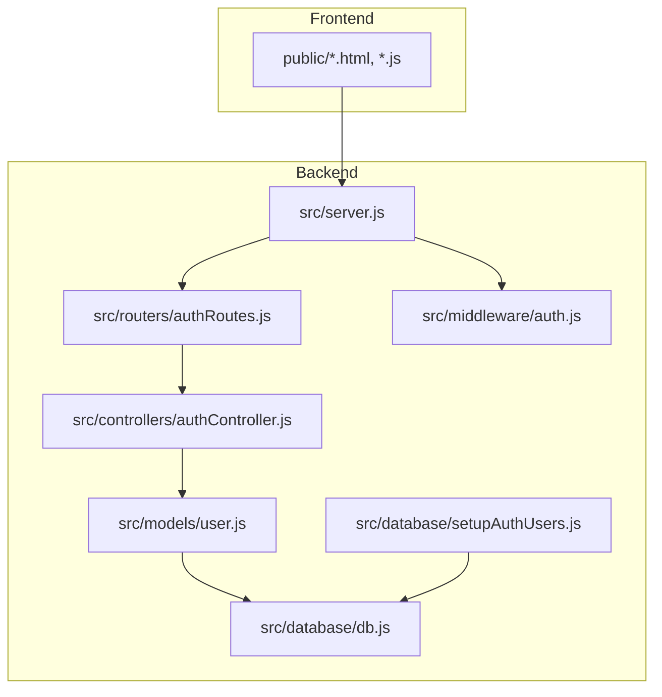
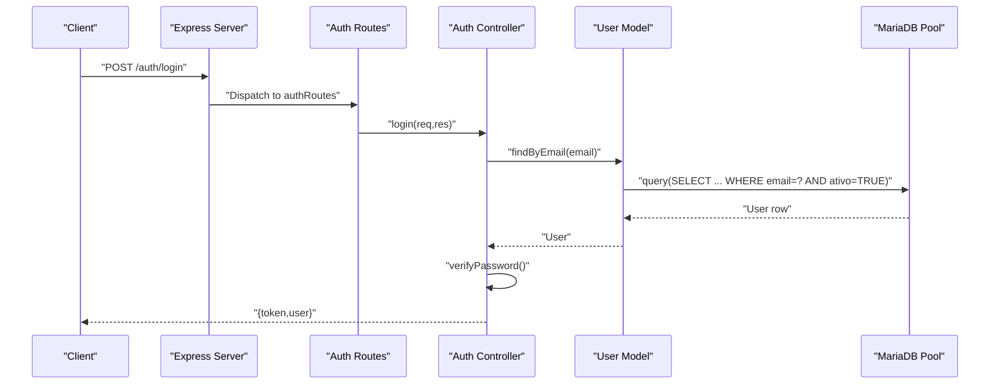
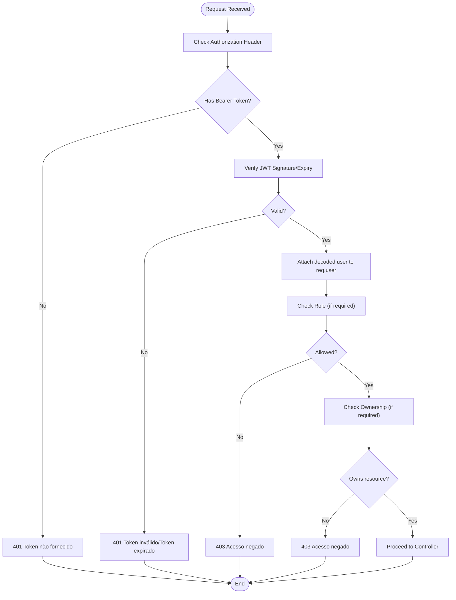
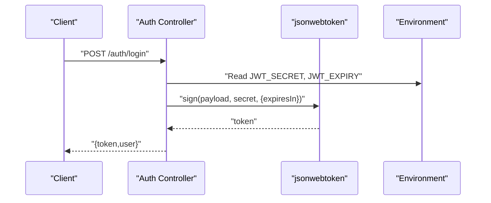
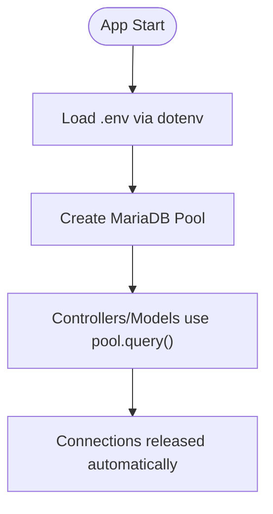
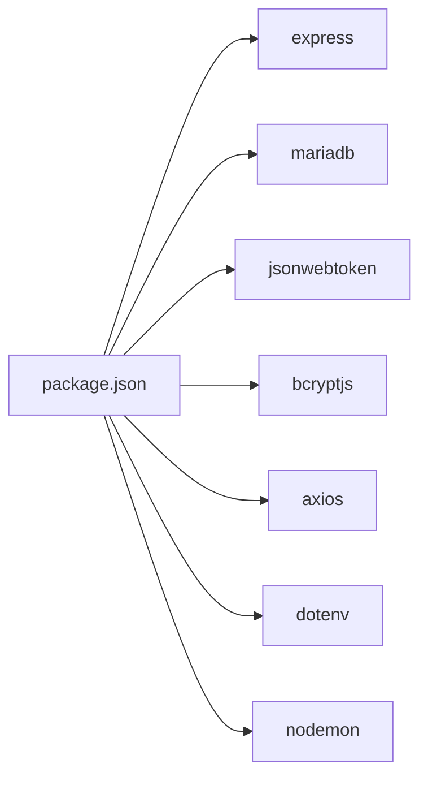

# Troubleshooting & FAQ

<cite>
**Referenced Files in This Document**
- [README.md](file://README.md)
- [AUTH_GUIDE.md](file://AUTH_GUIDE.md)
- [package.json](file://package.json)
- [src/server.js](file://src/server.js)
- [src/database/db.js](file://src/database/db.js)
- [src/database/setupAuthUsers.js](file://src/database/setupAuthUsers.js)
- [src/middleware/auth.js](file://src/middleware/auth.js)
- [src/routers/authRoutes.js](file://src/routers/authRoutes.js)
- [src/controllers/authController.js](file://src/controllers/authController.js)
- [src/models/user.js](file://src/models/user.js)
- [test/check_tables_temp.js](file://test/check_tables_temp.js)
- [test/check_questionarios.js](file://test/check_questionarios.js)
- [test/check_estagio_data.js](file://test/check_estagio_data.js)
- [test/alter_estagio_table.js](file://test/alter_estagio_table.js)
</cite>

## Table of Contents
1. [Introduction](#introduction)
2. [Project Structure](#project-structure)
3. [Core Components](#core-components)
4. [Architecture Overview](#architecture-overview)
5. [Detailed Component Analysis](#detailed-component-analysis)
6. [Dependency Analysis](#dependency-analysis)
7. [Performance Considerations](#performance-considerations)
8. [Troubleshooting Guide](#troubleshooting-guide)
9. [FAQ](#faq)
10. [Conclusion](#conclusion)
11. [Appendices](#appendices)

## Introduction
This document provides comprehensive troubleshooting and Frequently Asked Questions for NodeMural. It focuses on installation issues, database connectivity, authentication failures, runtime errors, debugging techniques, log analysis, and error resolution strategies. It also covers performance tuning, memory optimization, database query optimization, and step-by-step solutions for JWT token issues, permission errors, and API connectivity problems.

## Project Structure
NodeMural is a Node.js application using Express and MariaDB. The backend is organized into modular folders:
- src/server.js: Entry point that initializes Express, middleware, static serving, and routes.
- src/routers/*: Route groups for features (e.g., auth, alunos, docentes, estagios).
- src/controllers/*: Business logic for each feature.
- src/models/*: Data access and ORM-like functions interacting with MariaDB via a connection pool.
- src/database/db.js: MariaDB connection pool configuration.
- src/middleware/auth.js: JWT verification, role checks, ownership checks, and helpers.
- src/database/setupAuthUsers.js: Initializes the auth_users table for authentication.
- test/*: Diagnostic scripts for database inspection and maintenance.

**Diagram sources**
- [src/server.js](file://src/server.js#L1-L73)
- [src/routers/authRoutes.js](file://src/routers/authRoutes.js#L1-L20)
- [src/controllers/authController.js](file://src/controllers/authController.js#L1-L157)
- [src/middleware/auth.js](file://src/middleware/auth.js#L1-L137)
- [src/database/db.js](file://src/database/db.js#L1-L15)
- [src/database/setupAuthUsers.js](file://src/database/setupAuthUsers.js#L1-L38)
- [src/models/user.js](file://src/models/user.js#L1-L146)

**Section sources**
- [README.md](file://README.md#L1-L61)
- [src/server.js](file://src/server.js#L1-L73)

## Core Components
- Server initialization and routing: Express app, middleware, static file serving, and route registration.
- Database pool: Connection configuration, limits, and queue behavior.
- Authentication middleware: Token verification, role-based access control, ownership checks, and user retrieval helpers.
- Auth routes: Public endpoints (register, login, whoami) and protected/admin endpoints.
- Auth controller: Registration, login, profile retrieval, and admin user listing with validation and error handling.
- User model: CRUD operations against auth_users, password hashing, and soft-deleted filtering.

**Section sources**
- [src/server.js](file://src/server.js#L31-L73)
- [src/database/db.js](file://src/database/db.js#L5-L13)
- [src/middleware/auth.js](file://src/middleware/auth.js#L6-L137)
- [src/routers/authRoutes.js](file://src/routers/authRoutes.js#L8-L17)
- [src/controllers/authController.js](file://src/controllers/authController.js#L6-L157)
- [src/models/user.js](file://src/models/user.js#L7-L146)

## Architecture Overview
The system follows a layered architecture:
- Presentation: Static HTML/JS served from public/.
- Routing: Express routes grouped by feature.
- Controllers: Request handlers implementing business logic.
- Middleware: Authentication and authorization enforcement.
- Models: Database interactions via MariaDB pool.
- Database: MariaDB with a configurable pool.

**Diagram sources**
- [src/server.js](file://src/server.js#L31-L73)
- [src/routers/authRoutes.js](file://src/routers/authRoutes.js#L8-L17)
- [src/controllers/authController.js](file://src/controllers/authController.js#L77-L127)
- [src/models/user.js](file://src/models/user.js#L37-L46)
- [src/database/db.js](file://src/database/db.js#L5-L13)

## Detailed Component Analysis

### Authentication and Authorization Flow
- Token verification validates Authorization header and JWT signature/expiration.
- Role-based access control restricts endpoints to allowed roles.
- Ownership checks ensure users can only access or modify their own records.
- User registration enforces validation and inserts hashed passwords.

**Diagram sources**
- [src/middleware/auth.js](file://src/middleware/auth.js#L6-L137)

**Section sources**
- [src/middleware/auth.js](file://src/middleware/auth.js#L6-L137)
- [AUTH_GUIDE.md](file://AUTH_GUIDE.md#L289-L300)

### JWT Token Lifecycle and Validation
- Token generation includes id, email, nome, role, and entidade_id with configured expiry.
- Token verification uses JWT_SECRET from environment; expired tokens return 401 with “Token expirado”.
- Frontend must send Authorization: Bearer <token> for protected endpoints.

**Diagram sources**
- [src/controllers/authController.js](file://src/controllers/authController.js#L99-L109)
- [AUTH_GUIDE.md](file://AUTH_GUIDE.md#L164-L191)

**Section sources**
- [src/controllers/authController.js](file://src/controllers/authController.js#L99-L109)
- [AUTH_GUIDE.md](file://AUTH_GUIDE.md#L164-L191)

### Database Connection and Pool Configuration
- Connection pool parameters include host, user, password, database, connectionLimit, and queue behavior.
- Environment variables are loaded via dotenv; missing values fall back to defaults.
- Diagnostic scripts demonstrate connection and table inspection.

**Diagram sources**
- [src/database/db.js](file://src/database/db.js#L5-L13)
- [src/server.js](file://src/server.js#L1-L73)

**Section sources**
- [src/database/db.js](file://src/database/db.js#L5-L13)
- [test/check_tables_temp.js](file://test/check_tables_temp.js#L4-L9)
- [test/check_questionarios.js](file://test/check_questionarios.js#L5-L9)
- [test/check_estagio_data.js](file://test/check_estagio_data.js#L4-L8)

## Dependency Analysis
- Runtime dependencies include Express, MariaDB driver, jsonwebtoken, bcryptjs, axios, dotenv, and nodemon.
- The server registers routes for multiple features and serves static assets from public/.

**Diagram sources**
- [package.json](file://package.json#L22-L30)

**Section sources**
- [package.json](file://package.json#L10-L30)
- [src/server.js](file://src/server.js#L8-L53)

## Performance Considerations
- Connection pooling: Tune DB_POOL_LIMIT according to workload; monitor queueLimit and connectionLimit behavior.
- Query optimization: Use indexed columns in WHERE clauses (e.g., email, id, role).
- Middleware overhead: Keep token verification and role checks efficient; avoid unnecessary database calls inside middleware.
- Memory optimization: Ensure long-lived connections are reused; release resources after use in diagnostics.
- Logging: Prefer structured logs and avoid excessive console logging in production.

[No sources needed since this section provides general guidance]

## Troubleshooting Guide

### Installation Issues
Symptoms
- npm install fails or dependencies not found.
- Port already in use during startup.

Resolutions
- Confirm Node.js version meets prerequisites.
- Clear npm cache and retry installation.
- Change PORT in environment if 3333 is occupied.

Evidence and steps
- Review prerequisites and installation steps in the project documentation.
- Verify package scripts and environment variables.

**Section sources**
- [README.md](file://README.md#L5-L42)
- [package.json](file://package.json#L10-L13)

### Database Connection Problems
Symptoms
- Application starts but routes fail with database errors.
- Cannot connect to MariaDB server.

Resolutions
- Verify DB_HOST, DB_USER, DB_PASSWORD, DB_NAME, and DB_POOL_LIMIT in .env.
- Ensure MariaDB service is running and reachable.
- Use diagnostic scripts to confirm connectivity and table existence.

Evidence and steps
- Check pool configuration and fallback defaults.
- Run diagnostic scripts to list tables and inspect columns.

**Section sources**
- [src/database/db.js](file://src/database/db.js#L5-L13)
- [test/check_tables_temp.js](file://test/check_tables_temp.js#L11-L39)
- [test/check_questionarios.js](file://test/check_questionarios.js#L12-L28)
- [test/check_estagio_data.js](file://test/check_estagio_data.js#L11-L25)

### Authentication Failures
Symptoms
- 401 Token não fornecido, Token inválido, or Token expirado.
- 401 Email ou senha incorretos on login.
- 403 Acesso negado on protected routes.

Resolutions
- Ensure Authorization header includes Bearer <token>.
- Regenerate token after JWT_SECRET changes or expiry.
- Confirm user role and entidade_id match expected values.
- For ownership checks, ensure the authenticated user’s entidade_id matches the target resource.

Evidence and steps
- Review middleware error codes and messages.
- Validate JWT_SECRET and JWT_EXPIRY in environment.
- Confirm auth_users table exists and user is active.

**Section sources**
- [src/middleware/auth.js](file://src/middleware/auth.js#L6-L137)
- [AUTH_GUIDE.md](file://AUTH_GUIDE.md#L289-L300)
- [src/controllers/authController.js](file://src/controllers/authController.js#L77-L127)
- [src/database/setupAuthUsers.js](file://src/database/setupAuthUsers.js#L6-L38)

### JWT Token Issues
Symptoms
- 401 Token expirado or 401 Token inválido.
- Token appears valid on jwt.io but still rejected.

Resolutions
- Regenerate token with current JWT_SECRET and JWT_EXPIRY.
- Ensure consistent JWT_SECRET across deployments.
- Verify client stores token securely and sends Authorization: Bearer <token>.

Evidence and steps
- Check environment variables for JWT_SECRET and JWT_EXPIRY.
- Validate token payload and signature externally if needed.

**Section sources**
- [src/controllers/authController.js](file://src/controllers/authController.js#L99-L109)
- [AUTH_GUIDE.md](file://AUTH_GUIDE.md#L164-L191)

### Permission Errors
Symptoms
- 403 Acesso negado. Permissão insuficiente.
- Access denied for non-admin users.

Resolutions
- Apply verifyToken and checkRole middleware to protected routes.
- Ensure role values align with RBAC matrix.
- For ownership checks, ensure checkOwnership or checkInscricaoOwnership is applied where appropriate.

Evidence and steps
- Review middleware usage in routes.
- Confirm user role and entidade_id values.

**Section sources**
- [src/middleware/auth.js](file://src/middleware/auth.js#L32-L137)
- [AUTH_GUIDE.md](file://AUTH_GUIDE.md#L194-L202)
- [src/routers/authRoutes.js](file://src/routers/authRoutes.js#L13-L17)

### API Connectivity Problems
Symptoms
- Frontend cannot reach backend endpoints.
- Static assets not loading.

Resolutions
- Confirm server listens on expected PORT.
- Ensure static file serving is enabled and paths are correct.
- Verify route prefixes (/auth, /alunos, etc.) match frontend requests.

Evidence and steps
- Check server startup log and PORT configuration.
- Validate route registration order and nested routes.

**Section sources**
- [src/server.js](file://src/server.js#L31-L73)

### Debugging Techniques and Log Analysis
Techniques
- Enable development mode with auto-reload for iterative debugging.
- Use console.error in controllers and middleware to capture stack traces.
- Inspect environment variables at runtime to confirm values.

Evidence and steps
- Use development script to restart on changes.
- Review controller and middleware error handling blocks.

**Section sources**
- [README.md](file://README.md#L37-L42)
- [src/controllers/authController.js](file://src/controllers/authController.js#L67-L74)
- [src/middleware/auth.js](file://src/middleware/auth.js#L22-L28)

### Diagnostics and Monitoring
Commands and scripts
- List tables and check column definitions to validate schema.
- Count rows in specific tables to verify data presence.
- Alter table columns to fix nullable constraints if needed.

Evidence and steps
- Run diagnostic scripts to inspect database state.
- Use these scripts as templates for ad-hoc checks.

**Section sources**
- [test/check_tables_temp.js](file://test/check_tables_temp.js#L11-L39)
- [test/check_questionarios.js](file://test/check_questionarios.js#L12-L28)
- [test/check_estagio_data.js](file://test/check_estagio_data.js#L11-L25)
- [test/alter_estagio_table.js](file://test/alter_estagio_table.js#L11-L39)

## FAQ

Q1: How do I configure the database?
- Set DB_HOST, DB_USER, DB_PASSWORD, DB_NAME, and DB_POOL_LIMIT in .env. Defaults are applied if unspecified.

Q2: Why am I getting 401 Token não fornecido?
- Missing Authorization header or malformed Bearer token. Ensure Authorization: Bearer <token> is sent.

Q3: Why does my token keep expiring?
- Adjust JWT_EXPIRY in .env. Remember to regenerate tokens after changing JWT_SECRET.

Q4: How do I protect routes?
- Apply verifyToken and checkRole middleware to routes. Admin-only routes should restrict roles to admin.

Q5: How do I check if the auth_users table exists?
- Use the setup script or run the diagnostic scripts to list tables and inspect schema.

Q6: How do I troubleshoot database connectivity?
- Verify MariaDB is running, network accessibility, and .env values. Use diagnostic scripts to confirm connectivity.

Q7: How do I handle ownership restrictions?
- Use checkOwnership or checkInscricaoOwnership middleware to enforce record-level access control.

Q8: How do I optimize performance?
- Tune DB_POOL_LIMIT, minimize unnecessary queries, and avoid heavy computations in middleware.

Q9: How do I debug runtime errors?
- Use development mode, review console.error outputs, and validate environment variables.

Q10: How do I reset or fix table constraints?
- Use the alter_estagio_table script as a template to adjust nullable columns or other constraints.

**Section sources**
- [src/database/db.js](file://src/database/db.js#L5-L13)
- [src/middleware/auth.js](file://src/middleware/auth.js#L32-L137)
- [src/database/setupAuthUsers.js](file://src/database/setupAuthUsers.js#L6-L38)
- [test/check_tables_temp.js](file://test/check_tables_temp.js#L11-L39)
- [test/alter_estagio_table.js](file://test/alter_estagio_table.js#L11-L39)
- [README.md](file://README.md#L18-L28)

## Conclusion
This guide consolidates practical troubleshooting steps, error resolution strategies, and operational best practices for NodeMural. By validating environment configuration, understanding authentication and authorization flows, inspecting database connectivity, and applying performance and debugging techniques, most issues can be resolved quickly and efficiently.

[No sources needed since this section summarizes without analyzing specific files]

## Appendices

### Environment Variables Reference
- DB_HOST: MariaDB host (default: localhost)
- DB_USER: MariaDB user (default: root)
- DB_PASSWORD: MariaDB password (default: root)
- DB_NAME: Database name (default: tccess)
- DB_POOL_LIMIT: Connection pool size (default: 10)
- JWT_SECRET: Secret for signing JWT tokens
- JWT_EXPIRY: Token expiry (e.g., 7d)
- PORT: Server port (default: 3333)

**Section sources**
- [README.md](file://README.md#L18-L28)
- [src/database/db.js](file://src/database/db.js#L5-L13)
- [AUTH_GUIDE.md](file://AUTH_GUIDE.md#L243-L250)